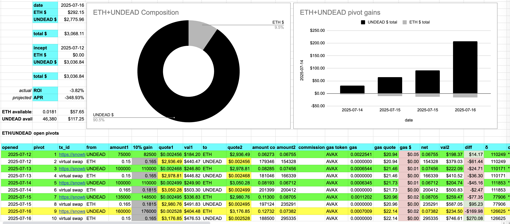
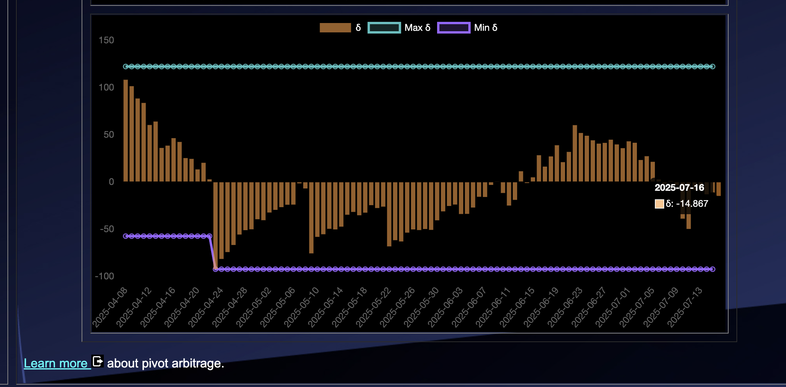
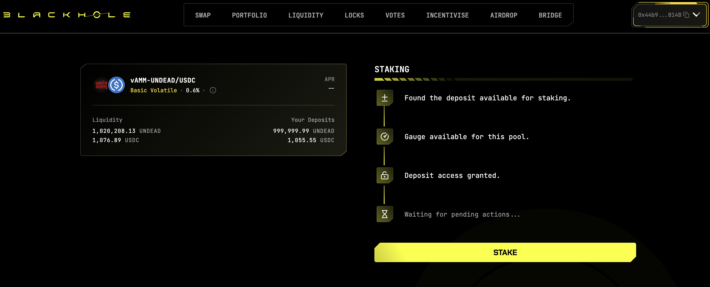

2025-07-16

$BTC price-chart.

Just because.
# 2025-07-16 Status of @UndeadBlocks / $UNDEAD 

 
 
 
 

* rank: 8240 
* quote: $0.00255 
* market cap: $38,288 
* 24-hr volume: $132,060 (δ: $35,677 ) 

[UNDEAD data source](https://www.coingecko.com/en/coins/undead-blocks) 

When we get LPs funded on multiple blockchains, what will $UNDEAD look like? 

## $UNDEAD performance analysis, 2025-07-16 

* "δ" indicates change since 2025-06-05 
* "α" is annualized since 2025-06-05 

 
 
 
 

* rank: 8240 (δ: -9.17% ) , α: -81.62% 
* quote: $0.00255 (δ: -15.63% ) , α: -139.16% 
* market cap: $38,288 (δ: -15.65% ) , α: -139.33% 
* 24-hr volume: $132,060 (δ: -17.81% ) , α: -158.58% 

[2025-06-05 $UNDEAD report (archived)](https://github.com/pivoteur/biz/tree/main/blog/snapshot) 

# $UNDEAD Liquidity Pools

@UndeadBlocks has an @Uniswap LP AVAX/UNDEAD on @avax. Stay tuned for ANNOUNCEMENTs for LPs we are launching today on DEXes on @avax.

For $UNDEAD, the fun begins: today.

You MAY want to start thinking about an investment into $UNDEAD. #NFA #DYOR 

# PIVOTS

## AVAX+UNDEAD

I close 1 hedge for gains of:

* actual ROI: 16.57% / 6046.50% APR projected
* or: 150k $UNDEAD -> $AVAX -> 175k $UNDEAD
* or: $63-gain on $265-hedge

Instead of distributing gains, I'm in conversations with stakers about using the gains to BUIDL new pools.

### Open AVAX+UNDEAD pivots, 2025-07-16 

 
 

The positive δ calls to open an AVAX-on-UNDEAD pivot, which I do. 

 

I also open an UNDEAD-on-AVAX hedge. 

 

The AVAX+UNDEAD pivot pool composition and γ-apportionment are as charted. 

 
 

### Gains disposition

After discussing with stakers, we're going ahead with profit from +UNDEAD pivot pools funding new pivot pools.

I swap 80% of the gains to $BTC and send it to the treasury addy to reserve funds to start new pools.

I'll be creating these new pivot pools sequentially.

# Bridging $UNDEAD

In preparation for funding liquidity pools on @avax, I bridge $UNDEAD from my @Ledger addy on @ethereum using @VeraBridge_io. 

# PIVOTS (reprise)

## ETH+UNDEAD

D-mn. 😳

I close 1 hedge for gains of:

* actual ROI: 32.97% / 12034.06% APR projected
* or: 135k $UNDEAD -> $ETH -> 181k $UNDEAD
* or: $113-gain on $259 hedge, ... WHAAAA?? 💥

I swap 80% of the gains to $ETH in reserve to fund new pivot pools. 

### Open Pivot 

 
 

The positive δ calls to open an ETH-on-UNDEAD pivot, which I do. 

 

I also hedge with an UNDEAD-on-ETH pivot. 

 

The ETH+UNDEAD pivot pool composition and γ-apportionment are as charted. 

 
 
## UNDEAD+USDC 

No close pivots. 

### Open Pivot 

 
 

The meh δ makes no call, but I open an UNDEAD-on-USDC pivot, anyway. 

 

I also open an USDC-on-UNDEAD pivot 

 

The UNDEAD+USDC pivot pool composition and γ-apportionment are as charted. 

 
 

# Funding Liquidity Pools on Blackhole DEX

Let's fund liquidity pools on @BlackholeDex!

I provide liquidity to, then stake, both LP UNDEAD/WAVAX and LP UNDEAD/USDC. 

## Go vote for Blackhole $UNDEAD liquidity pools

💥💥💥ANNOUNCEMENT!💥💥💥

Both LP UNDEAD/WAVAX and LP UNDEAD/USDC are provisioned on @BlackholeDex.

Go to [Blackhole DEX voting page](https://blackhole.xyz/vote) then search for 'UNDEAD' to vote for these liquidity pools to be incentivized!

## HOWTO Vote to incentivize Blackhole LPs

Voting for @BlackholeDex LPs

1. [Swap to $BLACK](https://blackhole.xyz/swap?token0=0xavax&token1=0xcd94a87696fac69edae3a70fe5725307ae1c43f6)

2. [Permalock your $BLACK](https://blackhole.xyz/locks) to maximize $BLACK voting-power (locking is required; permalocking is optional)

3. Confirm lock

4. Search for UNDEAD LPs and [vote!](https://blackhole.xyz/vote)

