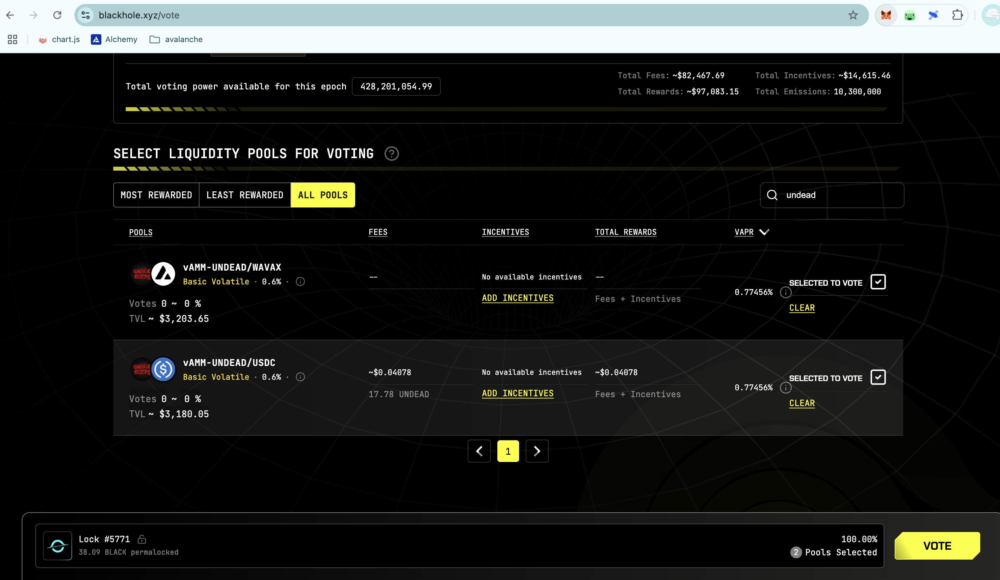
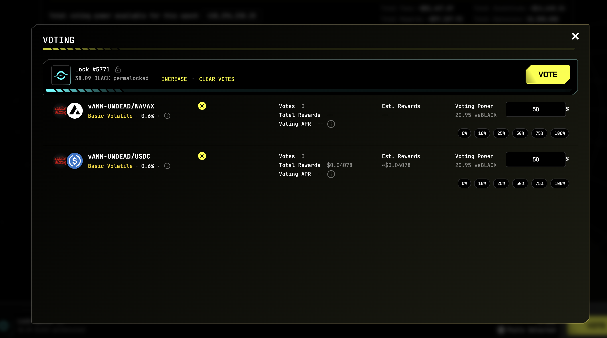
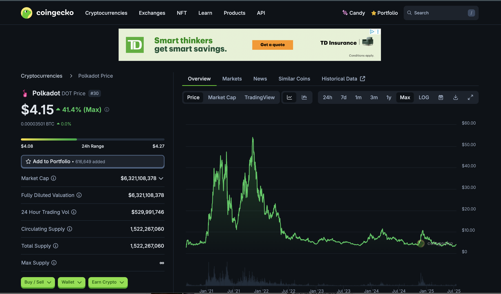
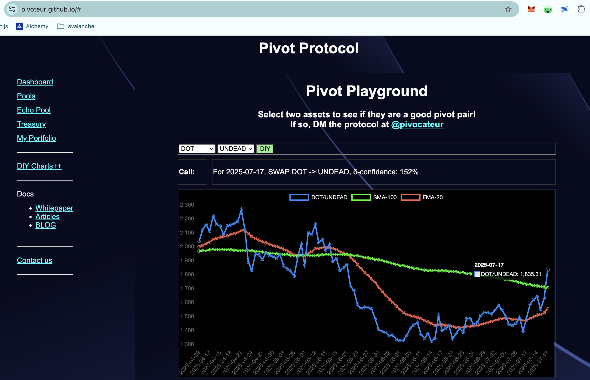
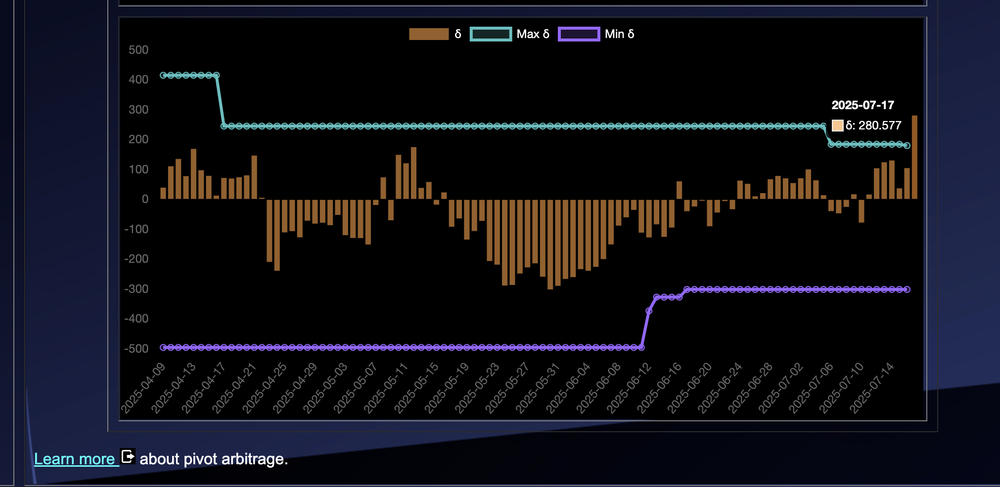

# Vote on Blackhole DEX

2025-07-17

Good morning, pivoteurs!

A new day; a new Epoch on @BlackholeDex.

Reminder to go [vote](https://blackhole.xyz/vote) for the @UndeadBlocks $UNDEAD liquidity pools on that DEX.

[HOWTO vote instructions](https://x.com/pivocateur/status/1945637734682341791)

#IVotedForUNDEAD 
# 2025-07-17 Spotlight on Polkadot / $DOT 

 
 
 

* rank: 30 
* quote: $4.15000 
* market cap: $6,321,108,378 
* 24-hr volume: $529,991,746 
* UNDEAD ratio: 1835 

[DOT data source](https://www.coingecko.com/en/coins/polkadot) 

