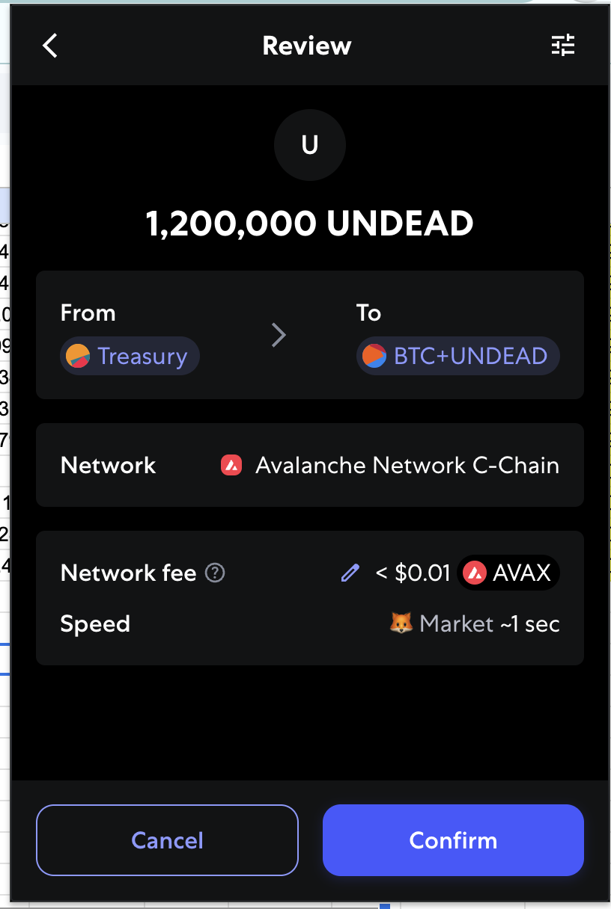

# Vote on Blackhole DEX

2025-07-17

Good morning, pivoteurs!

A new day; a new Epoch on @BlackholeDex.

Reminder to go [vote](https://blackhole.xyz/vote) for the @UndeadBlocks $UNDEAD liquidity pools on that DEX.

[HOWTO vote instructions](https://x.com/pivocateur/status/1945637734682341791)

#IVotedForUNDEAD 
# 2025-07-17 Spotlight on Polkadot / $DOT 

 
 
 

* rank: 30 
* quote: $4.15000 
* market cap: $6,321,108,378 
* 24-hr volume: $529,991,746 
* UNDEAD ratio: 1835 

[DOT data source](https://www.coingecko.com/en/coins/polkadot) 

# 2025-07-17 Status of @UndeadBlocks / $UNDEAD 

 
 
 
 

* rank: 8480 
* quote: $0.00221 
* market cap: $33,187 
* 24-hr volume: $94,618 (δ: -$37,442 ) 

[UNDEAD data source](https://www.coingecko.com/en/coins/undead-blocks) 

When we get LPs funded on multiple blockchains, what will $UNDEAD look like? 

# DEX race

Same swap; 4 DEX, 2025-07-17

I swap 134,000 $UNDEAD to get:

1. 249.72 $USDC on @PharaohExchange

2. 227.39 $USDC with a 28% price-slippage warning on @BlackholeDex

3. 258.53 $UDSD on @KyberNetwork💥

4. 258.08 $USDC on @LFJ_gg

Winner: @KyberNetwork, followed closely by @LFJ_gg 

# PIVOTS 

## BTC+UNDEAD 

 

I create this pivot pool on @avax with 1.2M $UNDEAD liquidity. 

