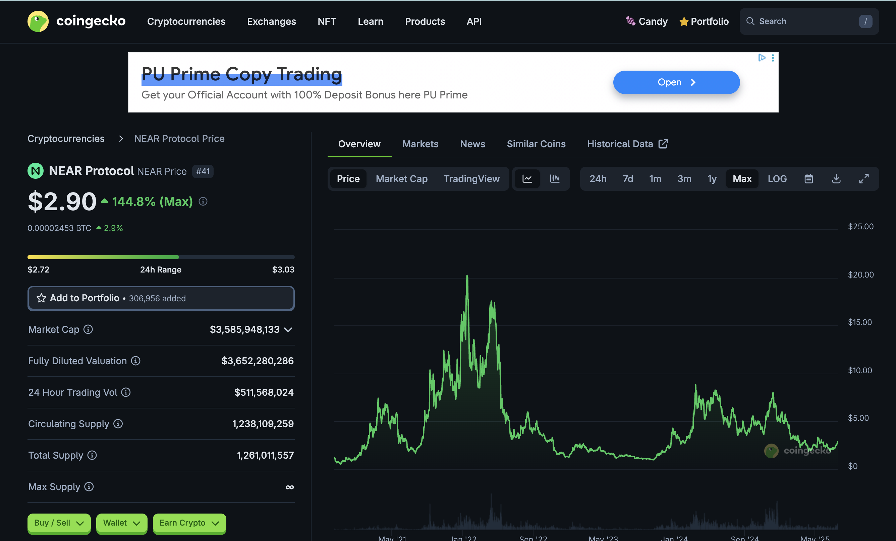
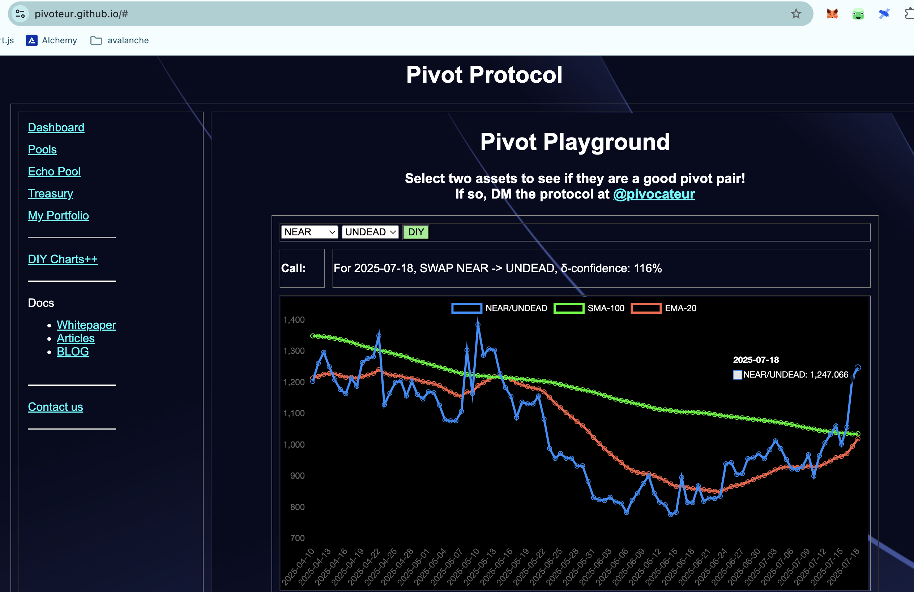

# 2025-07-18 Spotlight on @NEARProtocol / $NEAR 

 
 
 

* rank: 41 
* quote: $2.90000 
* market cap: $3,585,948,133 
* 24-hr volume: $511,568,024 
* UNDEAD ratio: 1247 

[NEAR data source](https://www.coingecko.com/en/coins/near) 

I'm done with my spotlights; [comment to me on twitter](https://x.com/pivocateur) if you'd like a blockchain spotlight.
