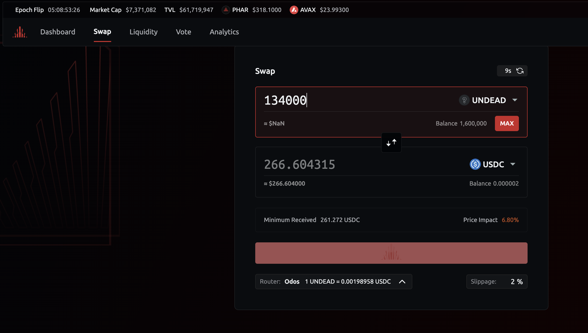
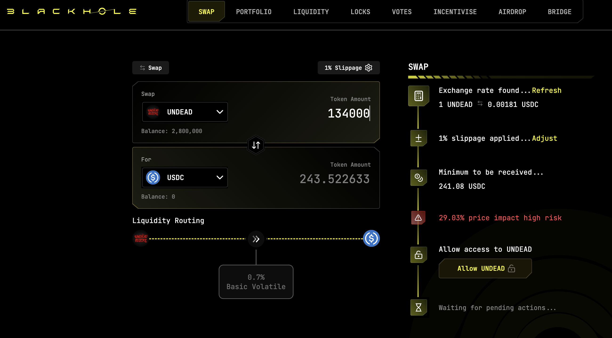
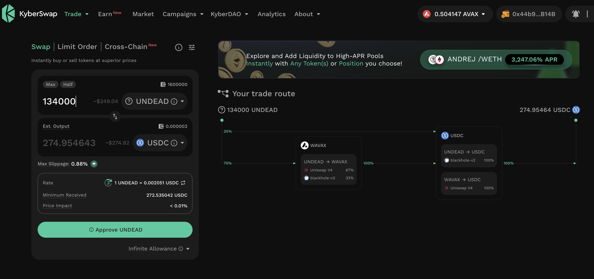
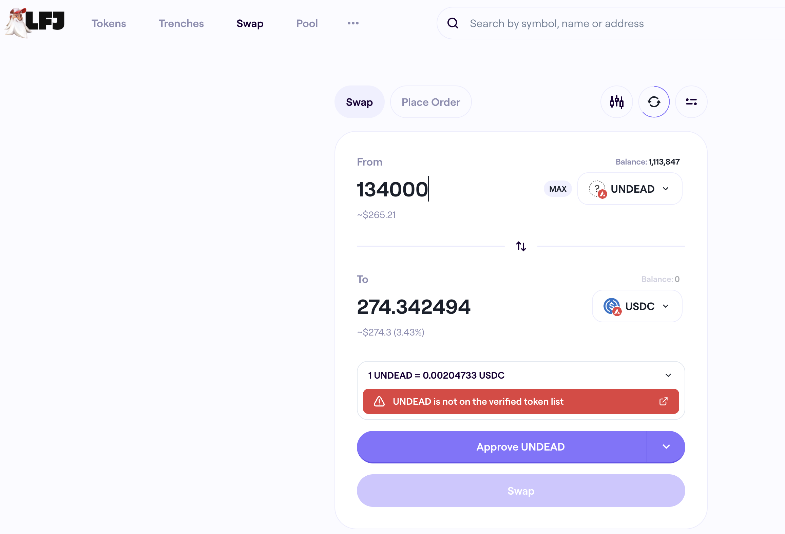

# 2025-07-18 Spotlight on @NEARProtocol / $NEAR 

 
 
 

* rank: 41 
* quote: $2.90000 
* market cap: $3,585,948,133 
* 24-hr volume: $511,568,024 
* UNDEAD ratio: 1247 

[NEAR data source](https://www.coingecko.com/en/coins/near) 

I'm done with my spotlights; [comment to me on twitter](https://x.com/pivocateur) if you'd like a blockchain spotlight.
# 2025-07-18 Status of @UndeadBlocks / $UNDEAD 

 
 
 
 

* rank: 8472 
* quote: $0.00232 
* market cap: $34,666 
* 24-hr volume: $103,234 (δ: $8,616 ) 

[UNDEAD data source](https://www.coingecko.com/en/coins/undead-blocks) 

When we get LPs funded on multiple blockchains, what will $UNDEAD look like? 

## $UNDEAD performance analysis, 2025-07-18 

* "δ" indicates change since 2025-07-17 
* "α" is annualized since 2025-07-17 

 
 
 
 

* rank: 8472 (δ: 0.09% ) , α: 34.43% 
* quote: $0.00232 (δ: 4.79% ) , α: 1749.89% 
* market cap: $34,666 (δ: 4.46% ) , α: 1627.00% 
* 24-hr volume: $103,234 (δ: 9.11% ) , α: 3323.80% 

[2025-07-17 $UNDEAD report (archived)](https://github.com/pivoteur/biz/tree/main/blog/snapshot) 
# DEX UNDEAD/USDC-swap Race 

Same swap; 4 DEX, 2025-07-18 

I swap 134000 $UNDEAD for: 

1. 266.60 $USDC on @PharaohExchange 

 

2. 243.52 $USDC on @BlackholeDex with 29.03% slippage 

 

3. 274.95 $USDC on @KyberNetwork 💥 

 

4. 274.34 $USDC on @LFJ_gg 

 

Winner: @KyberNetwork (2-day streak) 
