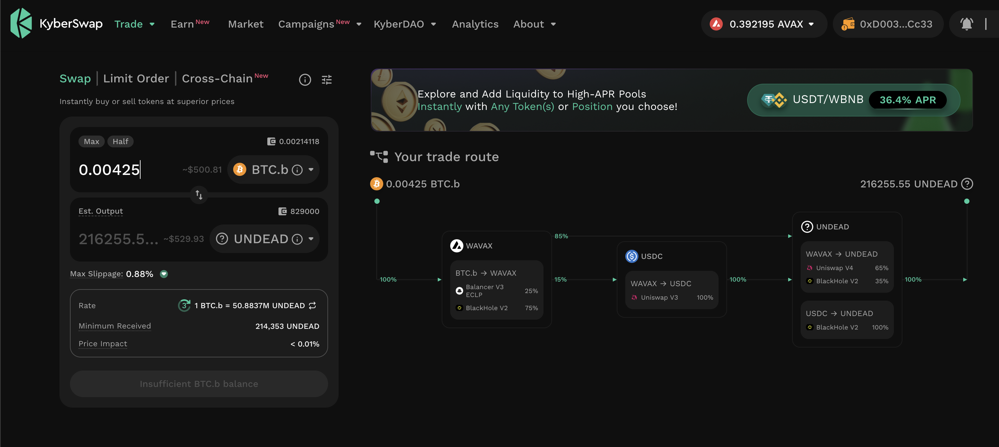
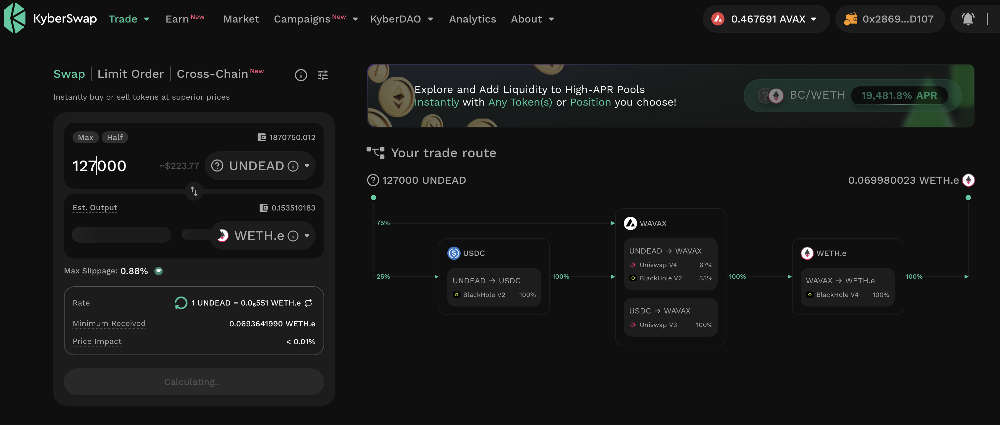
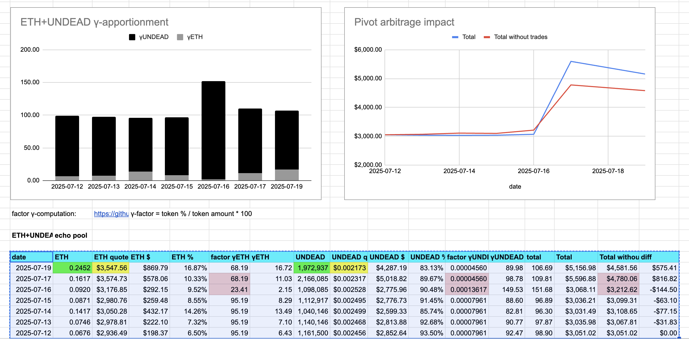
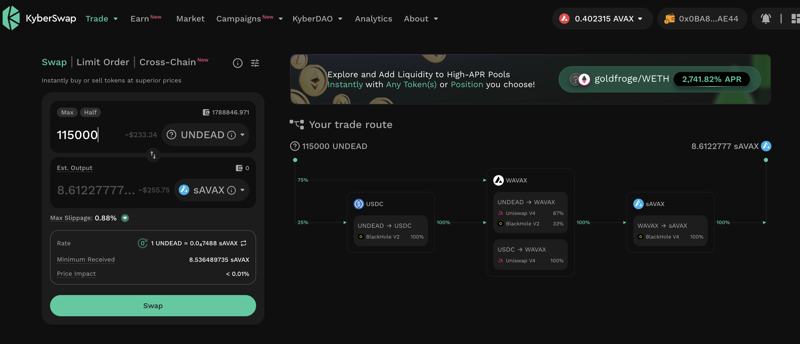

# 2025-07-19 Status of @UndeadBlocks / $UNDEAD 

 
 
 
 

* rank: 8530 
* quote: $0.00218 
* market cap: $32,764 
* 24-hr volume: $127,859 (δ: $24,625 ) 

[UNDEAD data source](https://www.coingecko.com/en/coins/undead-blocks) 

When we get LPs funded on multiple blockchains, what will $UNDEAD look like? 

## $UNDEAD performance analysis, 2025-07-19 

* "δ" indicates change since 2025-07-17 
* "α" is annualized since 2025-07-17 

 
 
 
 

* rank: 8530 (δ: -0.59% ) , α: -107.61% 
* quote: $0.00218 (δ: -1.45% ) , α: -264.13% 
* market cap: $32,764 (δ: -1.27% ) , α: -232.27% 
* 24-hr volume: $127,859 (δ: 35.13% ) , α: 6411.60% 

[2025-07-17 $UNDEAD report (archived)](https://github.com/pivoteur/biz/tree/main/blog/snapshot) 
# DEX UNDEAD/USDC-swap Race 

Same swap; 4 DEX, 2025-07-19 

I swap 134000 $UNDEAD for: 

1. 254.74 $USDC on @PharaohExchange 

 

2. 231.06 $USDC on @BlackholeDex with 28.28% slippage 

 

3. 262.66 $USDC on @KyberNetwork 

 

4. 262.70 $USDC on @LFJ_gg 💥 

 

Winner: @LFJ_gg 
# PIVOTS 

## BTC+UNDEAD 

No close pivots. 

### Open BTC+UNDEAD pivots 

 
 

The positive δ calls to open an BTC-on-UNDEAD pivot, which I do. 

 

I also open an UNDEAD-on-BTC hedge. 

 

The BTC+UNDEAD pivot pool composition and γ-apportionment are as charted. 

 
 

## ETH+UNDEAD

I close 1 pivot for gains of:

* actual ROI: 11.67% / 1420.26% APR projected
* or: 0.15 $ETH -> $UNDEAD -> 0.168 $ETH
* or: $62-gain on $747 pivoted

I distribute 80% of the $ETH gained to the treasury. 
## ETH+UNDEAD 

I close 1 pivot for gains of: 

### Open ETH+UNDEAD pivots 

 
 

The positive δ calls to open an ETH-on-UNDEAD pivot, which I do. 

 

I also open an UNDEAD-on-ETH hedge. 

 

The ETH+UNDEAD pivot pool composition and γ-apportionment are as charted. 

 
 
## AVAX+UNDEAD 

No close pivots. 

### Open AVAX+UNDEAD pivots 

 
 

The positive δ calls to open an AVAX-on-UNDEAD pivot, which I do. 

 

I also open an UNDEAD-on-AVAX hedge. 

 

The AVAX+UNDEAD pivot pool composition and γ-apportionment are as charted. 

 
 

## UNDEAD+USDC

I close 1 pivot for gains of:

* actual ROI: 10.67% / 778.78% APR projected
* or: 500 $USDC -> $UNDEAD -> 553 $USDC

I distribute 80% of the gains to the treasury addy.

