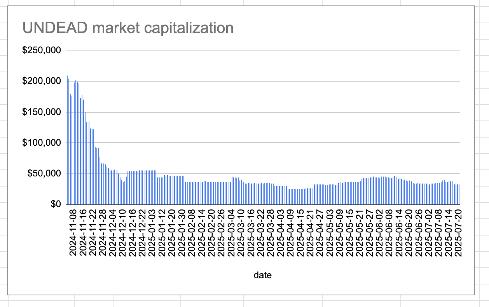

# 2025-07-20 Status of @UndeadBlocks / $UNDEAD 

 
 
 
 

* rank: 8516 
* quote: $0.00221 
* market cap: $33,066 
* 24-hr volume: $130,518 (δ: $2,659 ) 

[UNDEAD data source](https://www.coingecko.com/en/coins/undead-blocks) 

When we get LPs funded on multiple blockchains, what will $UNDEAD look like? 

## $UNDEAD performance analysis, 2025-07-20 

* "δ" indicates change since 2025-07-17 
* "α" is annualized since 2025-07-17 

 
 
 
 

* rank: 8516 (δ: -0.42% ) , α: -51.65% 
* quote: $0.00221 (δ: -0.14% ) , α: -16.51% 
* market cap: $33,066 (δ: -0.36% ) , α: -44.39% 
* 24-hr volume: $130,518 (δ: 37.94% ) , α: 4616.32% 

[2025-07-17 $UNDEAD report (archived)](https://github.com/pivoteur/biz/tree/main/blog/snapshot) 
