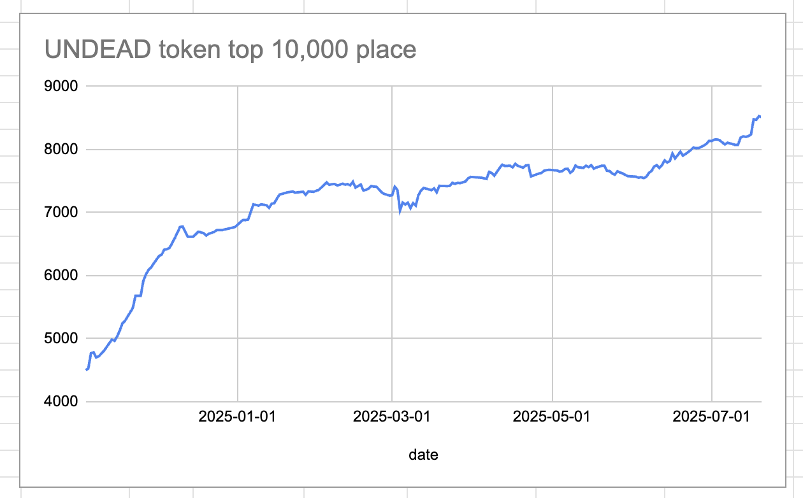
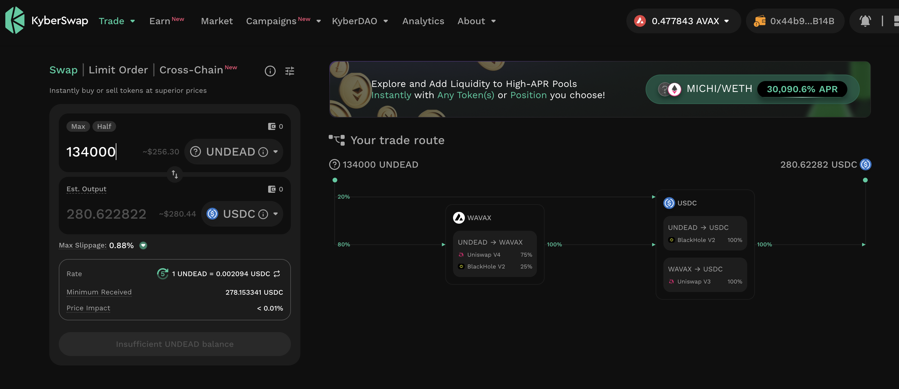
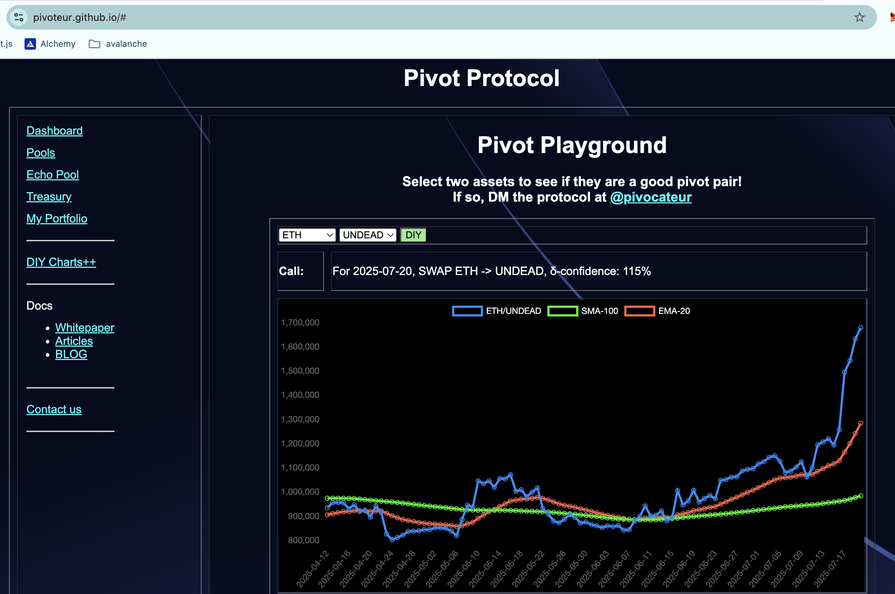
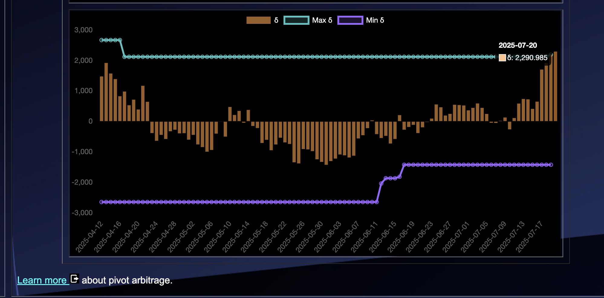

# 2025-07-20 Status of @UndeadBlocks / $UNDEAD 

 
 
 
 

* rank: 8516 
* quote: $0.00221 
* market cap: $33,066 
* 24-hr volume: $130,518 (δ: $2,659 ) 

[UNDEAD data source](https://www.coingecko.com/en/coins/undead-blocks) 

When we get LPs funded on multiple blockchains, what will $UNDEAD look like? 

## $UNDEAD performance analysis, 2025-07-20 

* "δ" indicates change since 2025-07-17 
* "α" is annualized since 2025-07-17 

 
 
 
 

* rank: 8516 (δ: -0.42% ) , α: -51.65% 
* quote: $0.00221 (δ: -0.14% ) , α: -16.51% 
* market cap: $33,066 (δ: -0.36% ) , α: -44.39% 
* 24-hr volume: $130,518 (δ: 37.94% ) , α: 4616.32% 

[2025-07-17 $UNDEAD report (archived)](https://github.com/pivoteur/biz/tree/main/blog/snapshot) 
# DEX UNDEAD/USDC-swap Race 

Same swap; 4 DEX, 2025-07-20 

I swap 134000 $UNDEAD for: 

1. 266.22 $USDC on @PharaohExchange 

 

2. 243.97 $USDC on @BlackholeDex with 28.94% slippage 

 

3. 280.62 $USDC on @KyberNetwork 

 

4. 280.66 $USDC on @LFJ_gg 💥 

 

Winner: @LFJ_gg (2-day streak) 
# PIVOTS 

## BTC+UNDEAD 

No close pivots. 

### Open BTC+UNDEAD pivots 

 
 

The positive δ calls to open an BTC-on-UNDEAD pivot, which I do. 

 

The BTC+UNDEAD pivot pool composition and γ-apportionment are as charted. 

 
 

All BTC+UNDEAD assets are now committed to pivots.

## ETH+UNDEAD 

No close pivots. 

### Open ETH+UNDEAD pivots 

 
 

The positive δ calls to open an ETH-on-UNDEAD pivot, which I do. 

 

I also open an UNDEAD-on-ETH hedge 

 

The ETH+UNDEAD pivot pool composition and γ-apportionment are as charted. 

 
 
## AVAX+UNDEAD 

No close pivots. 

### Open AVAX+UNDEAD pivots 

 
 

The positive δ calls to open an AVAX-on-UNDEAD pivot, which I do. 

 

All AVAX+UNDEAD assets are now committed to pivots. 

The AVAX+UNDEAD pivot pool composition and γ-apportionment are as charted. 

 
 
## UNDEAD+USDC 

No close pivots. 

### Open UNDEAD+USDC pivots 

 
 

The negative δ calls to open an USDC-on-UNDEAD pivot, which I do. 

 

I also open an UNDEAD-on-USDC hedge. 

 

The UNDEAD+USDC pivot pool composition and γ-apportionment are as charted. 

 
 

# Liquidity pools.

Here I am, swapping $USDt to $UNDEAD to provide liquidity to a newly created @Uniswap LP UNDEAD/USDC. 

My @Uniswap $UNDEAD LPs are shown.
