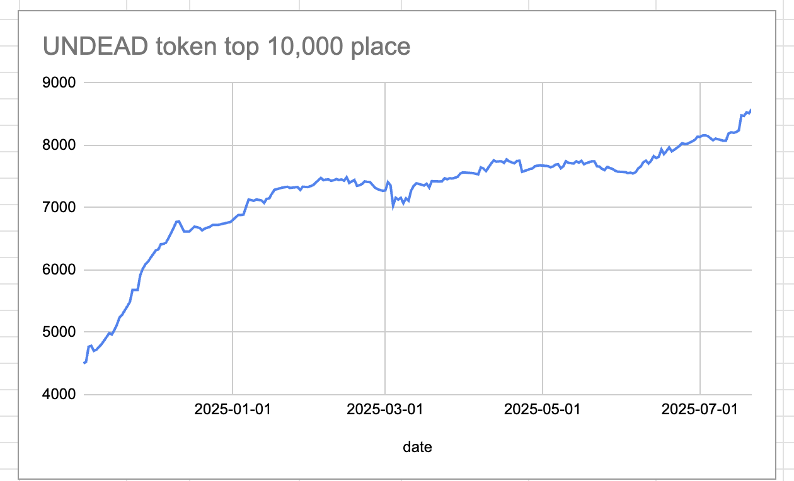

# 2025-07-21 Status of @UndeadBlocks / $UNDEAD 

 
 
 
 

* rank: 8581 
* quote: $0.00224 
* market cap: $33,604 
* 24-hr volume: $133,682 (δ: $3,164 ) 

[UNDEAD data source](https://www.coingecko.com/en/coins/undead-blocks) 

When we get LPs funded on multiple blockchains, what will $UNDEAD look like? 

## $UNDEAD performance analysis, 2025-07-21 

* "δ" indicates change since 2025-07-17 
* "α" is annualized since 2025-07-17 

 
 
 
 

* rank: 8581 (δ: -1.19% ) , α: -108.68% 
* quote: $0.00224 (δ: 1.31% ) , α: 119.69% 
* market cap: $33,604 (δ: 1.26% ) , α: 114.76% 
* 24-hr volume: $133,682 (δ: 41.29% ) , α: 3767.37% 

[2025-07-17 $UNDEAD report (archived)](https://github.com/pivoteur/biz/tree/main/blog/snapshot) 
