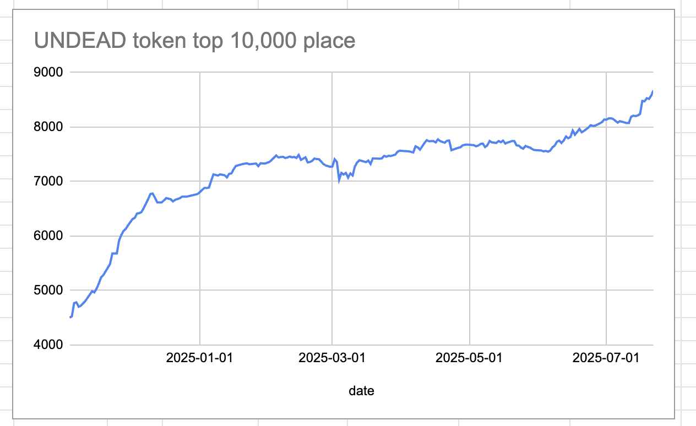
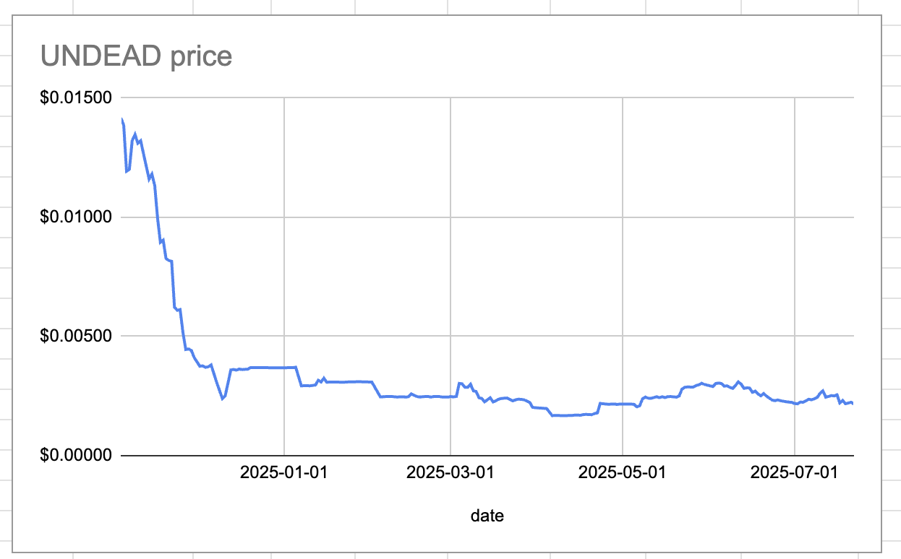

# 2025-07-22 Status of @UndeadBlocks / $UNDEAD 

 
 
 
 

* rank: 8677 
* quote: $0.00217 
* market cap: $32,659 
* 24-hr volume: $136,543 (δ: $2,861 ) 

[UNDEAD data source](https://www.coingecko.com/en/coins/undead-blocks) 

When we get LPs funded on multiple blockchains, what will $UNDEAD look like? 

## $UNDEAD performance analysis, 2025-07-22 

* "δ" indicates change since 2025-07-17 
* "α" is annualized since 2025-07-17 

 
 
 
 

* rank: 8677 (δ: -2.32% ) , α: -169.59% 
* quote: $0.00217 (δ: -1.90% ) , α: -138.67% 
* market cap: $32,659 (δ: -1.59% ) , α: -116.21% 
* 24-hr volume: $136,543 (δ: 44.31% ) , α: 3234.63% 

[2025-07-17 $UNDEAD report (archived)](https://github.com/pivoteur/biz/tree/main/blog/snapshot) 
