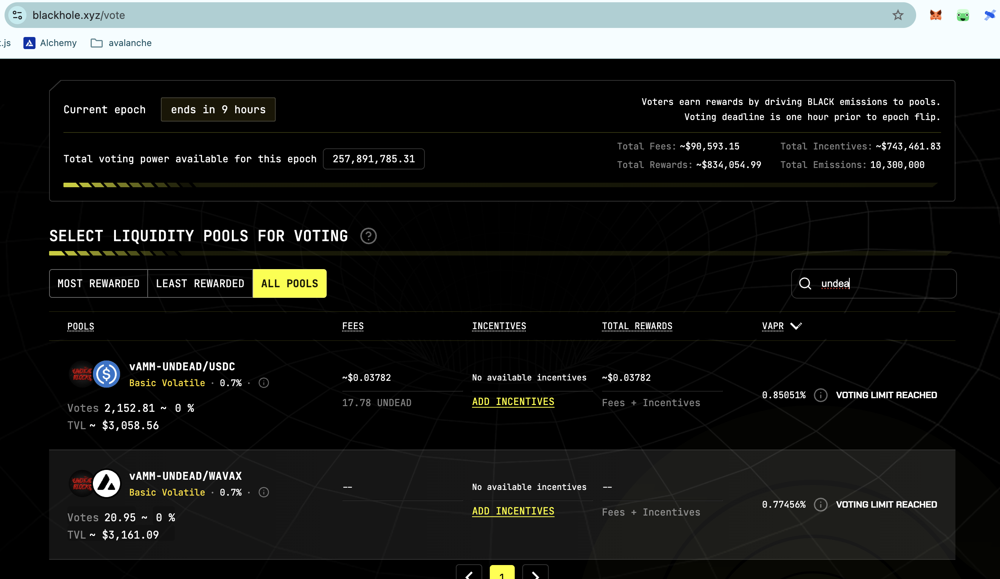

Voting for LPs ends in 9 HOURS on @BlackholeDex!

Go to the [Blackhole voting page](https://blackhole.xyz/vote), search for 'UNDEAD' and VOTE with your locked $BLACK! @UndeadBlocks 

[HOWTO vote for $UNDEAD LPs on @BlackholeDex]( https://x.com/pivocateur/status/1945637734682341791)
# 2025-07-23 Status of @UndeadBlocks / $UNDEAD 

 
 
 
 

* rank: 8682 
* quote: $0.00213 
* market cap: $31,925 
* 24-hr volume: $129,536 (δ: -$7,007 ) 

[UNDEAD data source](https://www.coingecko.com/en/coins/undead-blocks) 

When we get LPs funded on multiple blockchains, what will $UNDEAD look like? 

## $UNDEAD performance analysis, 2025-07-23 

* "δ" indicates change since 2025-07-17 
* "α" is annualized since 2025-07-17 

 
 
 
 

* rank: 8682 (δ: -2.38% ) , α: -144.91% 
* quote: $0.00213 (δ: -3.75% ) , α: -228.37% 
* market cap: $31,925 (δ: -3.80% ) , α: -231.23% 
* 24-hr volume: $129,536 (δ: 36.90% ) , α: 2245.02% 

[2025-07-17 $UNDEAD report (archived)](https://github.com/pivoteur/biz/tree/main/blog/snapshot) 
# DEX UNDEAD/USDC-swap Race 

Same swap; 4 DEX, 2025-07-23 

I swap 134000 $UNDEAD for: 

1. 275.27 $USDC on @PharaohExchange 

 

2. 249.91 $USDC on @BlackholeDex with 29.35% slippage 

 

3. 282.18 $USDC on @KyberNetwork 💥 

 

4. 282.15 $USDC on @LFJ_gg 

 

Winner: @KyberNetwork (3-day streak) 

# PIVOTS 

All assets committed. No close pivots. 

# CONCLUSION 

This concludes pivot-activity for today. 

 
 

[The Pivot protocol](https://pivoteur.github.io/#) 
