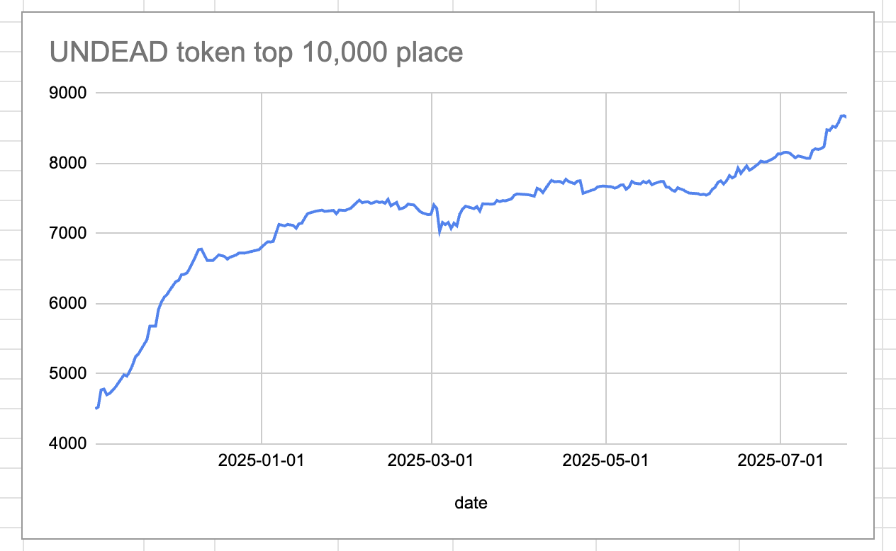
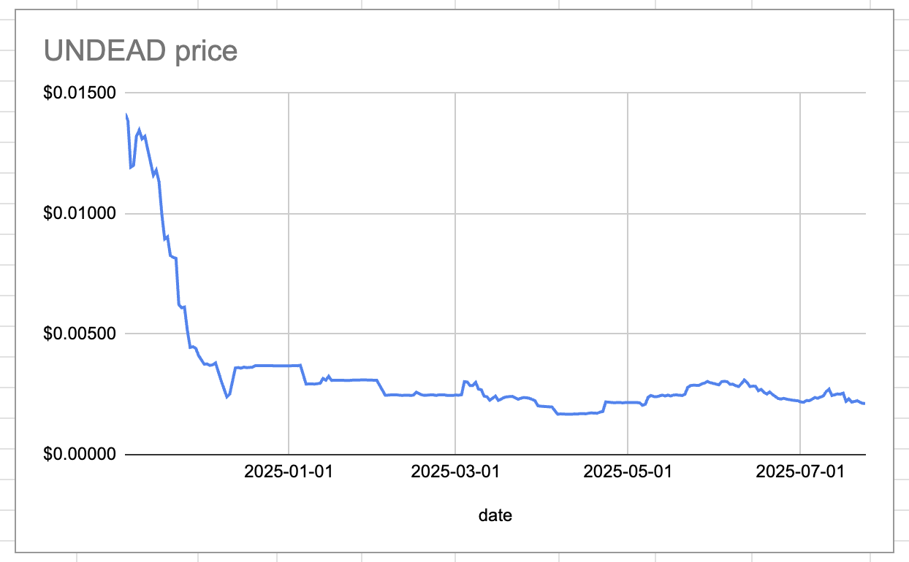
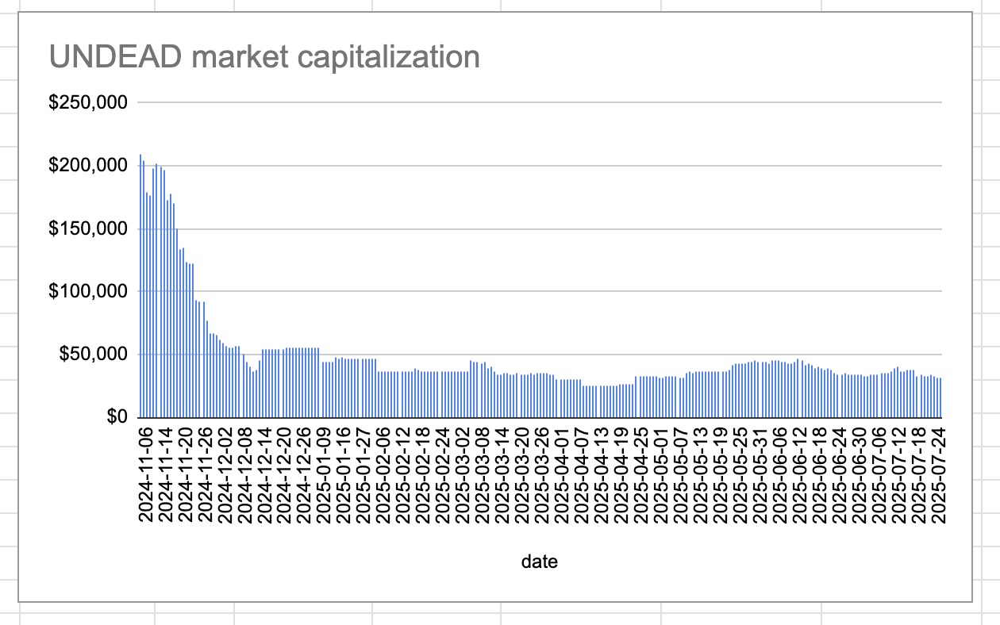
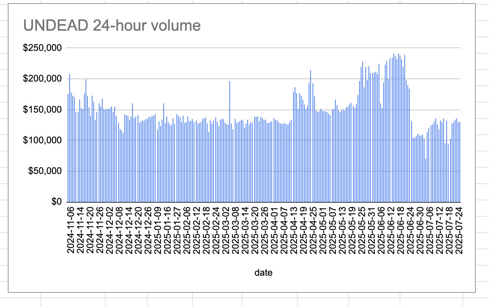
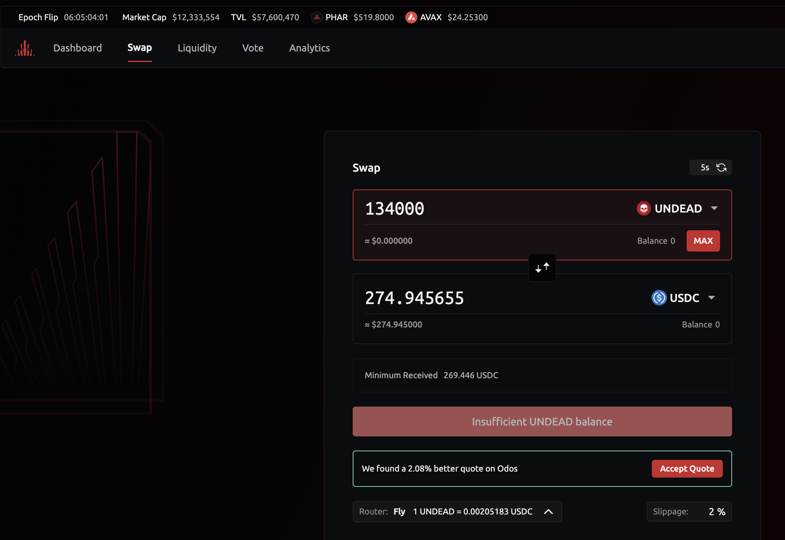
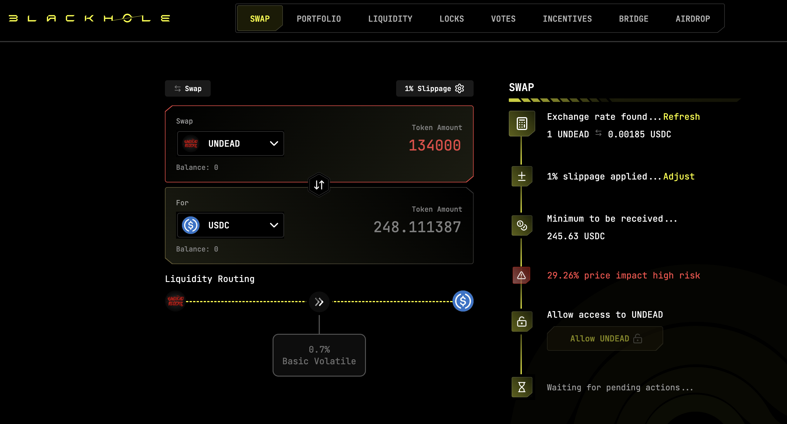
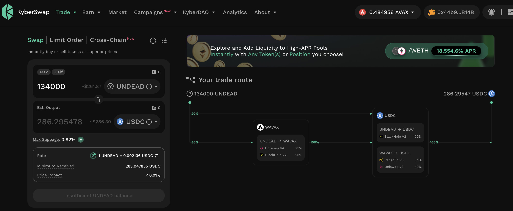
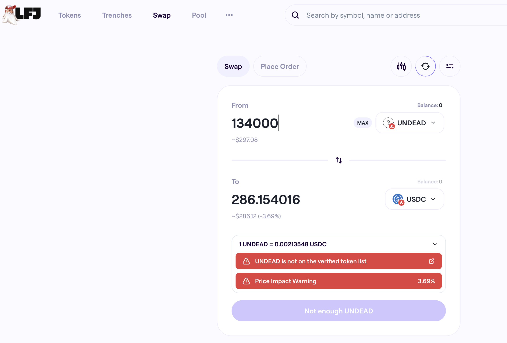

# 2025-07-24 Status of @UndeadBlocks / $UNDEAD 

 
 
 
 

* rank: 8655 
* quote: $0.00213 
* market cap: $32,227 
* 24-hr volume: $129,791 (δ: $255 ) 

[UNDEAD data source](https://www.coingecko.com/en/coins/undead-blocks) 

When we get LPs funded on multiple blockchains, what will $UNDEAD look like? 

## $UNDEAD performance analysis, 2025-07-24 

* "δ" indicates change since 2025-07-17 
* "α" is annualized since 2025-07-17 

 
 
 
 

* rank: 8655 (δ: -2.06% ) , α: -107.61% 
* quote: $0.00213 (δ: -3.66% ) , α: -191.03% 
* market cap: $32,227 (δ: -2.89% ) , α: -150.81% 
* 24-hr volume: $129,791 (δ: 37.17% ) , α: 1938.36% 

[2025-07-17 $UNDEAD report (archived)](https://github.com/pivoteur/biz/tree/main/blog/snapshot) 
# DEX UNDEAD/USDC-swap Race 

Same swap; 4 DEX, 2025-07-24 

I swap 134000 $UNDEAD for: 

1. 274.95 $USDC on @PharaohExchange 

 

2. 248.11 $USDC on @BlackholeDex with 29.26% slippage 

 

3. 286.30 $USDC on @KyberNetwork 💥 

 

4. 286.15 $USDC on @LFJ_gg 

 

Winner: @KyberNetwork (4-day streak) 
