# 2025-07-25 Status of @UndeadBlocks / $UNDEAD 

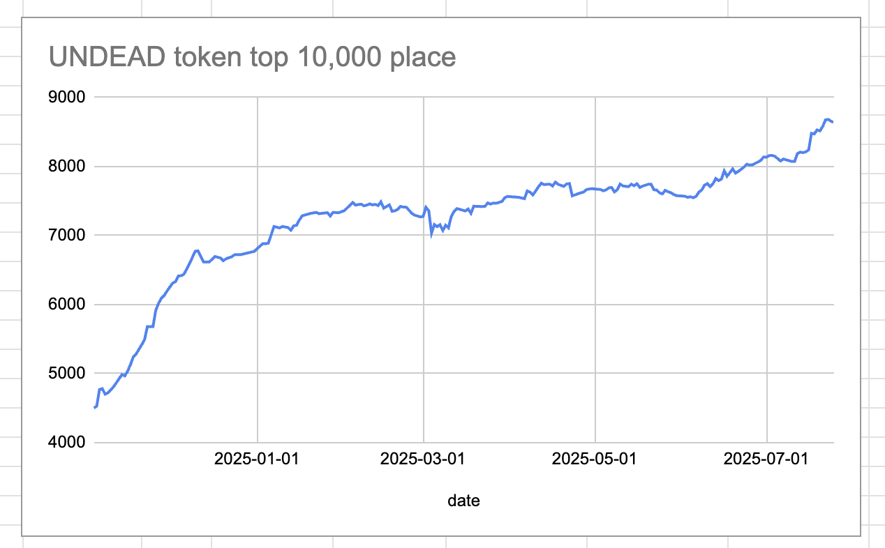 
 
 
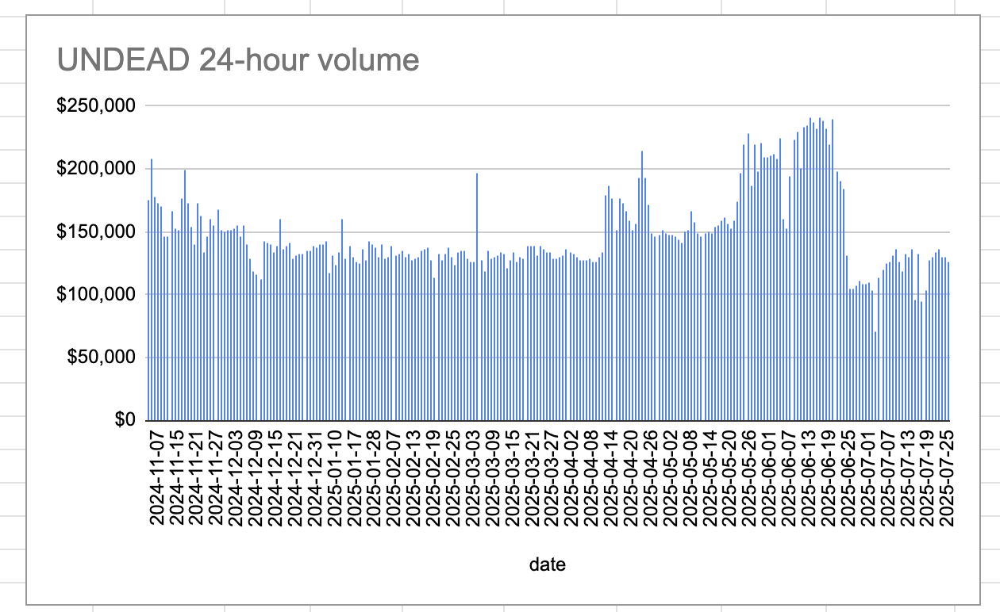 

* rank: 8640 
* quote: $0.00218 
* market cap: $32,736 
* 24-hr volume: $126,816 (δ: -$2,975 ) 

[UNDEAD data source](https://www.coingecko.com/en/coins/undead-blocks) 

When we get LPs funded on multiple blockchains, what will $UNDEAD look like? 

## $UNDEAD performance analysis, 2025-07-25 

* "δ" indicates change since 2025-07-17 
* "α" is annualized since 2025-07-17 

 
 
 
 

* rank: 8640 (δ: -1.89% ) , α: -86.08% 
* quote: $0.00218 (δ: -1.45% ) , α: -66.03% 
* market cap: $32,736 (δ: -1.36% ) , α: -62.02% 
* 24-hr volume: $126,816 (δ: 34.03% ) , α: 1552.61% 

[2025-07-17 $UNDEAD report (archived)](https://github.com/pivoteur/biz/tree/main/blog/snapshot) 
# DEX UNDEAD/USDC-swap Race 

Same swap; 4 DEX, 2025-07-25 

I swap 134000 $UNDEAD for: 

1. 277.09 $USDC on @PharaohExchange 

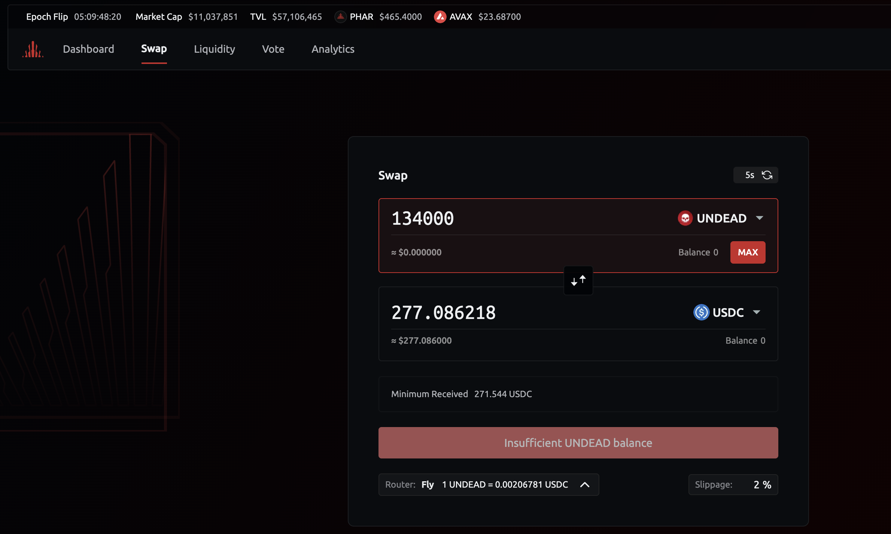 

2. 252.74 $USDC on @BlackholeDex with 29.49% slippage 

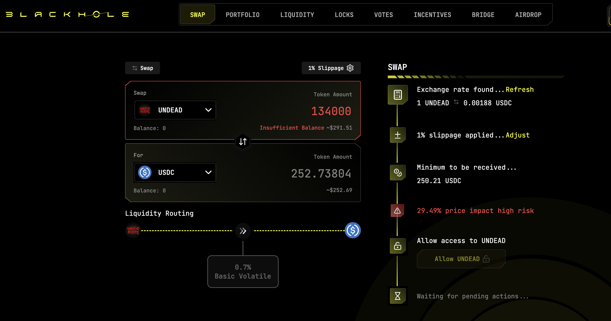 

3. 284.41 $USDC on @KyberNetwork 💥 

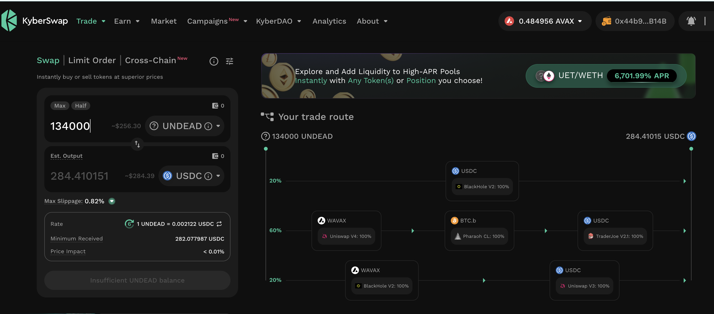 

4. 284.39 $USDC on @LFJ_gg 

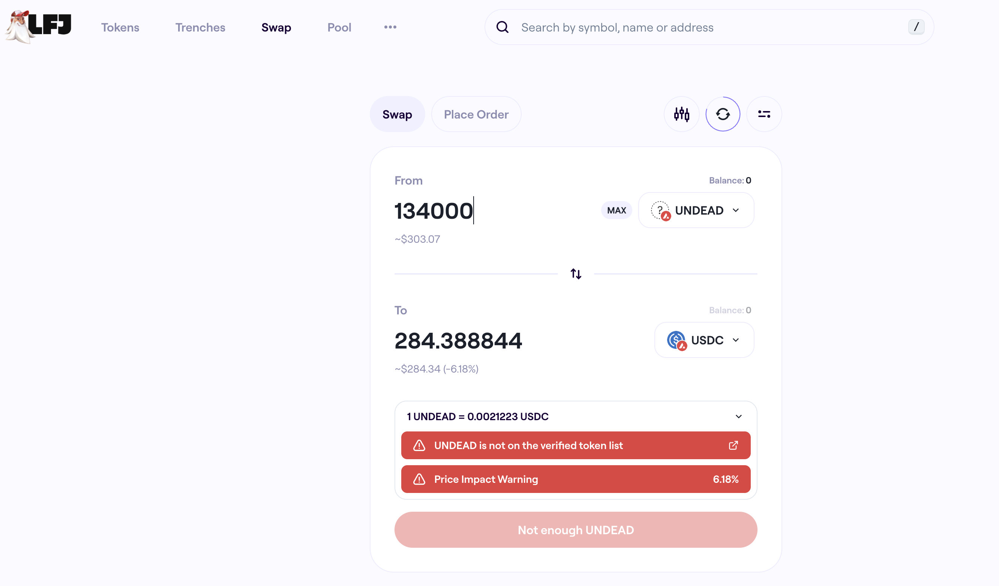 

Winner: @KyberNetwork (5-day streak) 

# PIVOTS

## BTC+UNDEAD

I seed this pivot pool on @avax with 1250000 $UNDEAD from the Treasury.

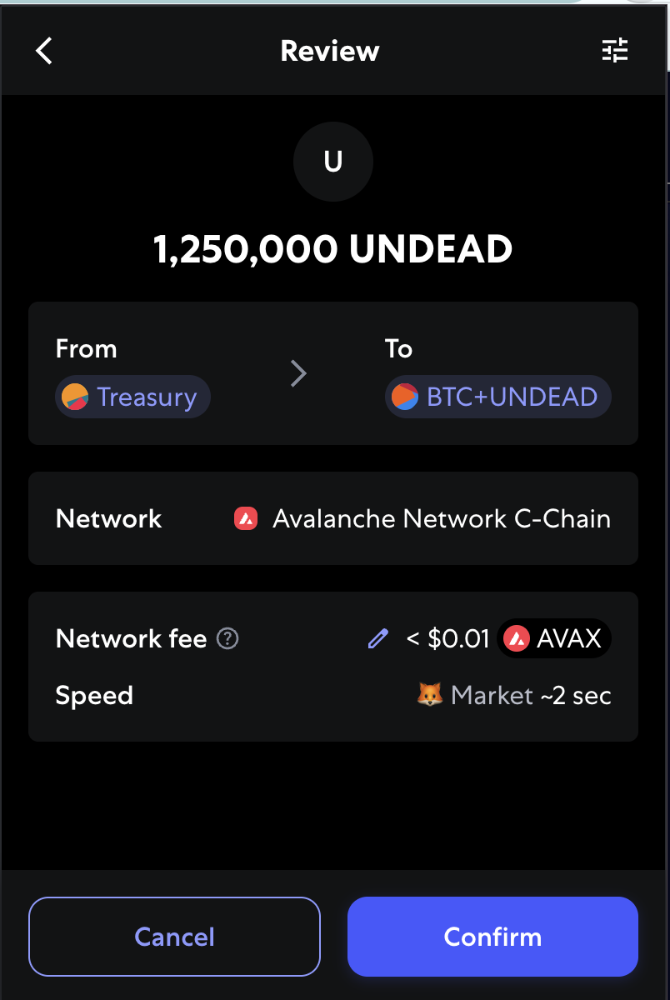

Where did I get this $UNDEAD-liquidity? I transferred it from the liquidity originally tagged as operating capital.

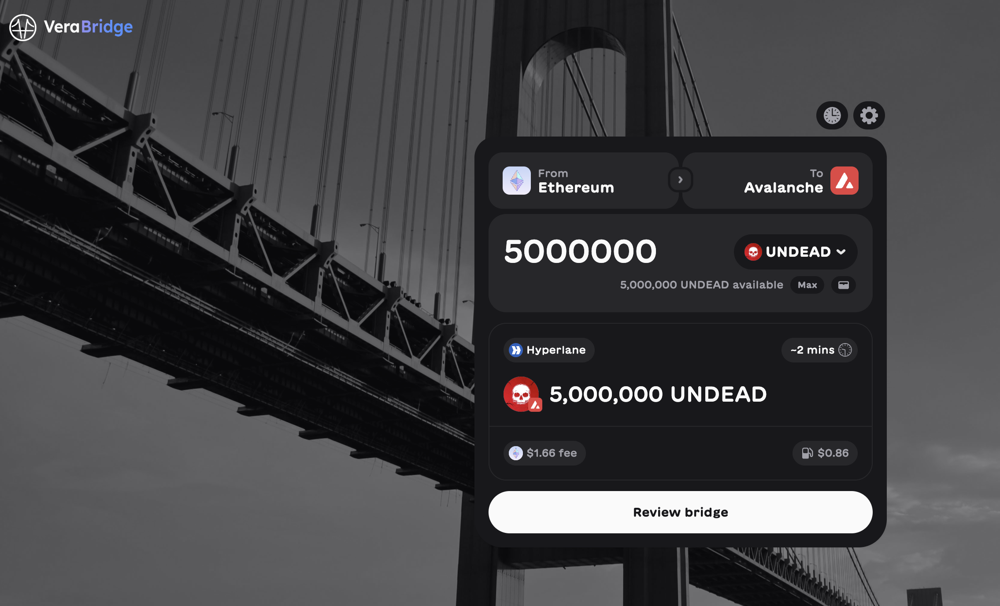

I am dividing that operating capital equally into the 4 pivot pools.
## ETH+UNDEAD 

 

I seed this pivot pool on @avax with 1250000 $UNDEAD from the Treasury. 

### Open ETH+UNDEAD pivots 

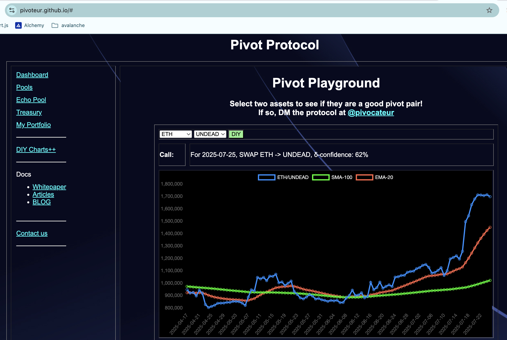 
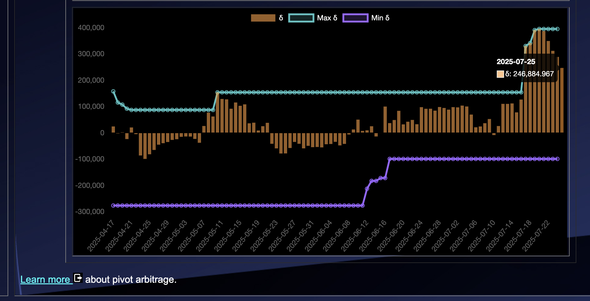 

The positive δ calls to open an ETH-on-UNDEAD pivot, which I do. 

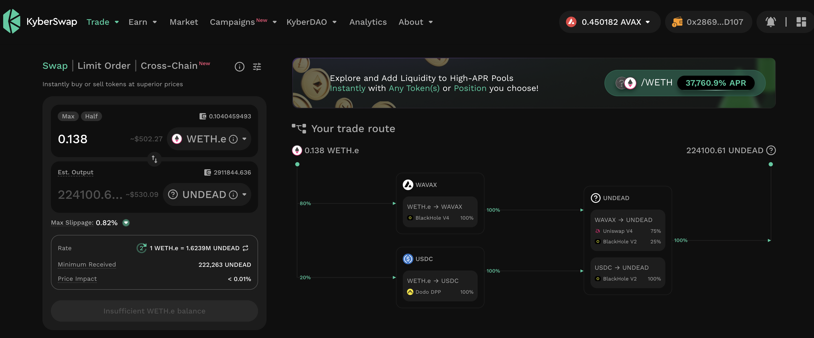 

I also open an UNDEAD-on-ETH hedge. 

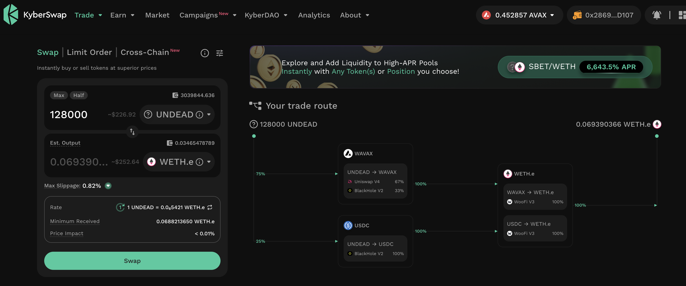 

The ETH+UNDEAD pivot pool composition and γ-apportionment are as charted. 

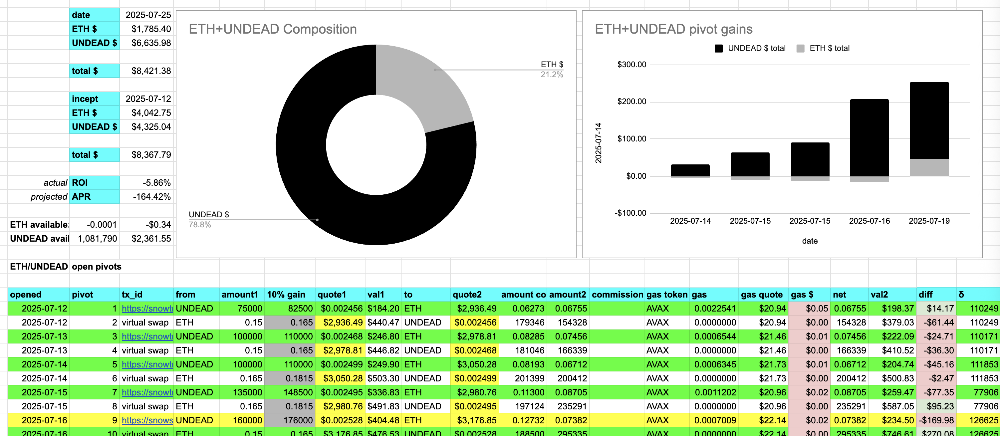 
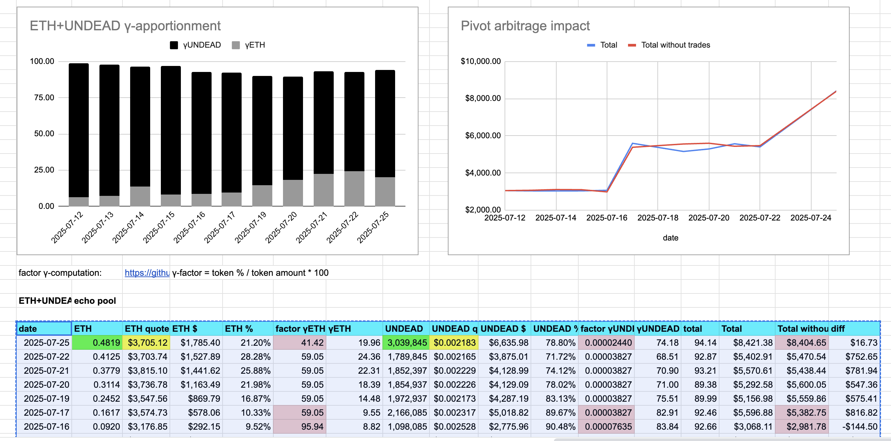 
