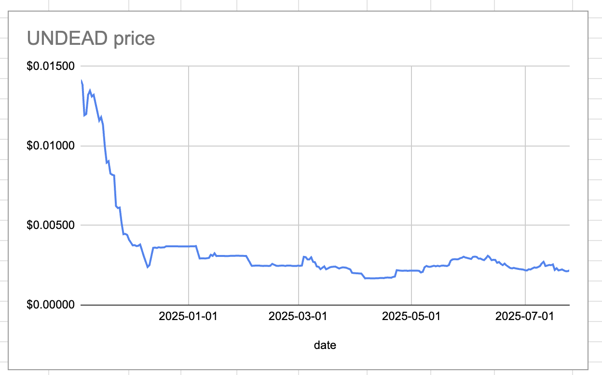

# 2025-07-25 Status of @UndeadBlocks / $UNDEAD 

 
 
 
 

* rank: 8640 
* quote: $0.00218 
* market cap: $32,736 
* 24-hr volume: $126,816 (δ: -$2,975 ) 

[UNDEAD data source](https://www.coingecko.com/en/coins/undead-blocks) 

When we get LPs funded on multiple blockchains, what will $UNDEAD look like? 

## $UNDEAD performance analysis, 2025-07-25 

* "δ" indicates change since 2025-07-17 
* "α" is annualized since 2025-07-17 

 
 
 
 

* rank: 8640 (δ: -1.89% ) , α: -86.08% 
* quote: $0.00218 (δ: -1.45% ) , α: -66.03% 
* market cap: $32,736 (δ: -1.36% ) , α: -62.02% 
* 24-hr volume: $126,816 (δ: 34.03% ) , α: 1552.61% 

[2025-07-17 $UNDEAD report (archived)](https://github.com/pivoteur/biz/tree/main/blog/snapshot) 
