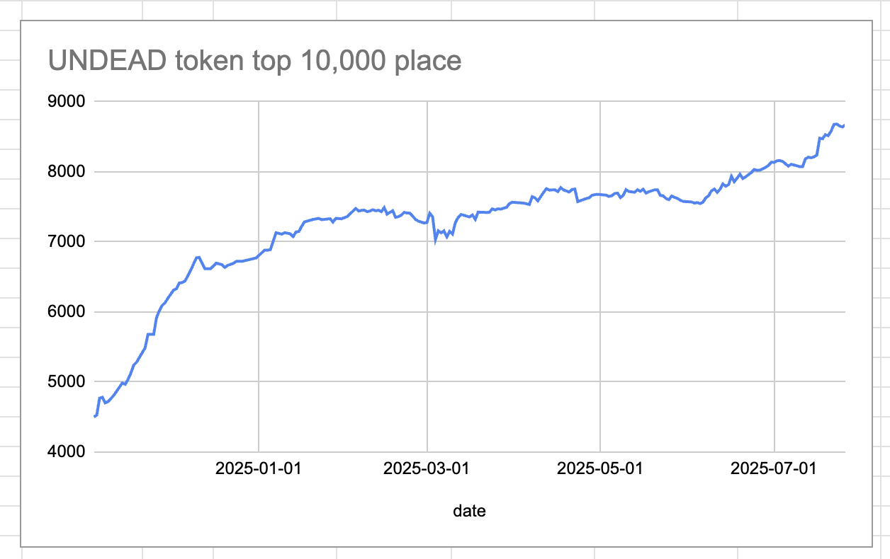

# 2025-07-26 Status of @UndeadBlocks / $UNDEAD 

 
 
 
 

* rank: 8670 
* quote: $0.00218 
* market cap: $32,610 
* 24-hr volume: $124,570 (δ: -$2,246 ) 

[UNDEAD data source](https://www.coingecko.com/en/coins/undead-blocks) 

When we get LPs funded on multiple blockchains, what will $UNDEAD look like? 

## $UNDEAD performance analysis, 2025-07-26 

* "δ" indicates change since 2025-07-17 
* "α" is annualized since 2025-07-17 

 
 
 
 

* rank: 8670 (δ: -2.24% ) , α: -90.87% 
* quote: $0.00218 (δ: -1.49% ) , α: -60.53% 
* market cap: $32,610 (δ: -1.74% ) , α: -70.45% 
* 24-hr volume: $124,570 (δ: 31.66% ) , α: 1283.83% 

[2025-07-17 $UNDEAD report (archived)](https://github.com/pivoteur/biz/tree/main/blog/snapshot) 
# Vote for $UNDEAD LPs on Blackhole 

2025-07-26 

Good morning, pivoteurs! 

A new day; a new Epoch on @BlackholeDex. 

Reminder to go [vote](https://blackhole.xyz/vote) for the @UndeadBlocks $UNDEAD liquidity pools on that DEX. Reminder to go to https://blackhole.xyz/vote and vote for the @UndeadBlocks $UNDEAD liquidity pools on that DEX. 

 
 LPs](imgs/02b-voted.png) 

[HOWTO vote instructions](https://x.com/pivocateur/status/1945637734682341791) HOWTO vote instructions: https://x.com/pivocateur/status/1945637734682341791 

#IVotedForUNDEAD 
