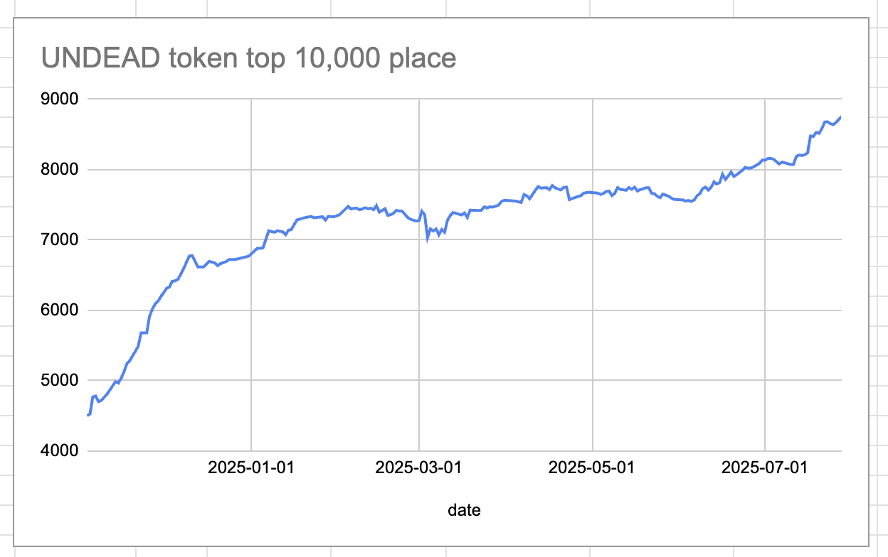
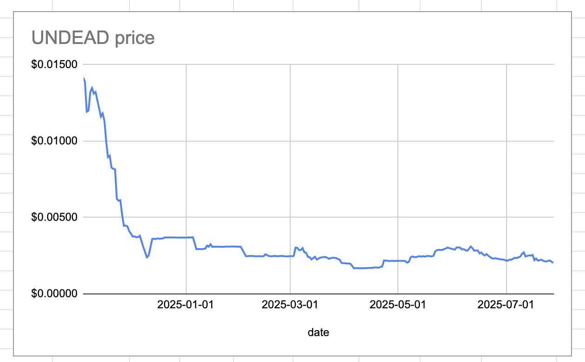
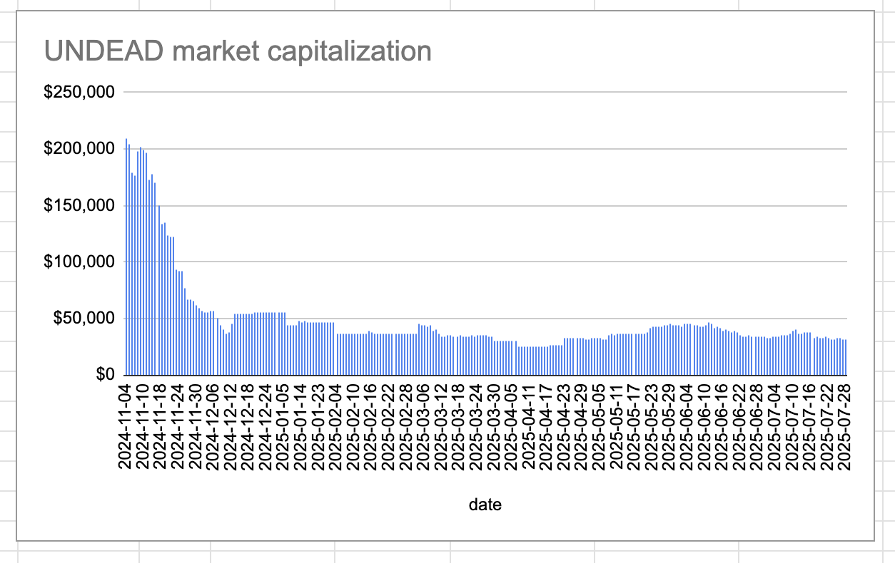
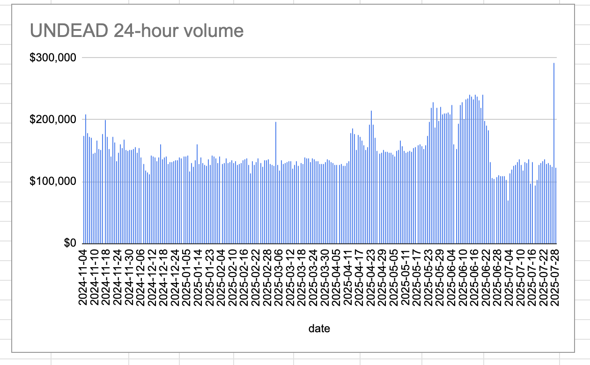
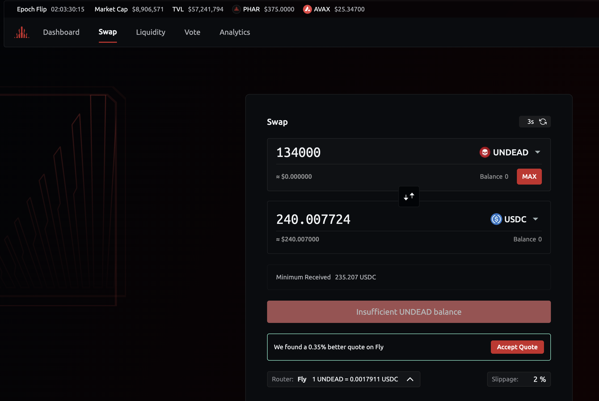
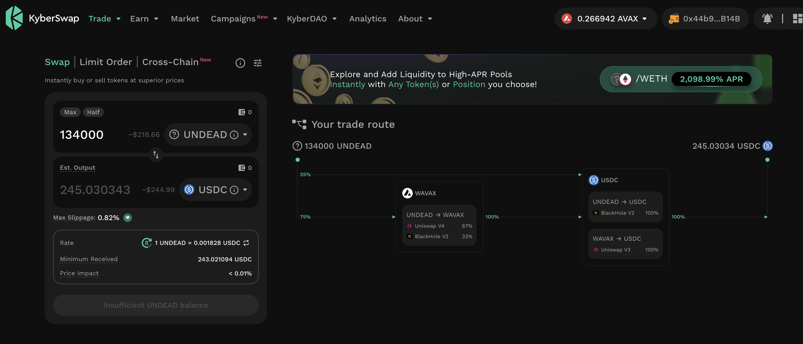
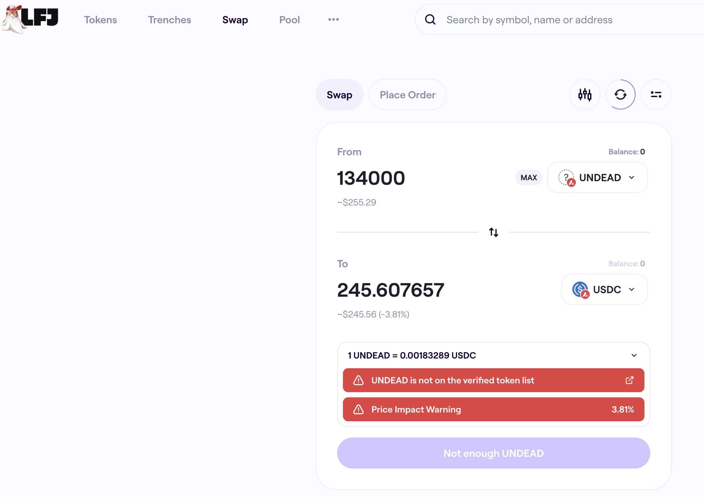

# 2025-07-28 Status of @UndeadBlocks / $UNDEAD 

 
 
 
 

* rank: 8754 
* quote: $0.00205 
* market cap: $31,007 
* 24-hr volume: $123,437 (δ: -$168,972 ) 

[UNDEAD data source](https://www.coingecko.com/en/coins/undead-blocks) 

When we get LPs funded on multiple blockchains, what will $UNDEAD look like? 

## $UNDEAD performance analysis, 2025-07-28 

* "δ" indicates change since 2025-07-17 
* "α" is annualized since 2025-07-17 

 
 
 
 

* rank: 8754 (δ: -3.23% ) , α: -107.21% 
* quote: $0.00205 (δ: -7.15% ) , α: -237.12% 
* market cap: $31,007 (δ: -6.57% ) , α: -217.92% 
* 24-hr volume: $123,437 (δ: 30.46% ) , α: 1010.67% 

[2025-07-17 $UNDEAD report (archived)](https://github.com/pivoteur/biz/tree/main/blog/snapshot) 
# DEX UNDEAD/USDC-swap Race 

Same swap; 4 DEX, 2025-07-28 

I swap 134000 $UNDEAD for: 

1. 240.01 $USDC on @PharaohExchange 

 

2. 219.88 $USDC on @BlackholeDex with 29.43% slippage 

 

3. 245.03 $USDC on @KyberNetwork 

 

4. 245.61 $USDC on @LFJ_gg 💥 

 

Winner: @LFJ_gg 💥 New title-winner! 
