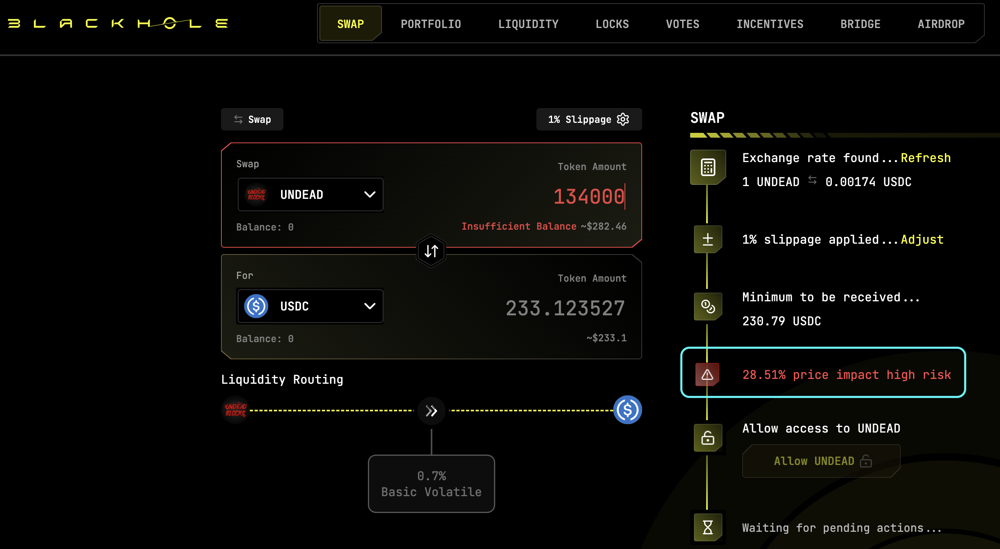

# 2025-07-31 Status of @UndeadBlocks / $UNDEAD 

 
 
 
 

* rank: 8682 
* quote: $0.00218 
* market cap: $32,629 
* 24-hr volume: $91,453 (δ: -$10,661 ) 

[UNDEAD data source](https://www.coingecko.com/en/coins/undead-blocks) 

When we get LPs funded on multiple blockchains, what will $UNDEAD look like? 

## $UNDEAD performance analysis, 2025-07-31 

* "δ" indicates change since 2025-07-20 
* "α" is annualized since 2025-07-20 

 
 
 
 

* rank: 8682 (δ: -1.95% ) , α: -64.68% 
* quote: $0.00218 (δ: -1.49% ) , α: -49.59% 
* market cap: $32,629 (δ: -1.32% ) , α: -43.88% 
* 24-hr volume: $91,453 (δ: -29.93% ) , α: -993.17% 

[2025-07-20 $UNDEAD report (archived)](https://github.com/pivoteur/biz/tree/main/blog/snapshot) 

# State of the Pivot Protocol.

After receiving custody of 50M $UNDEAD from @wagyugames, a price-shift in $UNDEAD today recovered $10k in NAV for the protocol.

* 50M $UNDEAD = $109,750.00
* Pivot Protocol NAV = $112,060.22

This shows the protocol has generated $2,310.22 in value.

## Distributions

The above does not include the $919.11 distributed to stakers to date, so this report will incorporate distributions, going forward. 
# DEX UNDEAD/USDC-swap Race 

Same swap; 4 DEX, 2025-07-31 

I swap 134000 $UNDEAD for: 

1. 265.02 $USDC on @PharaohExchange 

 

2. 233.12 $USDC on @BlackholeDex with 28.51% slippage 

 

3. 269.72 $USDC on @KyberNetwork 💥 

 

4. 269.65 $USDC on @LFJ_gg 

 

Winner: @KyberNetwork 💥 Renewed title-winner! 
