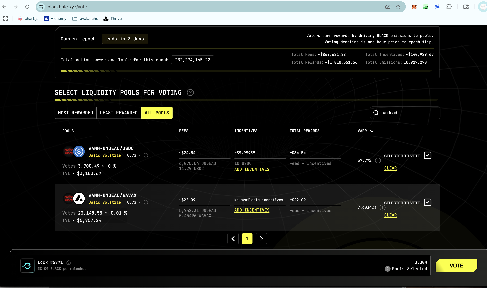
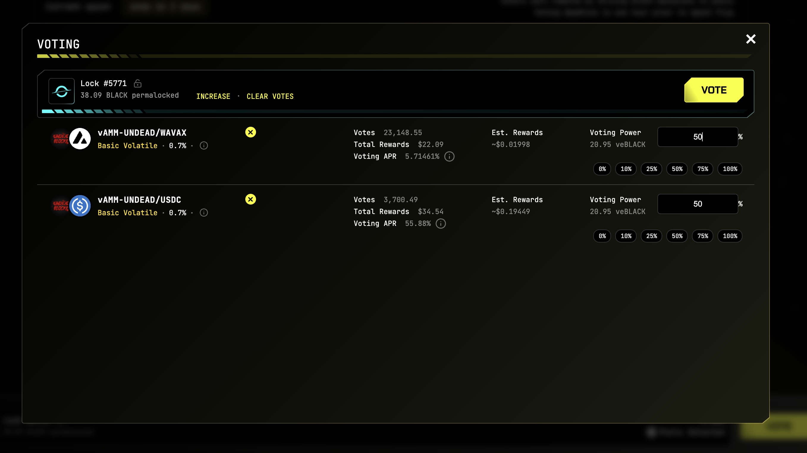
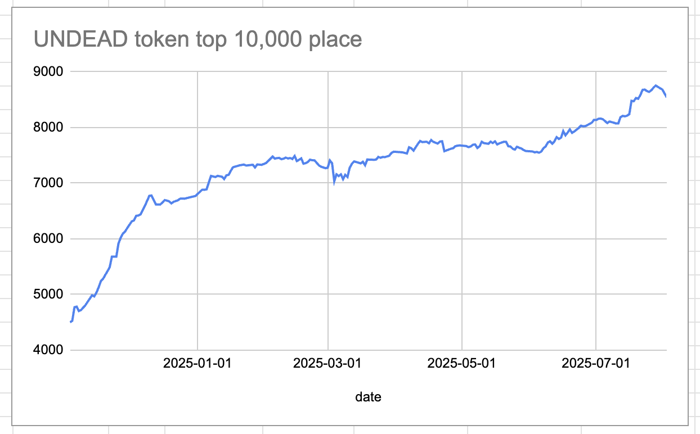
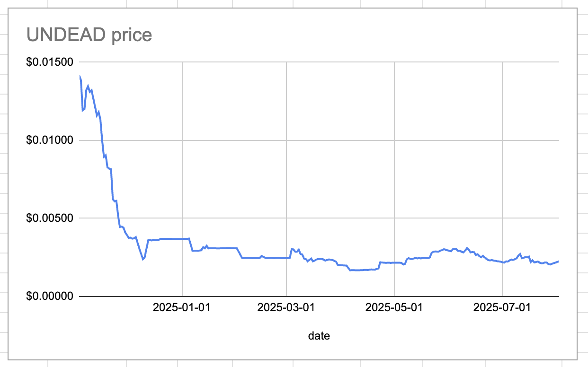
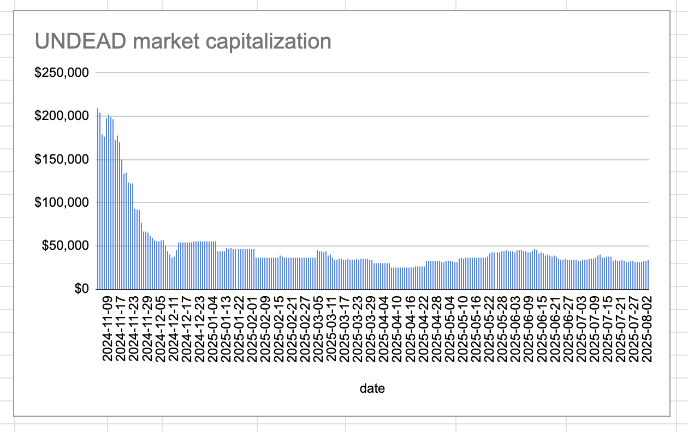
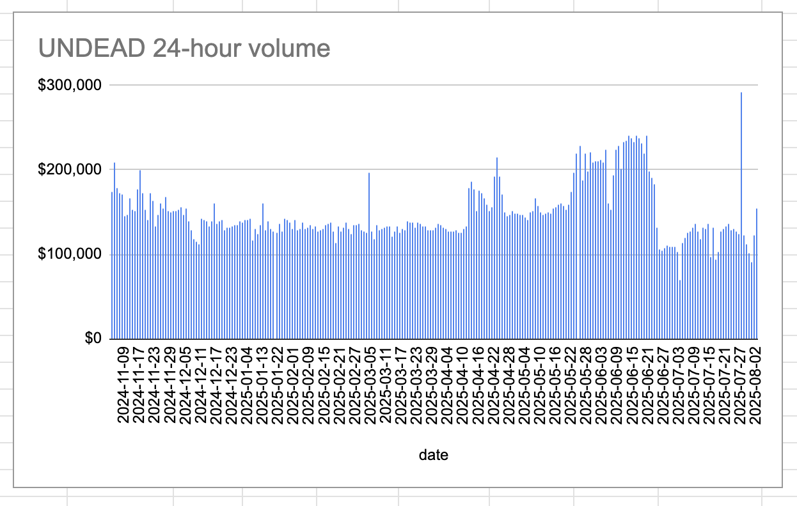

# HOUSEKEEPING, 2025-08-02

## Seeding new BTC pivot pools

I move 1M $UNDEAD and 0.5 $AVAX to seed three new pivot pools:

* BTC+ETH
* BTC+AVAX
* BTC+USDC

## Providing liquidity to LP UNDEAD/USDC

Next, I bridge $UNDEAD from @Ledger. I also harvest yields from the @BlackholeDex and @Uniswap UNDEAD LPs, which I then retarget to fund the @Uniswap LP UNDEAD/USDC. 

Slippage is bad for the UNDEAD/USDC-swap, so funding that LP takes priority. 

# Vote for $UNDEAD LPs on Blackhole 

2025-08-02 

Good day, pivoteurs! 

A new day; a new Epoch on @BlackholeDex. 

Reminder to go [vote](https://blackhole.xyz/vote) for the @UndeadBlocks $UNDEAD liquidity pools on that DEX.

 
 

[HOWTO vote instructions](https://x.com/pivocateur/status/1945637734682341791)

#IVotedForUNDEAD 
# 2025-08-02 Status of @UndeadBlocks / $UNDEAD 

 
 
 
 

* rank: 8542 
* quote: $0.00225 
* market cap: $33,846 
* 24-hr volume: $154,867 (δ: $31,707 ) 

[UNDEAD data source](https://www.coingecko.com/en/coins/undead-blocks) 

When we get LPs funded on multiple blockchains, what will $UNDEAD look like? 

## $UNDEAD performance analysis, 2025-08-02 

* "δ" indicates change since 2025-07-17 
* "α" is annualized since 2025-07-17 

 
 
 
 

* rank: 8542 (δ: -0.73% ) , α: -16.68% 
* quote: $0.00225 (δ: 1.90% ) , α: 43.33% 
* market cap: $33,846 (δ: 1.99% ) , α: 45.32% 
* 24-hr volume: $154,867 (δ: 63.68% ) , α: 1452.62% 

[2025-07-17 $UNDEAD report (archived)](https://github.com/pivoteur/biz/tree/main/blog/snapshot) 
