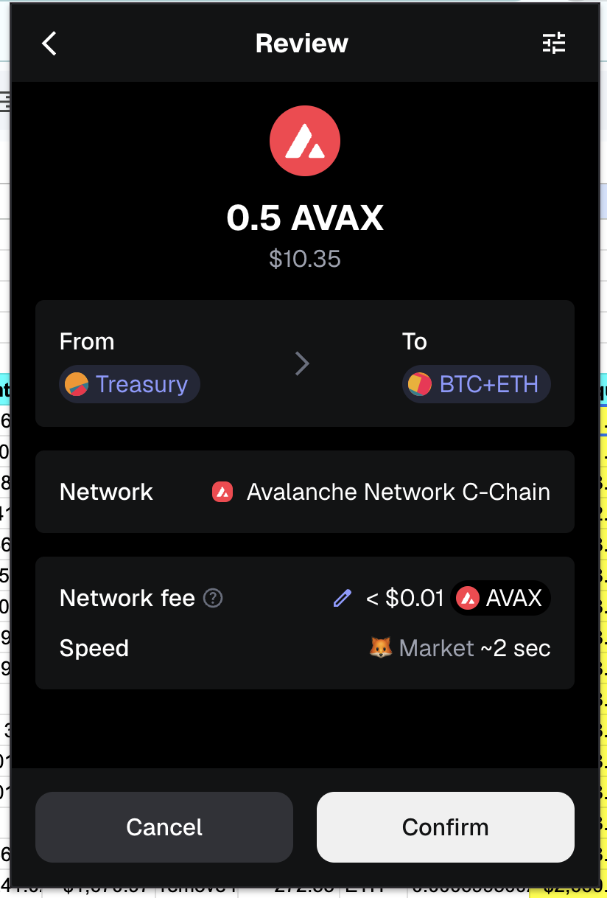
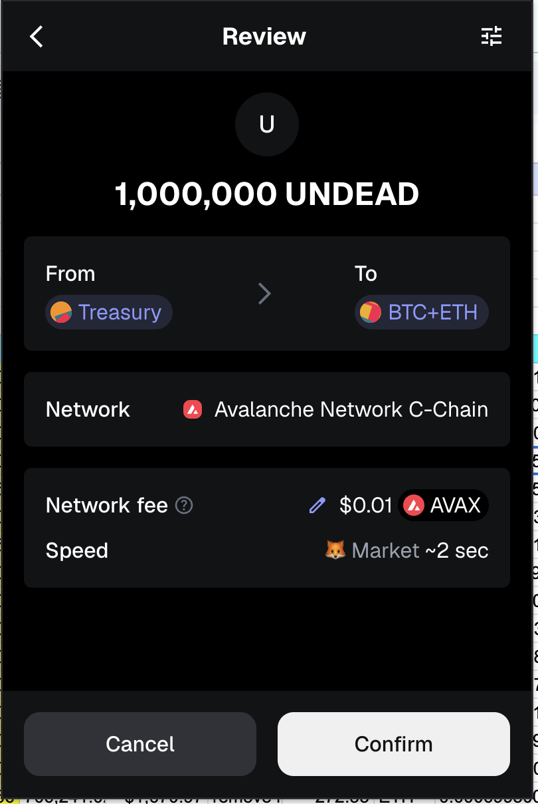
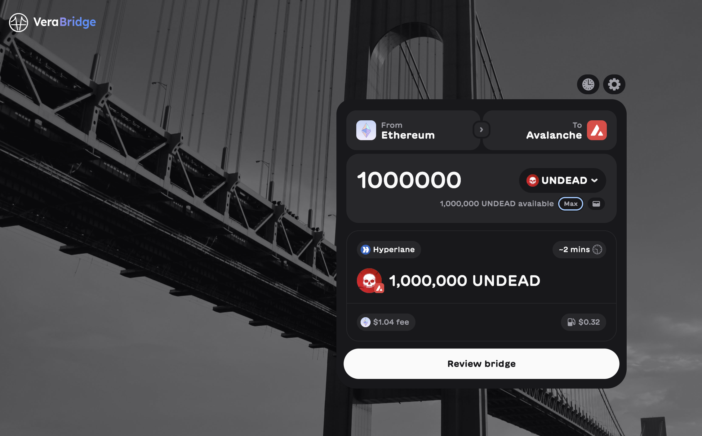
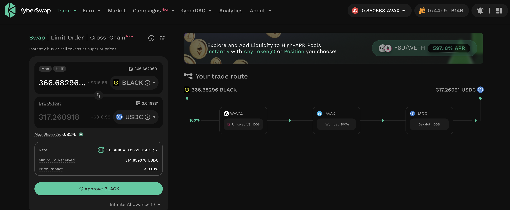
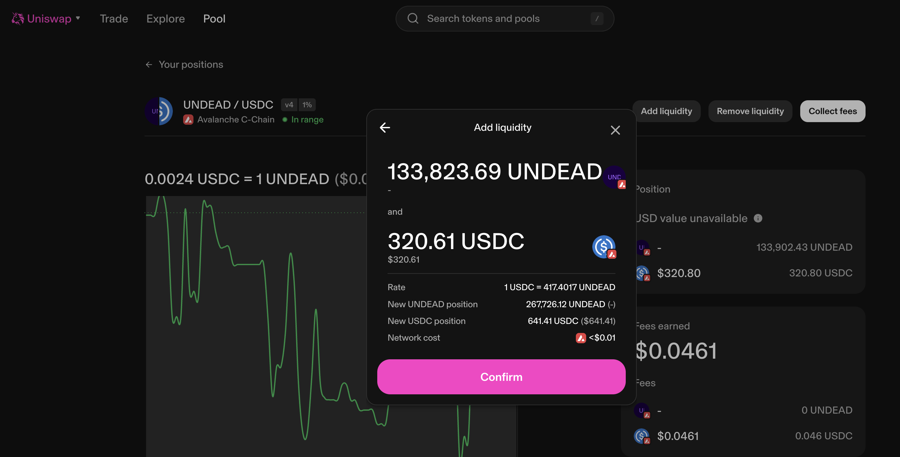
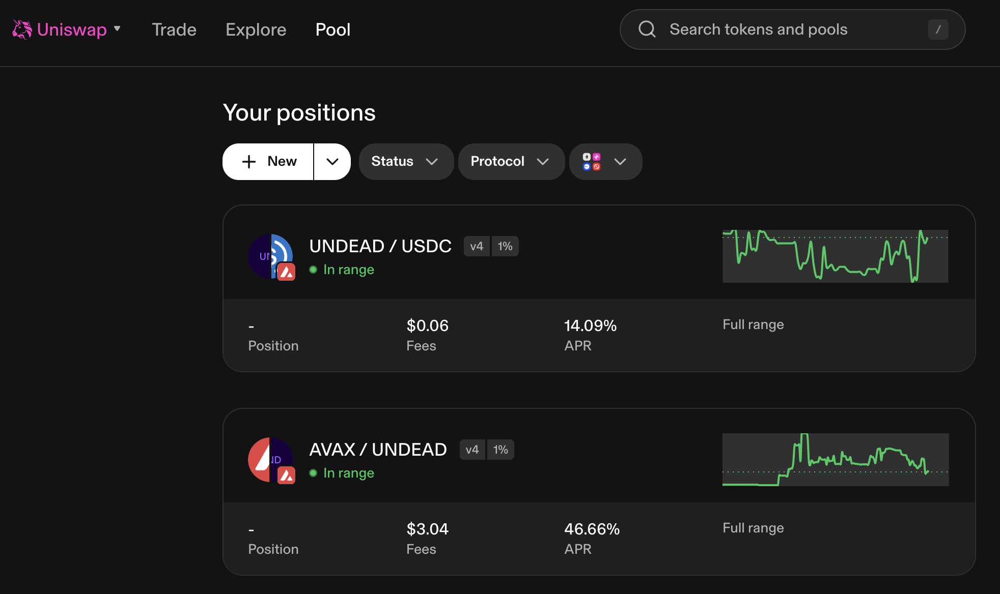

# HOUSEKEEPING, 2025-08-02

## Seeding new BTC pivot pools

I move 1M $UNDEAD and 0.5 $AVAX to seed three new pivot pools:

* BTC+ETH
* BTC+AVAX
* BTC+USDC

## Providing liquidity to LP UNDEAD/USDC

Next, I bridge $UNDEAD from @Ledger. I also harvest yields from the @BlackholeDex and @Uniswap UNDEAD LPs, which I then retarget to fund the @Uniswap LP UNDEAD/USDC. 

Slippage is bad for the UNDEAD/USDC-swap, so funding that LP takes priority. 

