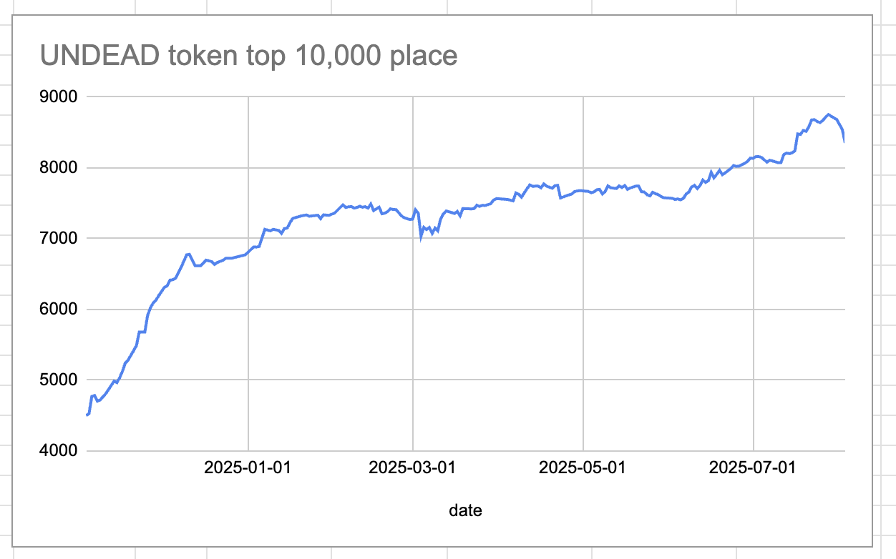
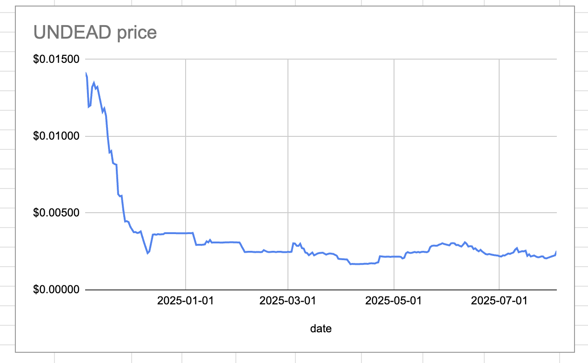
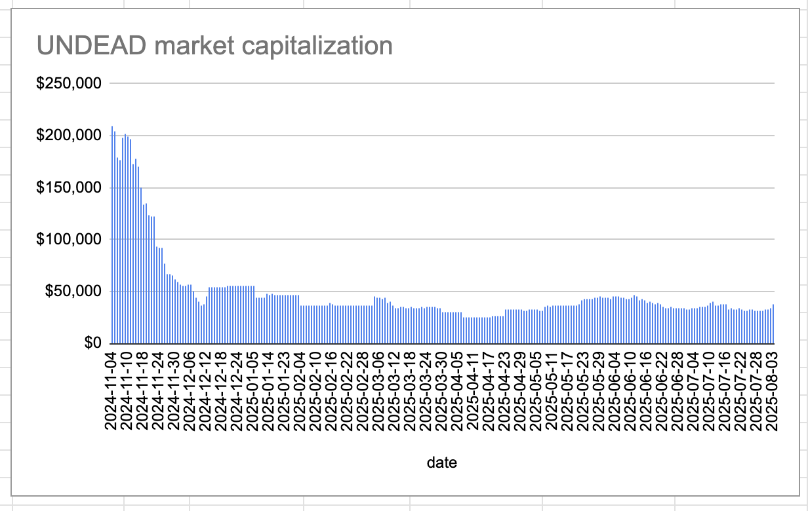
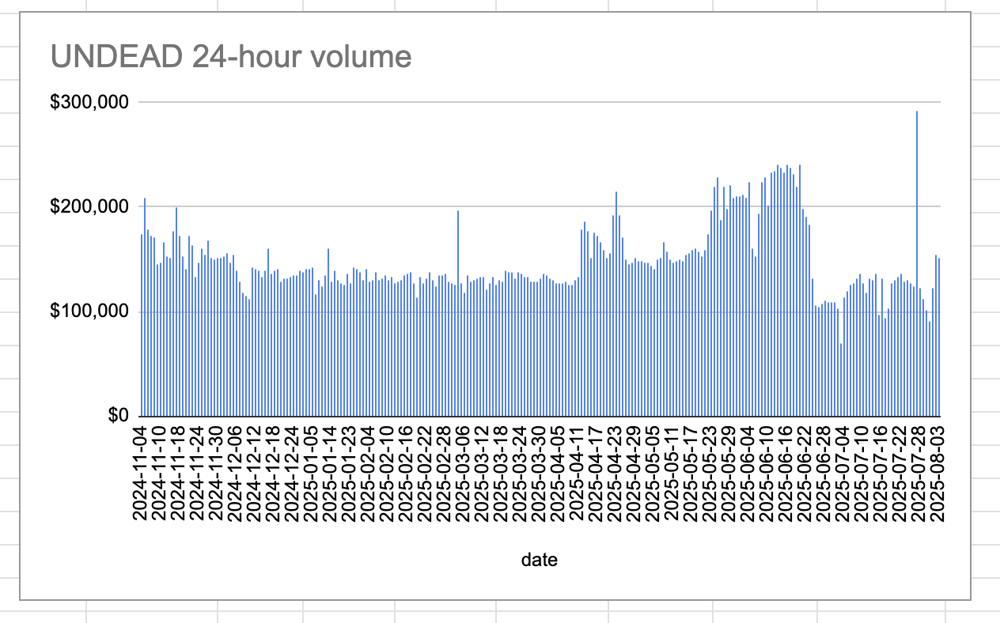
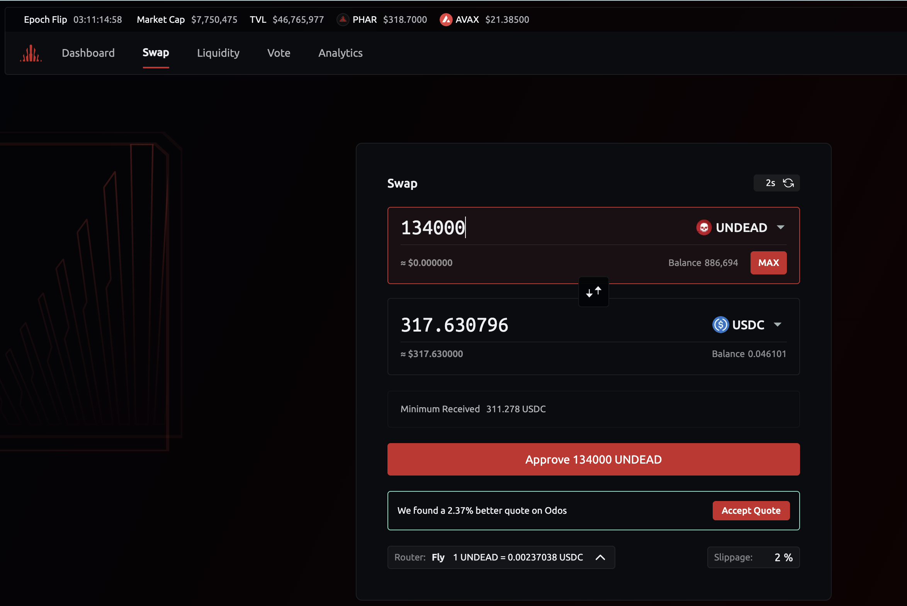
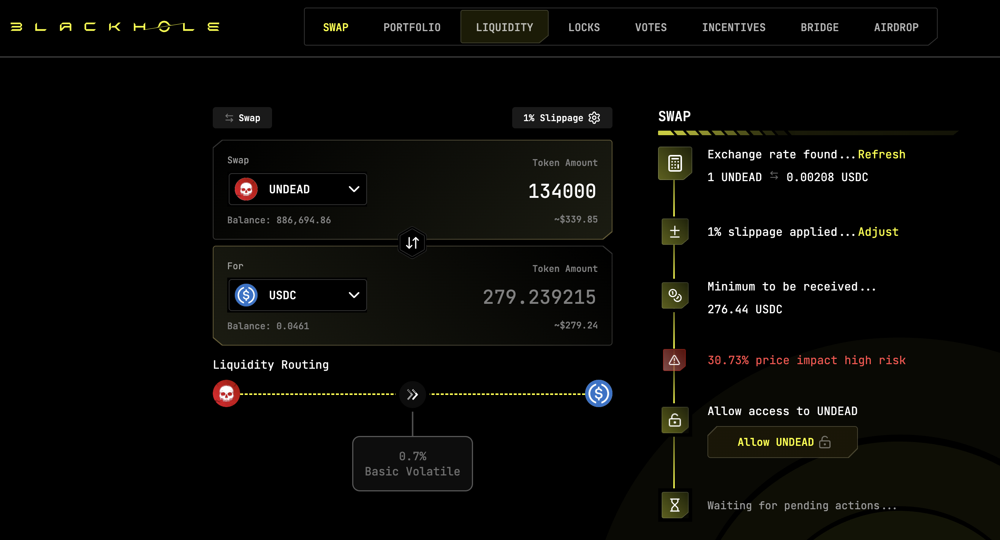
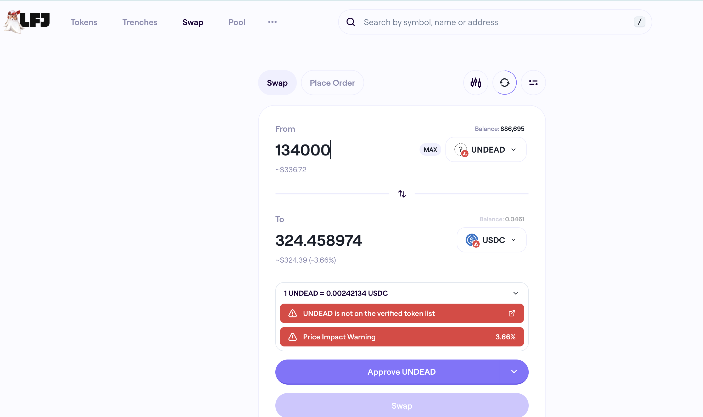

# 2025-08-03 Status of @UndeadBlocks / $UNDEAD 

 
 
 
 

* rank: 8352 
* quote: $0.00254 
* market cap: $38,073 
* 24-hr volume: $151,157 (δ: -$3,710 ) 

[UNDEAD data source](https://www.coingecko.com/en/coins/undead-blocks) 

When we get LPs funded on multiple blockchains, what will $UNDEAD look like? 

10%+ price-jump in one day. I'll take it. 😎

## $UNDEAD performance analysis, 2025-08-03 

* "δ" indicates change since 2025-07-17 
* "α" is annualized since 2025-07-17 

 
 
 
 

* rank: 8352 (δ: 1.51% ) , α: 32.41% 
* quote: $0.00254 (δ: 14.79% ) , α: 317.54% 
* market cap: $38,073 (δ: 14.72% ) , α: 316.09% 
* 24-hr volume: $151,157 (δ: 59.76% ) , α: 1282.98% 

[2025-07-17 $UNDEAD report (archived)](https://github.com/pivoteur/biz/tree/main/blog/snapshot) 
# DEX UNDEAD/USDC-swap Race 

Same swap; 4 DEX, 2025-08-03 

I swap 134000 $UNDEAD for: 

1. 317.63 $USDC on @PharaohExchange 

 

2. 279.24 $USDC on @BlackholeDex with 30.73% slippage 

 

3. 324.35 $USDC on @KyberNetwork 

 

4. 324.46 $USDC on @LFJ_gg 💥 

 

Winner: @LFJ_gg 💥 Renewed title-winner! 
