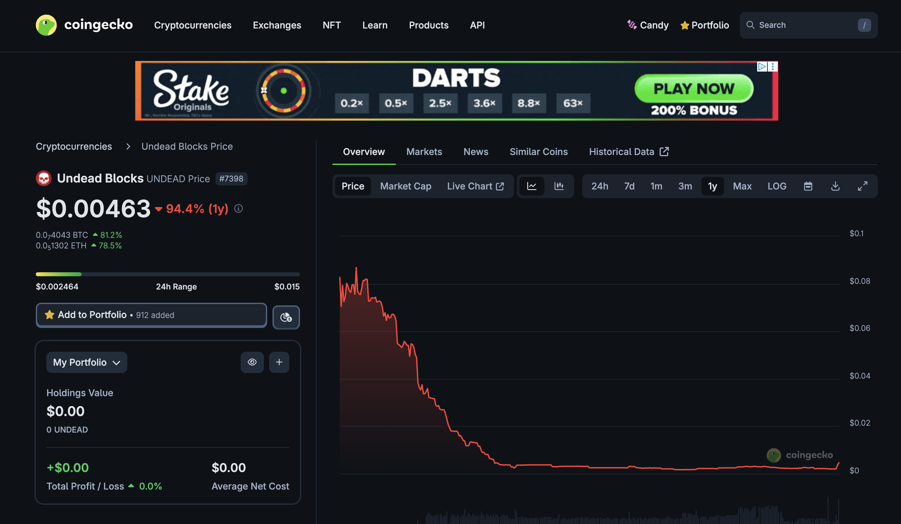
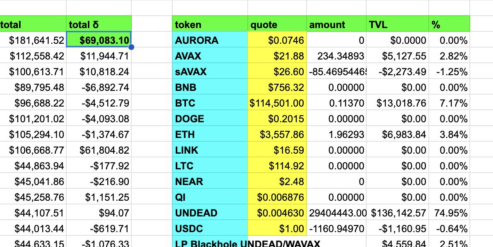
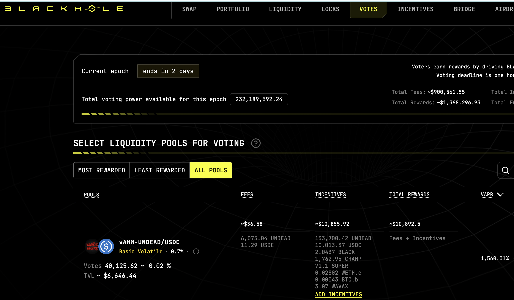
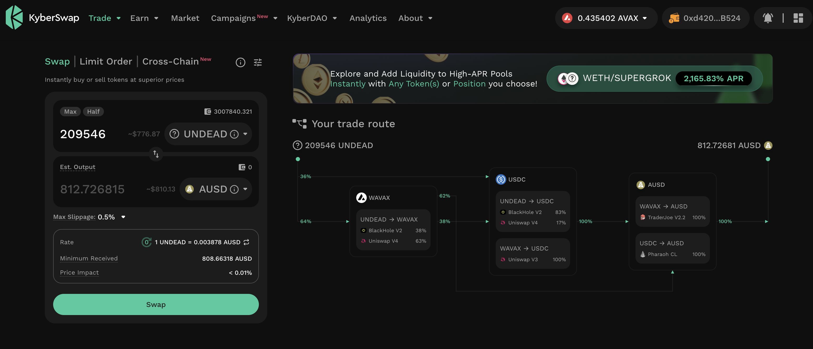
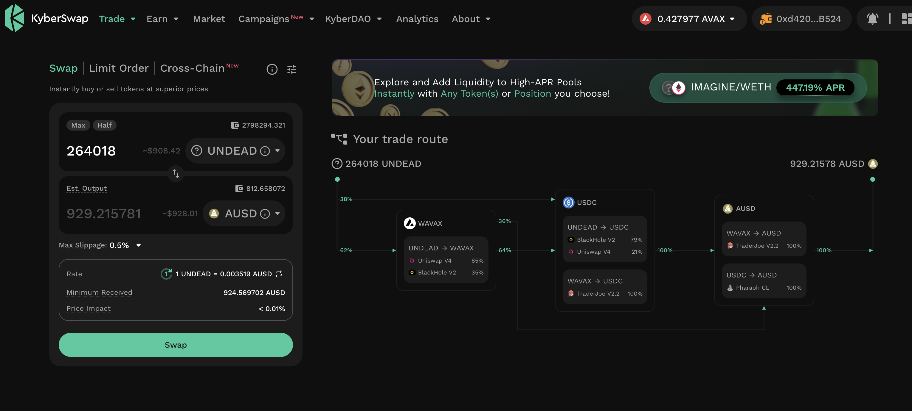

# 💥💥💥NEWSFLASH💥💥💥

## State of the Pivot Protocol, 2025-08-04

Due to a 4x price-increase of $UNDEAD (now resting at 2x), the Pivot Protocol has seen a 1-day NAV increase of $69k on 29 pivots, valued at $29k total.

# 💥💥💥NEWSFLASH💥💥💥

## Voting incentives for Blackhole LP UNDEAD/USDC

On the vote-page on @BlackholeDex, I see $10.8k incentives and a 1.5k% VAPR on the @UndeadBlocks LP UNDEAD/USDC. [Go vote!](https://blackhole.xyz/vote)

# PIVOTS

## UNDEAD+USDC

PIVOTS

I continue to close pivots where the pivot-asset is $UNDEAD.

I collate two smol USDC-on-UNDEAD pivots into one swap.

The other USDC-on-UNDEAD pivots I close using one swap each. 

