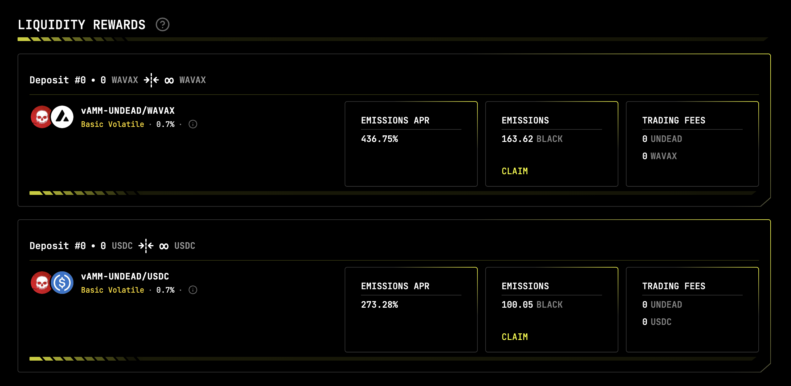
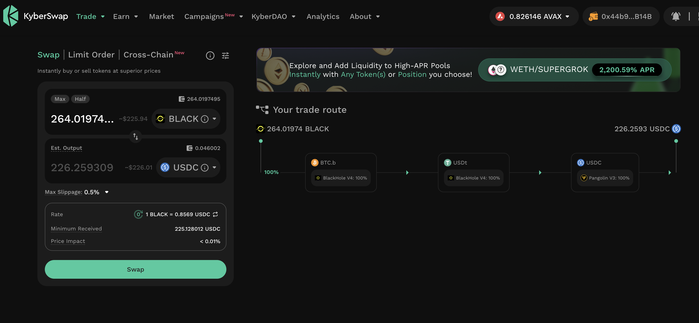
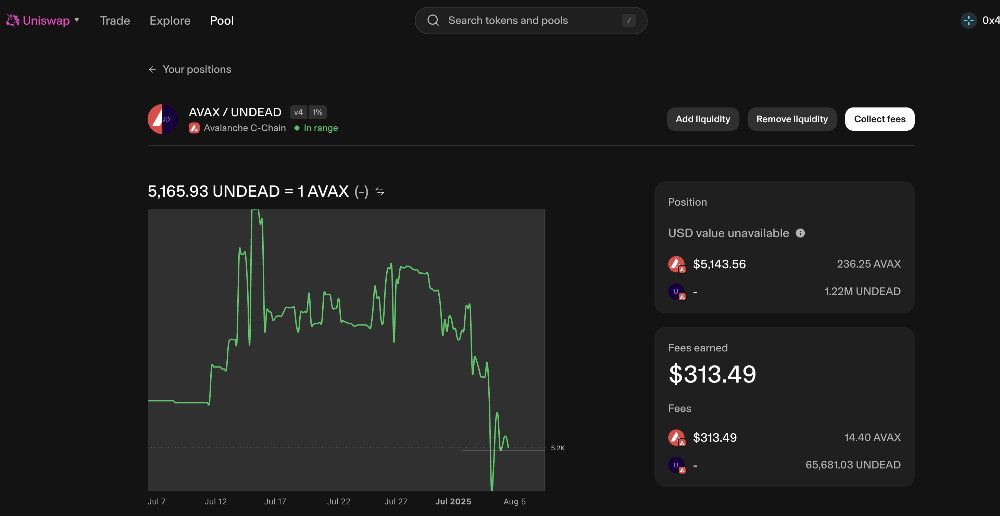
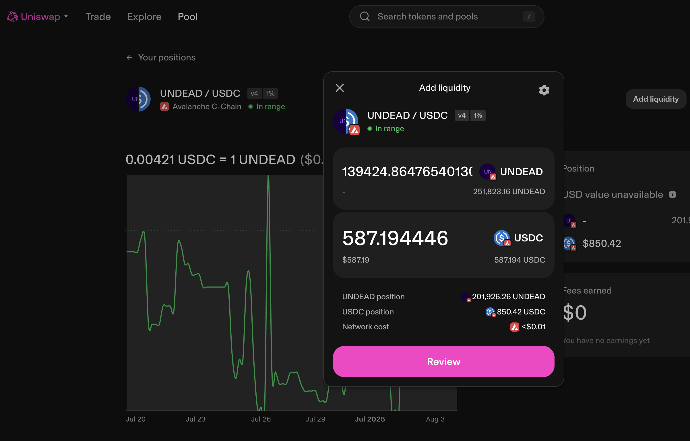
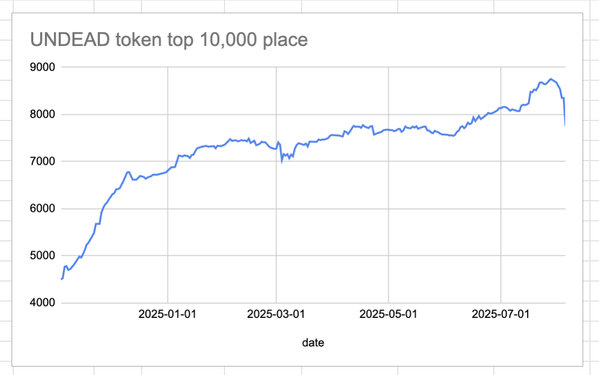
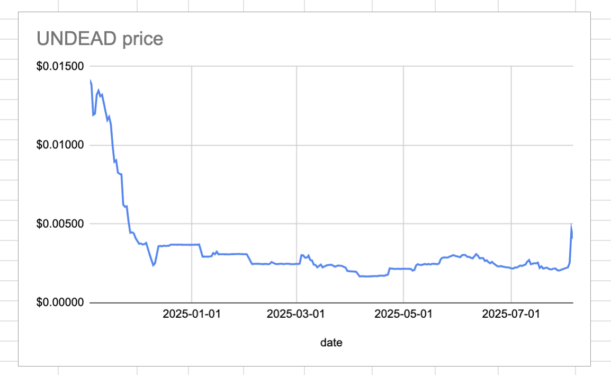
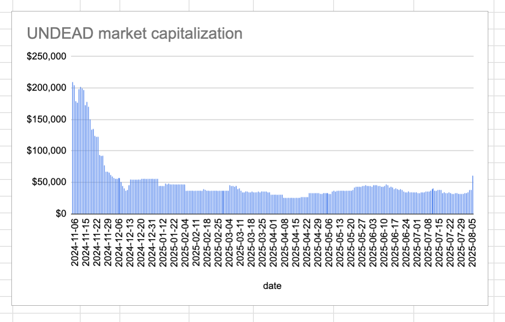
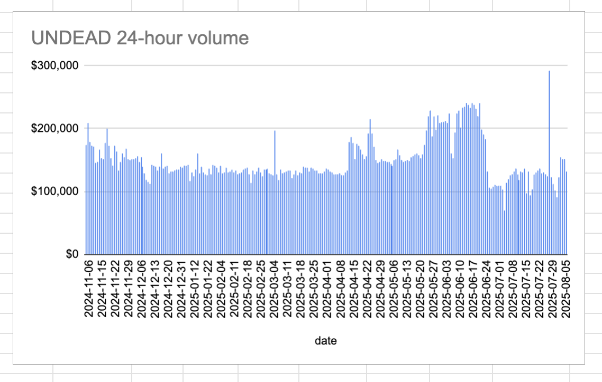

# HOUSEKEEPING, 2025-08-05

There are yields to harvest on the @BlackholeDex and @Uniswap $UNDEAD LPs, so I claim those yields, convert most to $USDC, the provide liquidity to the @Uniswap LP UNDEAD/USDC.

My aim here is to get it on par with the @Uniswap LP AVAX/UNDEAD.
# 2025-08-05 Status of @UndeadBlocks / $UNDEAD 

 
 
 
 

* rank: 7755 
* quote: $0.00407 
* market cap: $60,976 
* 24-hr volume: $132,488 (δ: -$18,669 ) 

[UNDEAD data source](https://www.coingecko.com/en/coins/undead-blocks) 

When we get LPs funded on multiple blockchains, what will $UNDEAD look like? 

