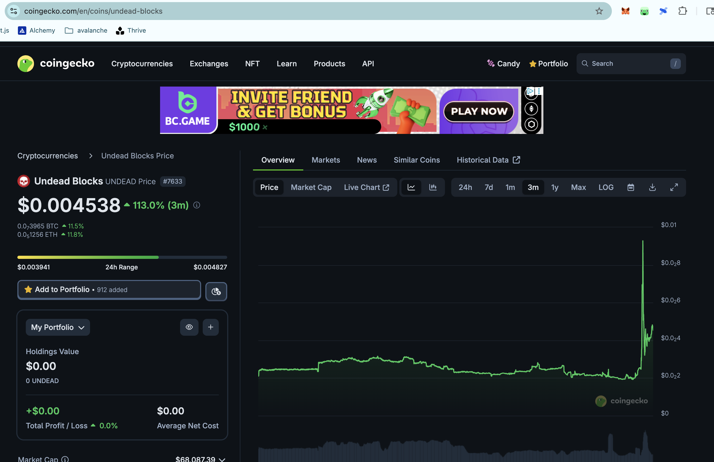
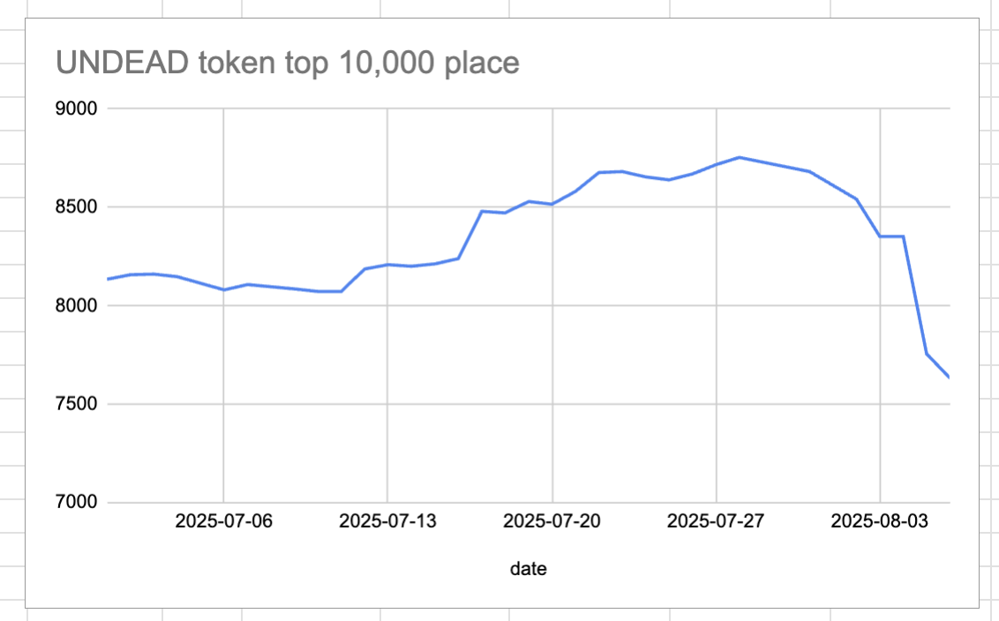
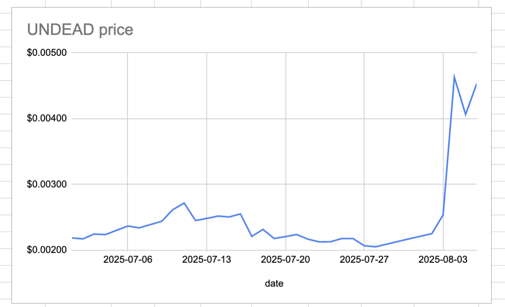
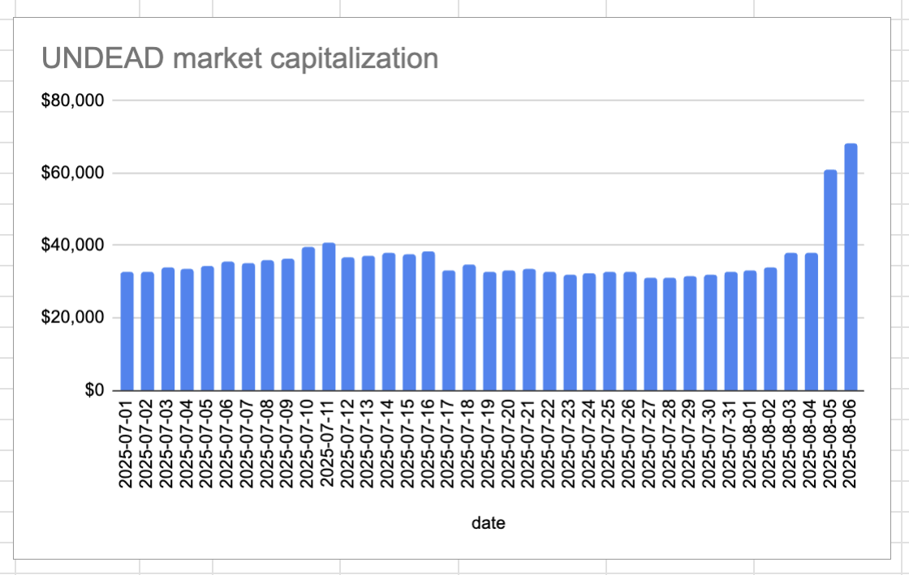
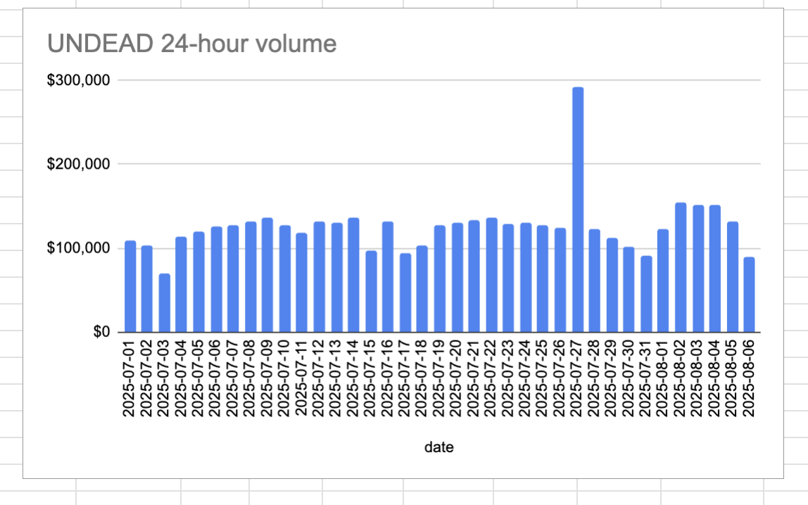

# IYKYK

Good morning on this date, 2025-08-06, pivoteurs.

Something's now brewing with @UndeadBlocks $UNDEAD-token, ...

... maybe it has something to do with all the work they've been putting in behind the scenes this past year? #NFA #DYOR 

# 2025-08-06 Status of @UndeadBlocks / $UNDEAD 

 
 
 
 

* rank: 7633 
* quote: $0.00454 
* market cap: $68,087 
* 24-hr volume: $89,973 (δ: -$42,515 ) 

[UNDEAD data source](https://www.coingecko.com/en/coins/undead-blocks) 

When we get LPs funded on multiple blockchains, what will $UNDEAD look like? 

## $UNDEAD performance analysis, 2025-08-06 

* "δ" indicates change since 2025-07-17 
* "α" is annualized since 2025-07-17 

 
 
 
 

* rank: 7633 (δ: 9.99% ) , α: 182.28% 
* quote: $0.00454 (δ: 105.25% ) , α: 1920.75% 
* market cap: $68,087 (δ: 105.16% ) , α: 1919.24% 
* 24-hr volume: $89,973 (δ: -4.91% ) , α: -89.60% 

[2025-07-17 $UNDEAD report (archived)](https://github.com/pivoteur/biz/tree/main/blog/snapshot) 
