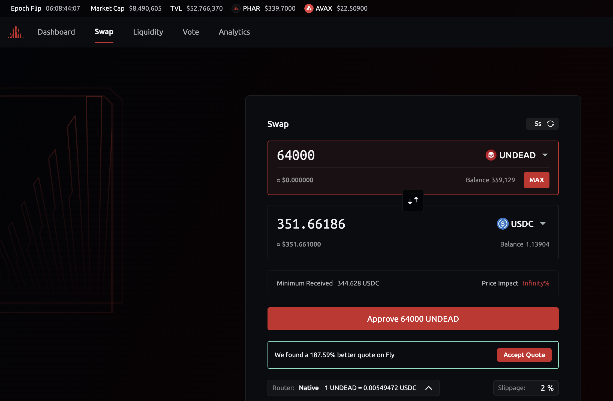
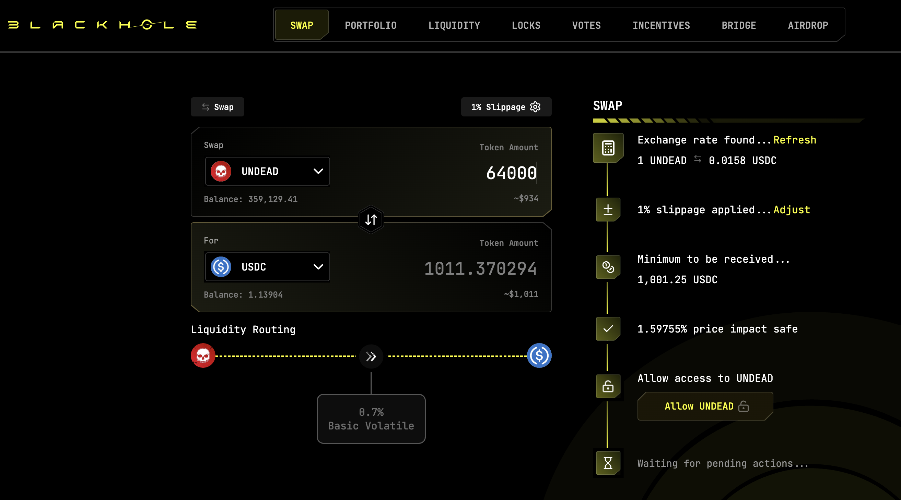
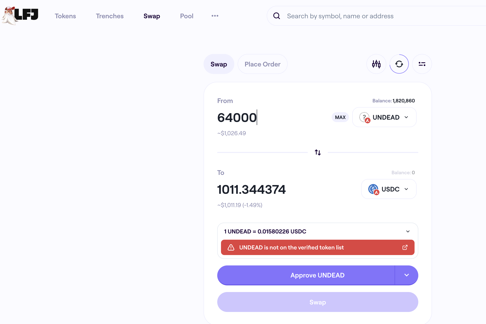
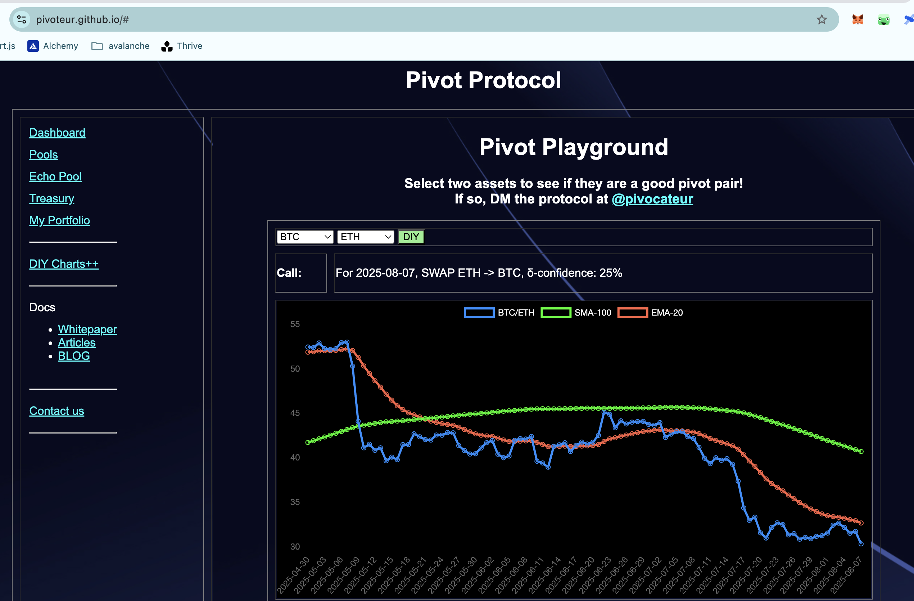
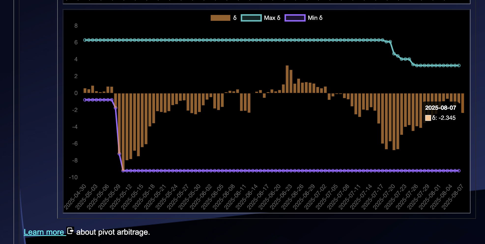
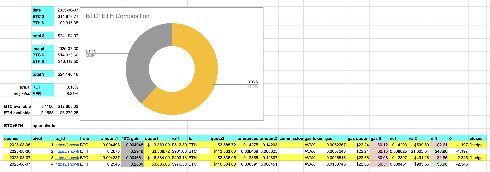
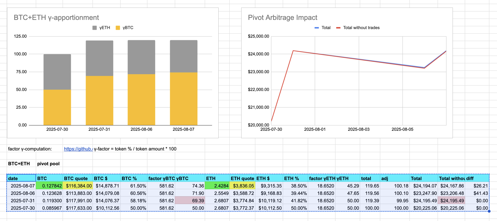

# State of the Pivot Protocol, 2025-08-07

Good morning, Pivoteurs.

hi.

hihi.

hihihihihihi.

Yes, this is an official report.

The Pivot Protocol value went up today by $365k, passing half-a-MILLION USD.

This is funny to me because the Pivot Protocol VALUE was $25k for MONTHS.

# Vote for $UNDEAD LPs on Blackhole 

2025-08-07 

Good day, pivoteurs! 

A new day; a new Epoch on @BlackholeDex. 

Reminder to go [vote](https://blackhole.xyz/vote) for the @UndeadBlocks $UNDEAD liquidity pools on that DEX. 

 
 

[HOWTO vote instructions](https://x.com/pivocateur/status/1945637734682341791) 

#IVotedForUNDEAD 

# 2025-08-07 Status of @UndeadBlocks / $UNDEAD 

 
 
 
 

* rank: 6006 
* quote: $0.01507 
* market cap: $226,076 
* 24-hr volume: $502,037 (δ: $412,064 ) 

[UNDEAD data source](https://www.coingecko.com/en/coins/undead-blocks) 

When we get LPs funded on multiple blockchains, what will $UNDEAD look like? 

## $UNDEAD performance analysis, 2025-08-07 

* "δ" indicates change since 2025-07-17 
* "α" is annualized since 2025-07-17 

 
 
 
 

* rank: 6006 (δ: 29.17% ) , α: 507.08% 
* quote: $0.01507 (δ: 581.59% ) , α: 10108.62% 
* market cap: $226,076 (δ: 581.22% ) , α: 10102.19% 
* 24-hr volume: $502,037 (δ: 430.59% ) , α: 7484.14% 

[2025-07-17 $UNDEAD report (archived)](https://github.com/pivoteur/biz/tree/main/blog/snapshot) 
# DEX UNDEAD/USDC-swap Race 

Same swap; 4 DEX, 2025-08-07 

I swap 64000 $UNDEAD for: 

1. 351.66 $USDC on @PharaohExchange 

 

2. 1011.37 $USDC on @BlackholeDex 💥 

 

3. 1011.34 $USDC on @KyberNetwork 

 

4. 1011.34 $USDC on @LFJ_gg 

 

Winner: @BlackholeDex 💥 New title-winner! 
# PIVOTS 

## BTC+ETH 

No close pivots. 

### Open BTC+ETH pivots 

 
 

The positive δ calls to open an BTC-on-ETH pivot, which I do. 

 

I also open an ETH-on-BTC hedge. 

 

The BTC+ETH pivot pool composition and γ-apportionment are as charted. 

 
 
