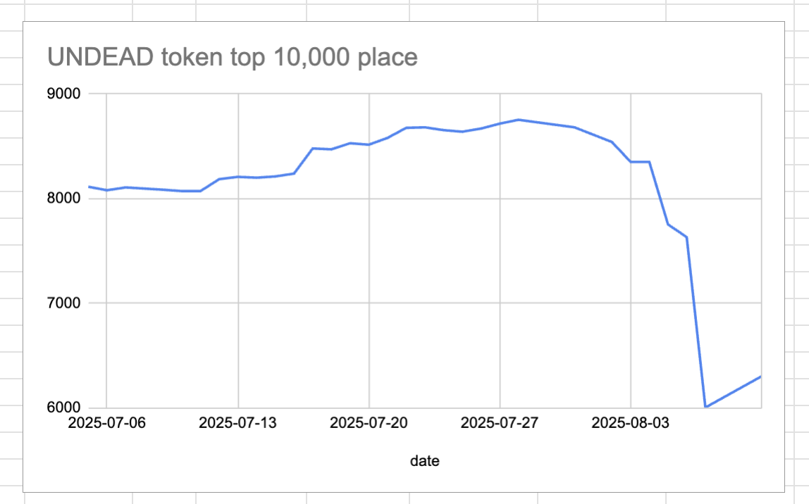
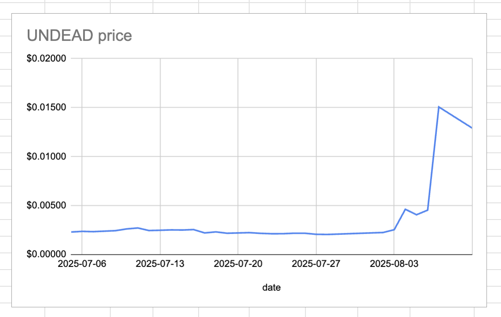
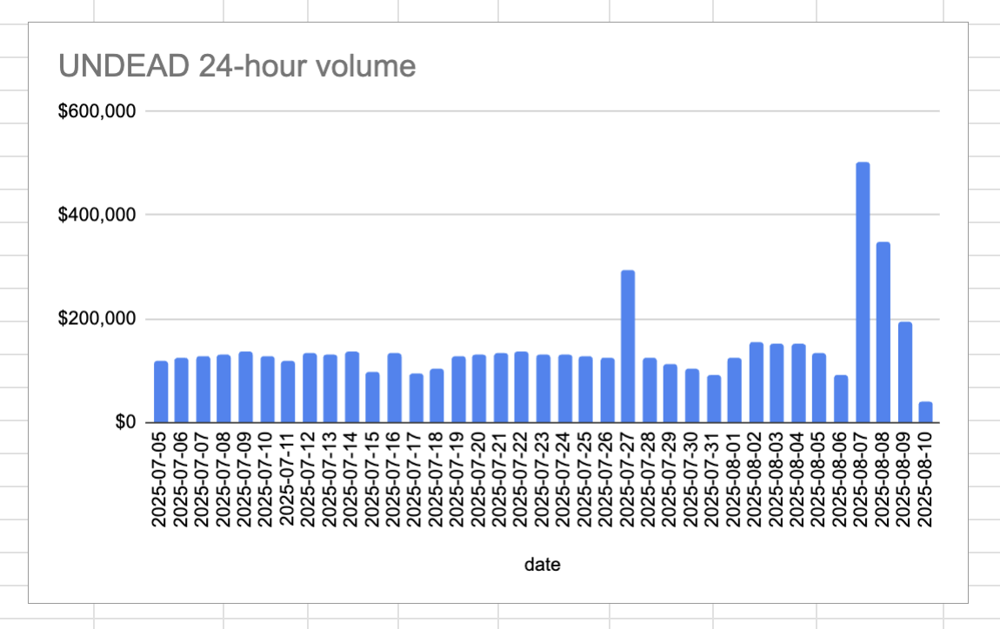
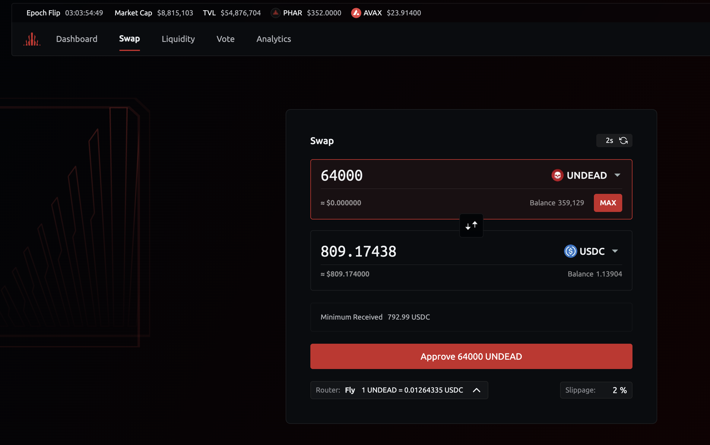
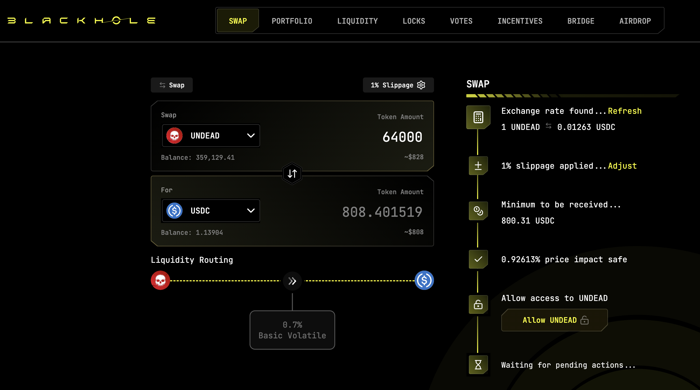
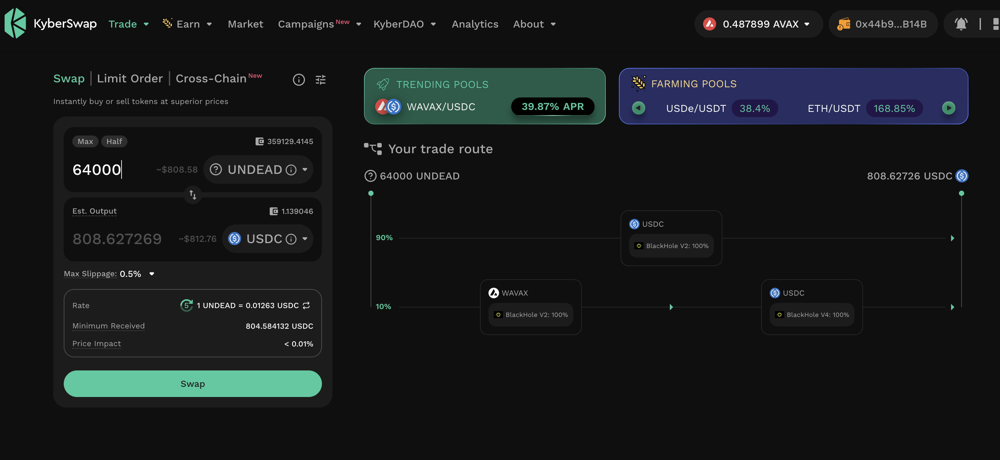
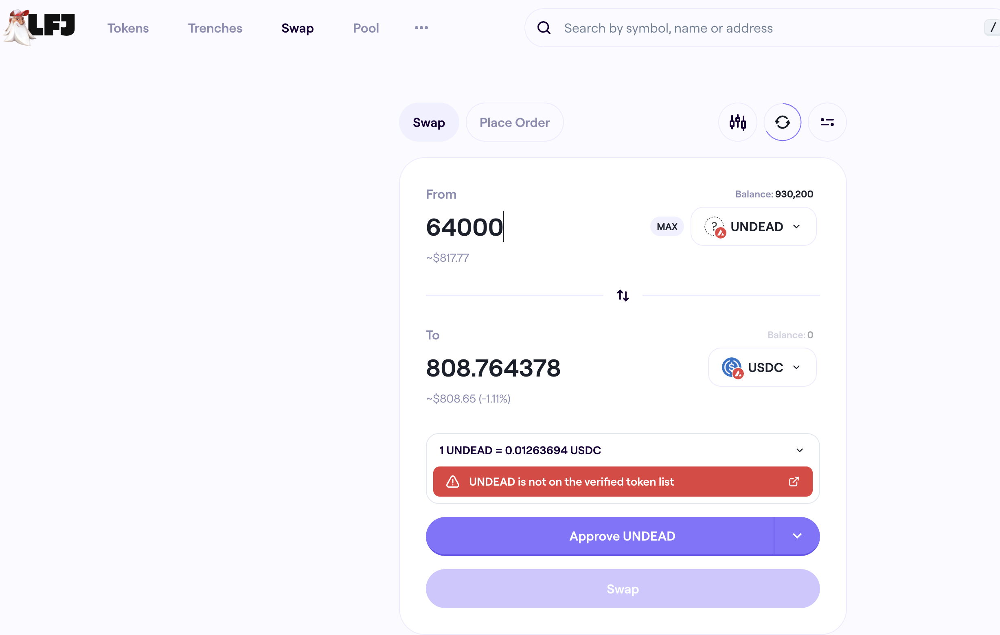

# 2025-08-10 Status of @UndeadBlocks / $UNDEAD 

 
 
 
 

* rank: 6304 
* quote: $0.01291 
* market cap: $193,487 
* 24-hr volume: $38,305 (δ: -$154,577 ) 

[UNDEAD data source](https://www.coingecko.com/en/coins/undead-blocks) 

When we get LPs funded on multiple blockchains, what will $UNDEAD look like? 

## $UNDEAD performance analysis, 2025-08-10 

* "δ" indicates change since 2025-07-17 
* "α" is annualized since 2025-07-17 

 
 
 
 

* rank: 6304 (δ: 25.66% ) , α: 390.25% 
* quote: $0.01291 (δ: 483.90% ) , α: 7359.29% 
* market cap: $193,487 (δ: 483.02% ) , α: 7345.98% 
* 24-hr volume: $38,305 (δ: -59.52% ) , α: -905.14% 

[2025-07-17 $UNDEAD report (archived)](https://github.com/pivoteur/biz/tree/main/blog/snapshot) 

# DEX UNDEAD/USDC-swap Race 

Same swap; 4 DEX, 2025-08-10 

I swap 64000 $UNDEAD for: 

1. 809.19 $USDC on @PharaohExchange 💥 

 

2. 808.40 $USDC on @BlackholeDex 

 

3. 808.63 $USDC on @KyberNetwork 

 

4. 808.76 $USDC on @LFJ_gg 

 

Winner: @PharaohExchange 💥 New title-winner! 
