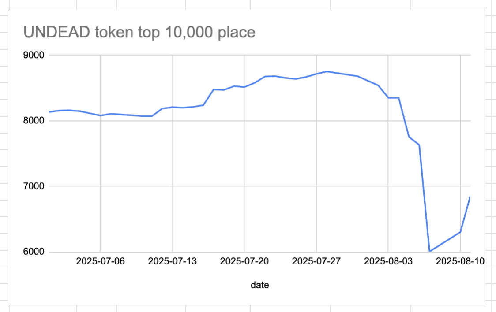
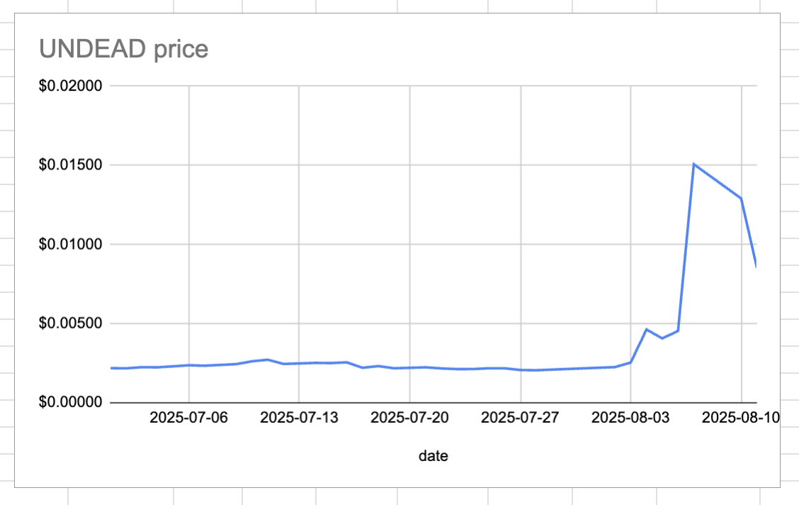
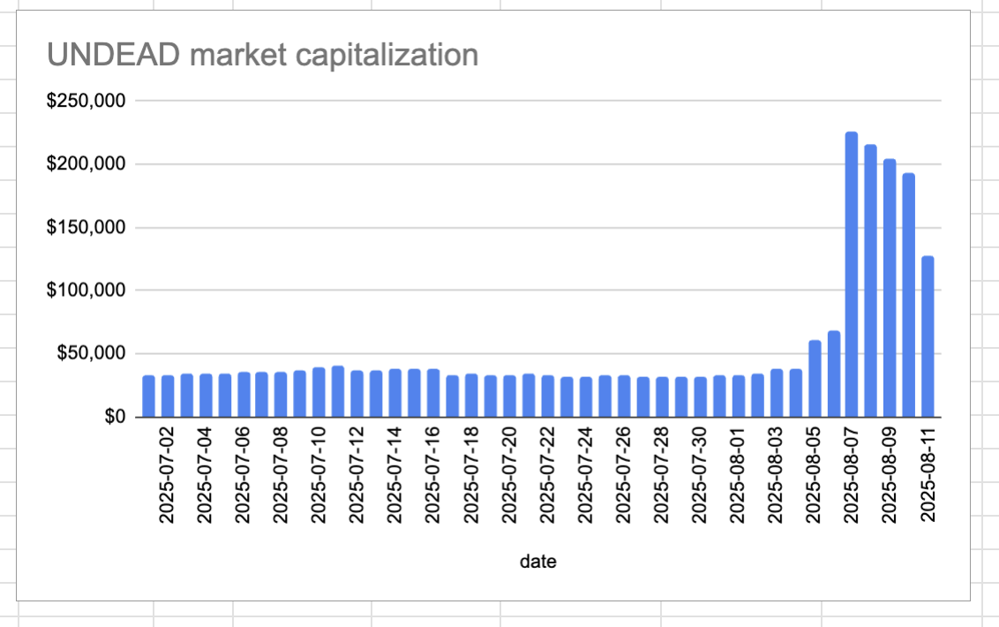
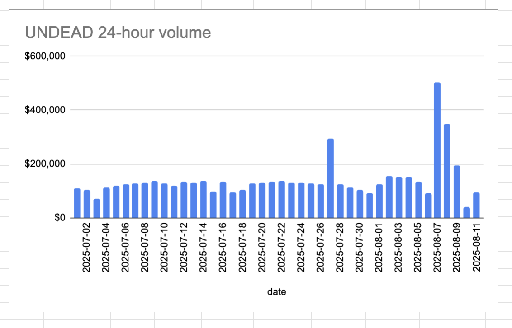

# 2025-08-11 Status of @UndeadBlocks / $UNDEAD 

 
 
 
 

* rank: 6872 
* quote: $0.00852 
* market cap: $127,839 
* 24-hr volume: $93,277 (δ: $54,972 ) 

[UNDEAD data source](https://www.coingecko.com/en/coins/undead-blocks) 

When we get LPs funded on multiple blockchains, what will $UNDEAD look like? 

## Comment

OH, NOES! $UNDEAD is down 50%! IS IT OVER? AM I FIRED?

Down 50% from what? If you can only have a token be up-only, then this may be too much for your constitution, even $BTC may be too much. "Down 50%" is not the whole story.

Find assets that work for you and stick to the Plan.

