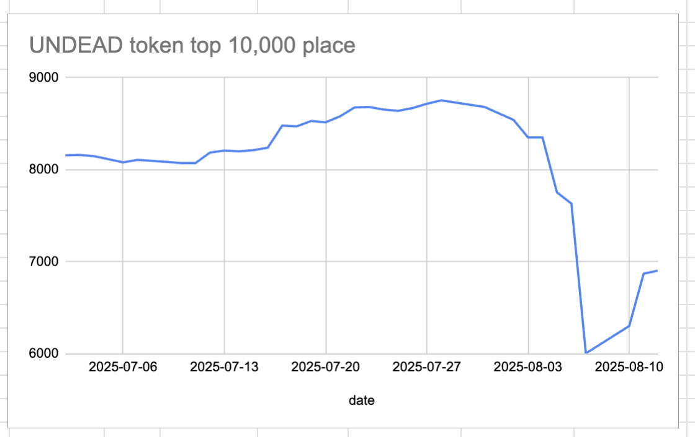
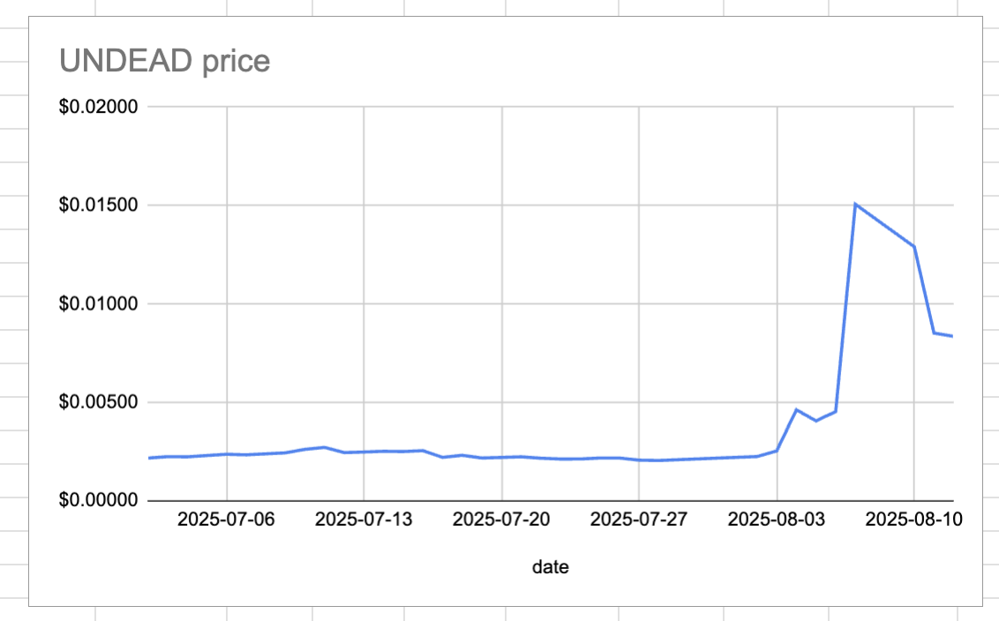
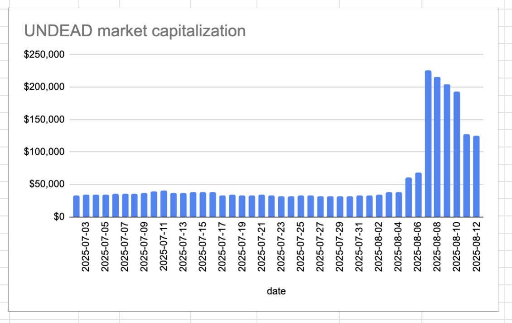
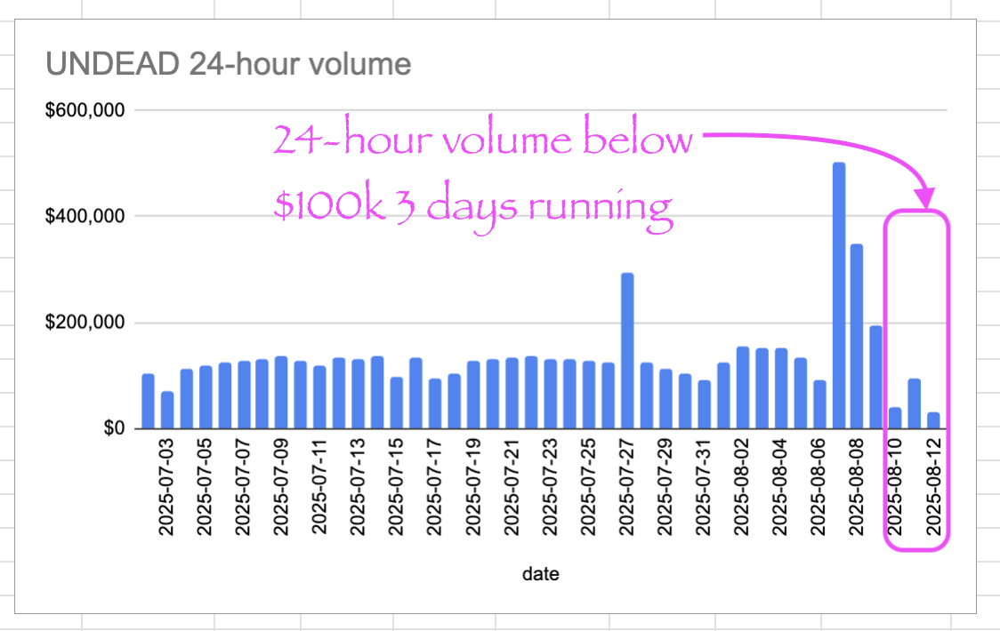

# 2025-08-12 Status of @UndeadBlocks / $UNDEAD 

 
 
 
 

* rank: 6905 
* quote: $0.00836 
* market cap: $125,445 
* 24-hr volume: $29,785 (δ: -$63,492 ) 

[UNDEAD data source](https://www.coingecko.com/en/coins/undead-blocks) 

When we get LPs funded on multiple blockchains, what will $UNDEAD look like? 

* 3rd day running where $UNDEAD 24-hour volume is below $100k.

## $UNDEAD performance analysis, 2025-08-12 

* "δ" indicates change since 2025-07-17 
* "α" is annualized since 2025-07-17 

 
 
 
 

* rank: 6905 (δ: 18.57% ) , α: 260.74% 
* quote: $0.00836 (δ: 278.25% ) , α: 3906.13% 
* market cap: $125,445 (δ: 278.00% ) , α: 3902.64% 
* 24-hr volume: $29,785 (δ: -68.52% ) , α: -961.92% 

[2025-07-17 $UNDEAD report (archived)](https://github.com/pivoteur/biz/tree/main/blog/snapshot) 
