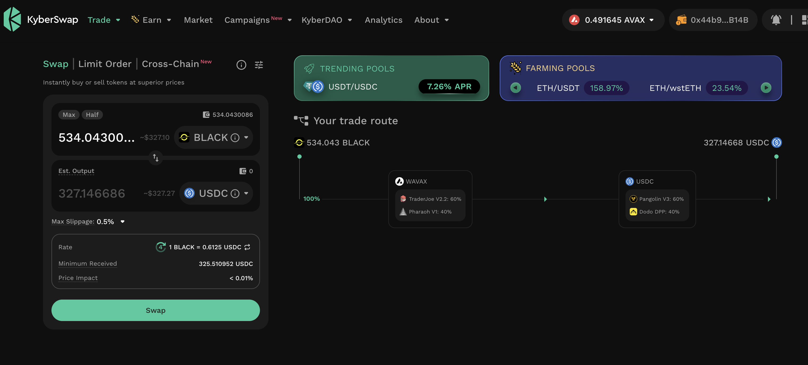

# 2025-08-12 Status of @UndeadBlocks / $UNDEAD 

 
 
 
 

* rank: 6905 
* quote: $0.00836 
* market cap: $125,445 
* 24-hr volume: $29,785 (δ: -$63,492 ) 

[UNDEAD data source](https://www.coingecko.com/en/coins/undead-blocks) 

When we get LPs funded on multiple blockchains, what will $UNDEAD look like? 

* 3rd day running where $UNDEAD 24-hour volume is below $100k.

## $UNDEAD performance analysis, 2025-08-12 

* "δ" indicates change since 2025-07-17 
* "α" is annualized since 2025-07-17 

 
 
 
 

* rank: 6905 (δ: 18.57% ) , α: 260.74% 
* quote: $0.00836 (δ: 278.25% ) , α: 3906.13% 
* market cap: $125,445 (δ: 278.00% ) , α: 3902.64% 
* 24-hr volume: $29,785 (δ: -68.52% ) , α: -961.92% 

[2025-07-17 $UNDEAD report (archived)](https://github.com/pivoteur/biz/tree/main/blog/snapshot) 
# DEX UNDEAD/USDC-swap Race 

Same swap; 4 DEX, 2025-08-12 

I swap 64000 $UNDEAD for: 

1. 537.39 $USDC on @PharaohExchange 

 

2. 536.69 $USDC on @BlackholeDex 

 

3. 537.95 $USDC on @KyberNetwork 

 

4. 538.03 $USDC on @LFJ_gg 💥 

 

Winner: @LFJ_gg (2-day streak) 

# Liquidity Pools 

* I harvest the yields from the LPs on @BlackholeDex and @Uniswap 

 

* swap the yields to $USDC, 

 

* then provide liquidity to the @Uniswap LP UNDEAD/USDC. 

 
 

The Uniswap UNDEAD LPs are as shown. 
# State of the Pivot Protocol, 2025-08-12 

 
 

News: Down another $12k? The thing is, earlier this morning, I was down $24k, but a price-increase of 0.0002 USD on $UNDEAD made back $12k, just like that. Also, we are still 10x, so I am not down $12k overall, I am up $300k+. #perspective 

# PIVOTS

## BTC+ETH

I close 1 BTC-on-ETH hedge for gains of:

* actual ROI: 13.50% / 985.32% APR projected
* or: 0.0042 $BTC -> $ETH -> 0.0048 $BTC
* or: $69-gain on $491 hedge

I distribute to or reinvest 80% of the gains for stakers, the rest of the gains are returned to the pool.

### Open BTC+ETH pivots 

 
 

The negative δ calls to open an ETH-on-BTC pivot, which I do. 

 

I also open an BTC-on-ETH hedge. 

 

The BTC+ETH pivot pool composition and γ-apportionment are as charted. 

 
 

## BTC+AVAX 

No close pivots. 

### Open BTC+AVAX pivots 

 
 

The meh δ makes no call, but I open an BTC-on-AVAX pivot, anyway. 

 

I also open an AVAX-on-BTC pivot. 

 

The BTC+AVAX pivot pool composition and γ-apportionment are as charted. 

 
 
## BTC+USDC 

No close pivots. 

### Open BTC+USDC pivots 

 
 

The positive δ calls to open an BTC-on-USDC pivot, which I do. 

 

I also open an USDC-on-BTC hedge. 

 

The BTC+USDC pivot pool composition and γ-apportionment are as charted. 

 
 
## BTC+UNDEAD 

No close pivots. 

### Open BTC+UNDEAD pivots 

 
 

The negative δ calls to open an UNDEAD-on-BTC pivot, which I do. 

 

I also open an BTC-on-UNDEAD hedge. 

 

The BTC+UNDEAD pivot pool composition and γ-apportionment are as charted. 

 
 

## ETH+UNDEAD

I close 1 UNDEAD-on-ETH pivot for gains of:

* actual ROI: 170.12% / 6899.16% APR projected
* or: 52.5k $UNDEAD -> $ETH -> 141.8k $UNDEAD HOLY!! 🎉🎉🎉
* or: $810-gained on $1,024 pivoted

I must be a magician because what is this wizardry?

I distribute 80% gains as stable liquidity.

