# State of the Pivot Protocol, 2025-08-13 

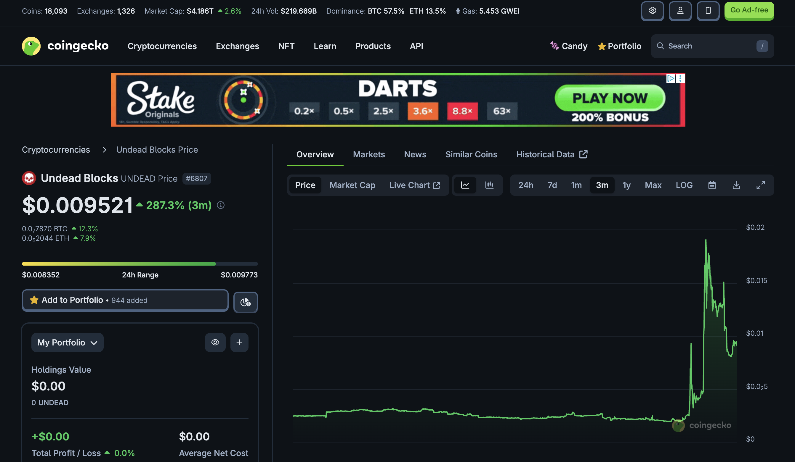 
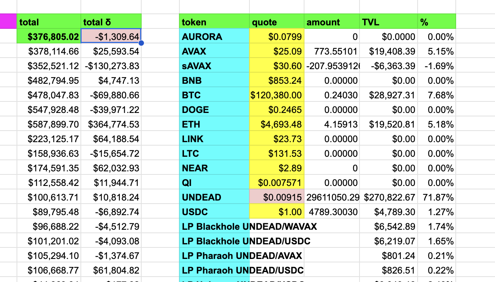 
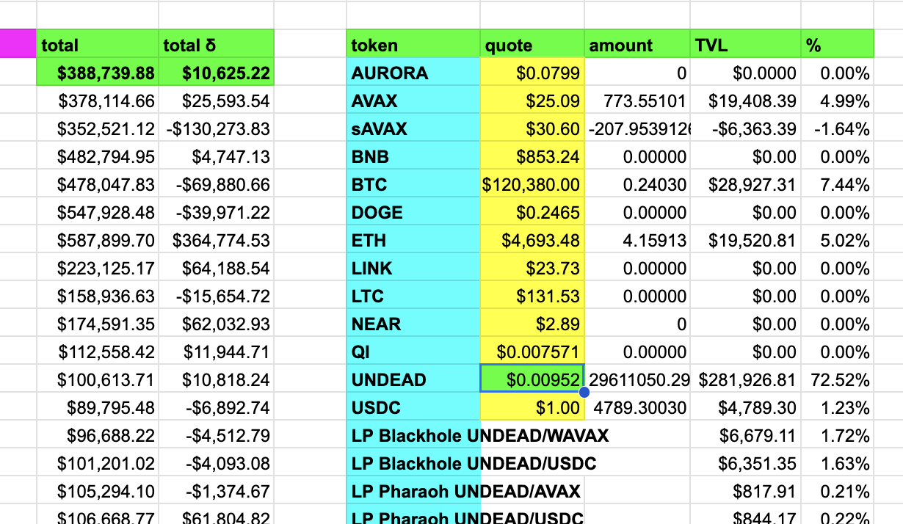 

News: It is CRAZY what a tenth of a ha-penny does to NAV. I recorded $UNDEAD price earlier this morning ($0.0091), but then, a bit later $UNDEAD rose to $0.0095, changing my NAV from $1k RED to $10k GREEN. This price-impact is insane! 
# 2025-08-13 Status of @UndeadBlocks / $UNDEAD 

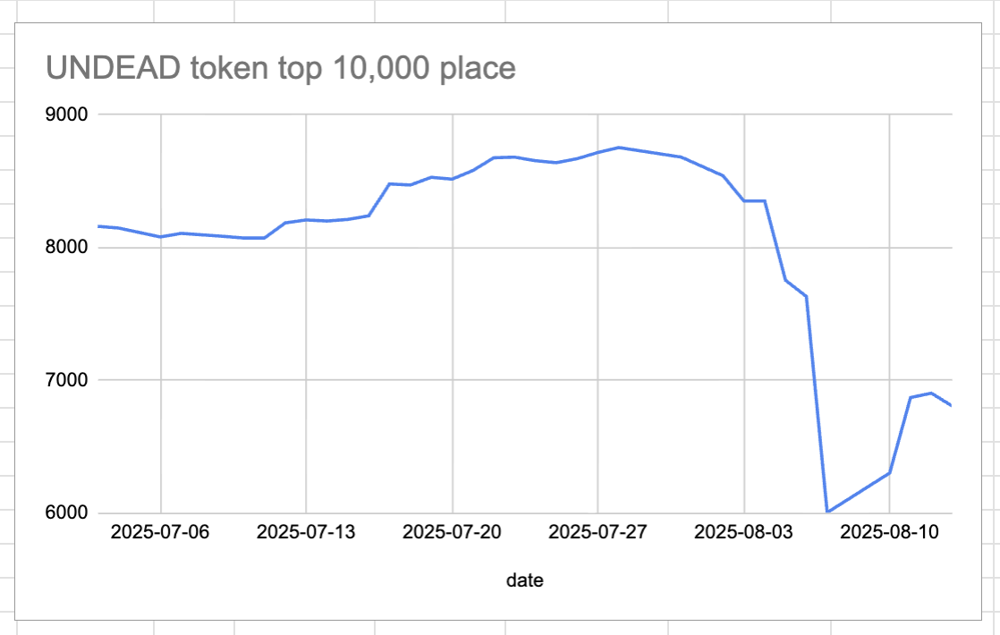 
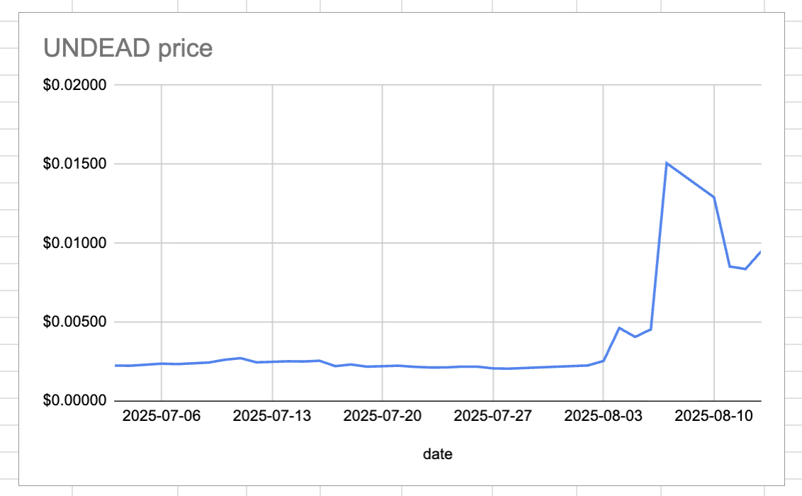 
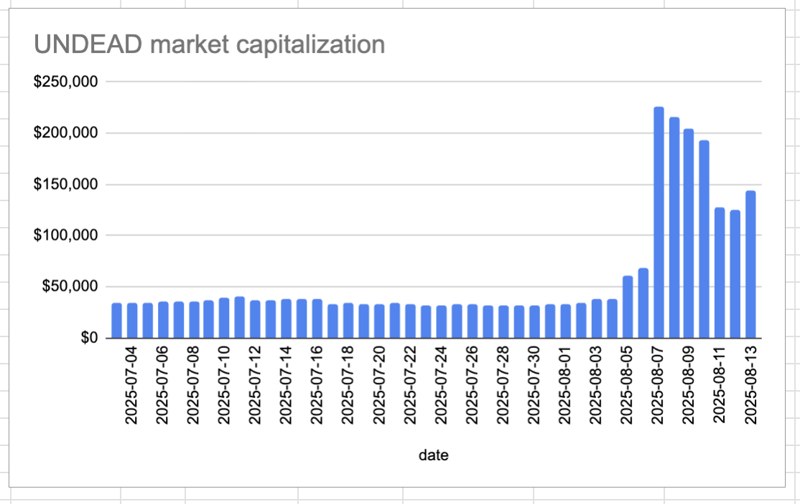 
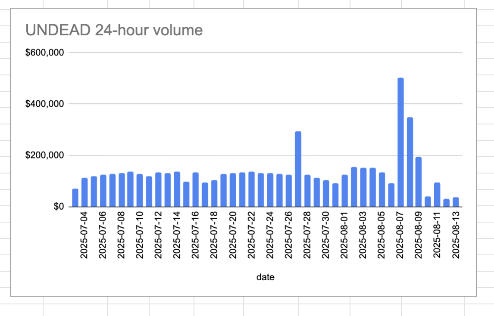 

* rank: 6808 
* quote: $0.00950 
* market cap: $143,343 
* 24-hr volume: $36,033 (δ: $6,248 ) 

[UNDEAD data source](https://www.coingecko.com/en/coins/undead-blocks) 

When we get LPs funded on multiple blockchains, what will $UNDEAD look like? 

## $UNDEAD performance analysis, 2025-08-13 

* "δ" indicates change since 2025-07-17 
* "α" is annualized since 2025-07-17 

 
 
 
 

* rank: 6808 (δ: 19.72% ) , α: 266.54% 
* quote: $0.00950 (δ: 329.49% ) , α: 4454.20% 
* market cap: $143,343 (δ: 331.93% ) , α: 4487.17% 
* 24-hr volume: $36,033 (δ: -61.92% ) , α: -837.02% 

[2025-07-17 $UNDEAD report (archived)](https://github.com/pivoteur/biz/tree/main/blog/snapshot) 
# DEX UNDEAD/USDC-swap Race 

Same swap; 4 DEX, 2025-08-13 

I swap 50000 $UNDEAD for: 

1. 472.76 $USDC on @PharaohExchange 

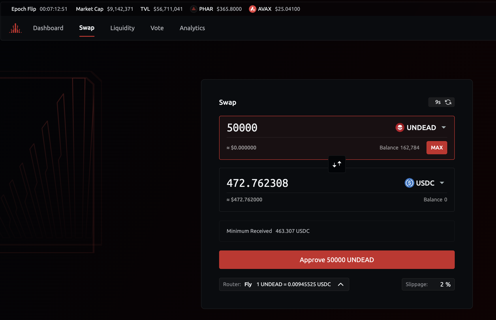 

2. 471.82 $USDC on @BlackholeDex 

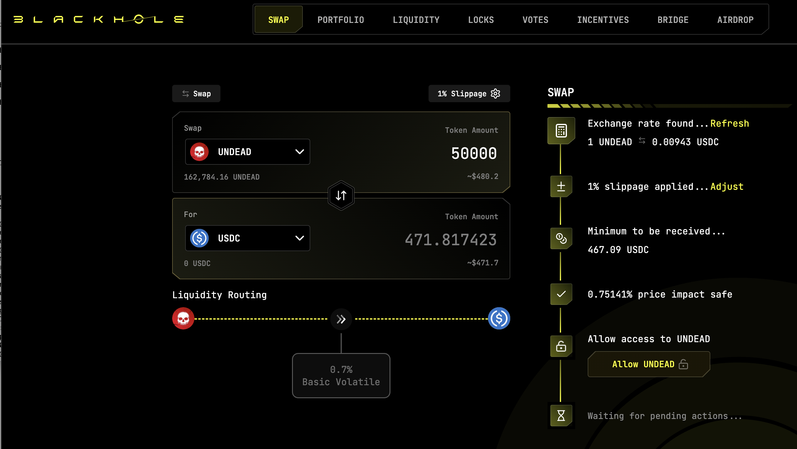 

3. 472.91 $USDC on @KyberNetwork 

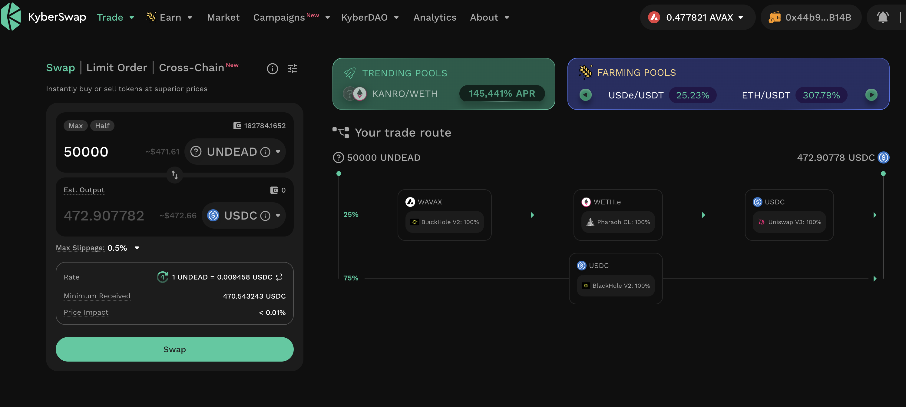 

4. 473.09 $USDC on @LFJ_gg 💥 

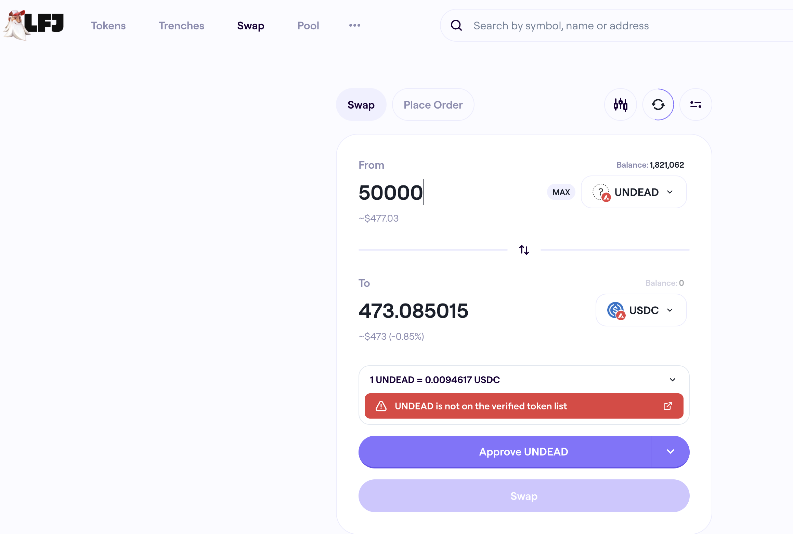 

Winner: @LFJ_gg (3-day streak) 
# Liquidity Pools 

* I harvest the yields from the LPs on @BlackholeDex and @Uniswap 

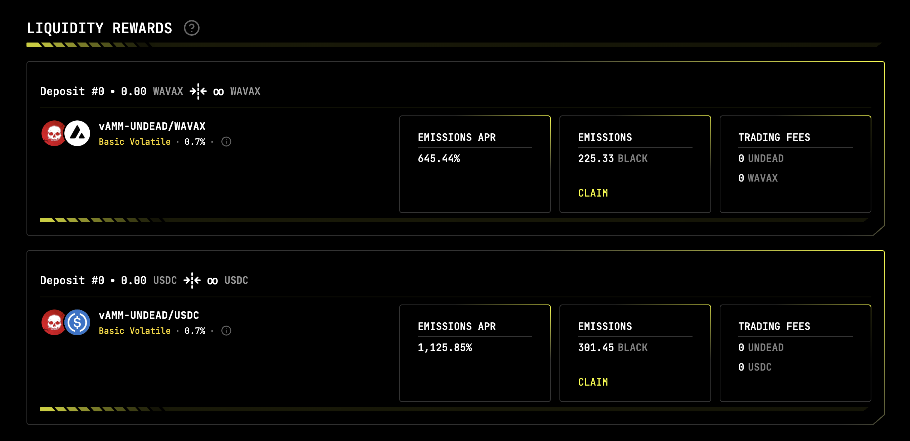 

* swap the yields to $USDC, 

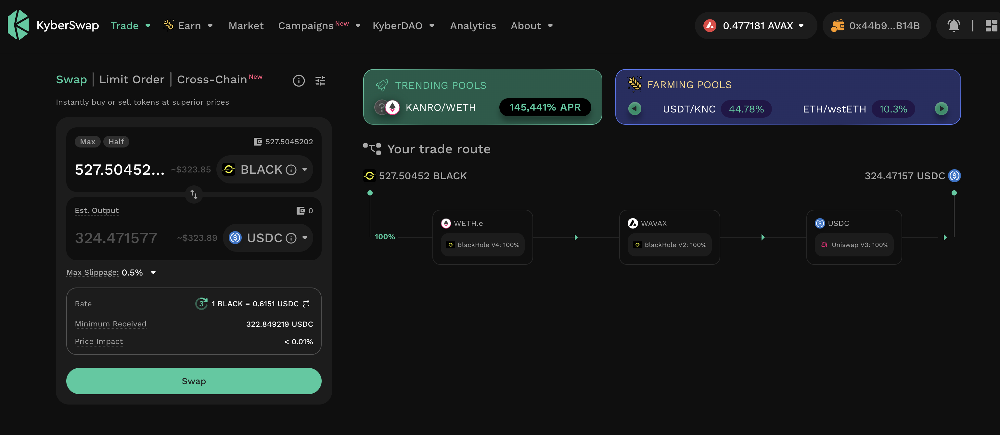 

* then provide liquidity to the @Uniswap LP UNDEAD/USDC. 

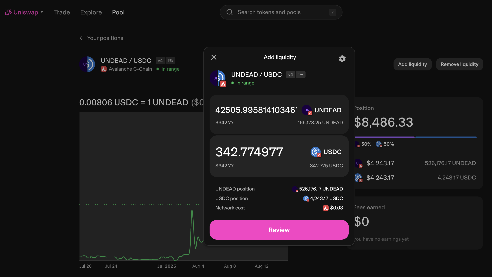 
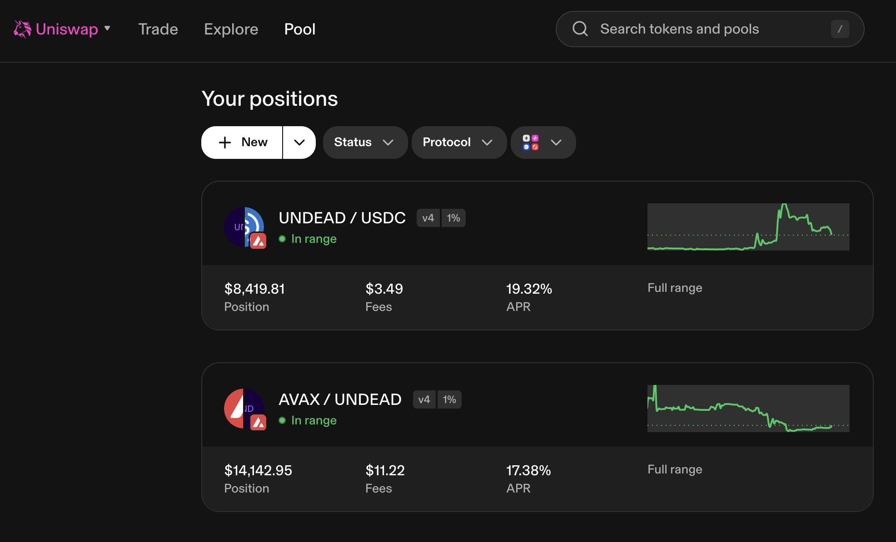 

The Uniswap UNDEAD LPs are as shown. 
