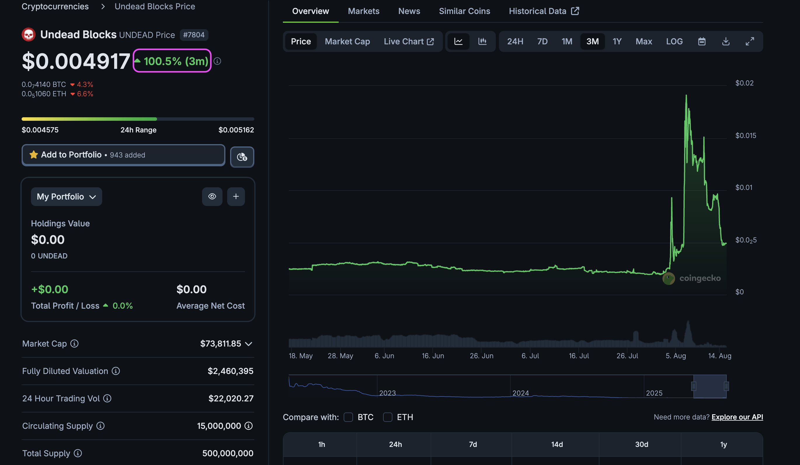
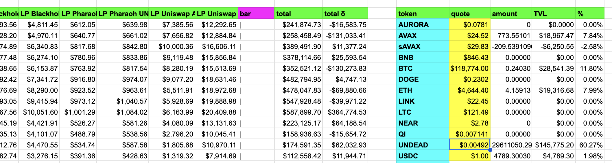
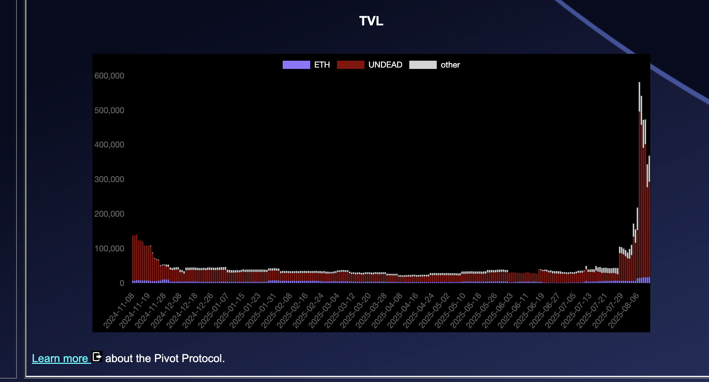
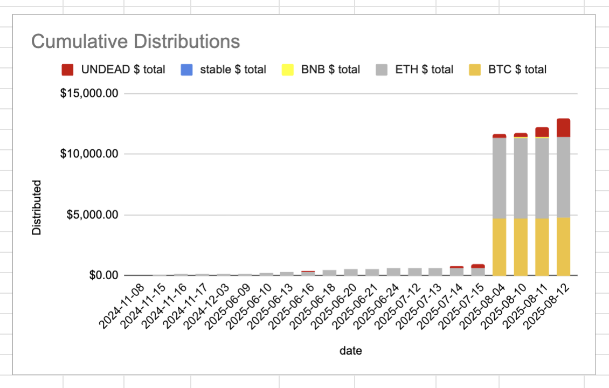
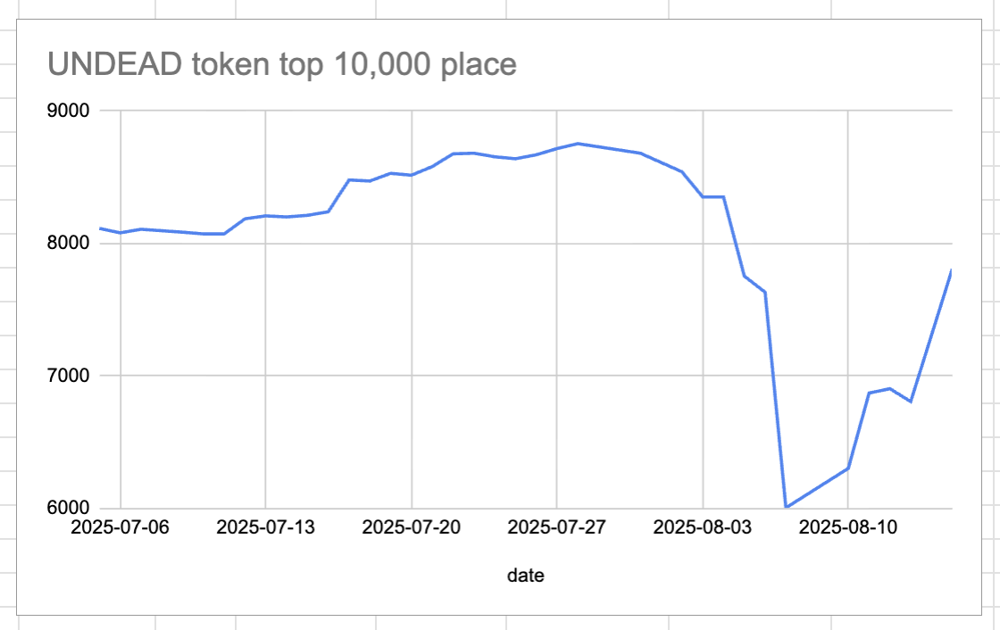
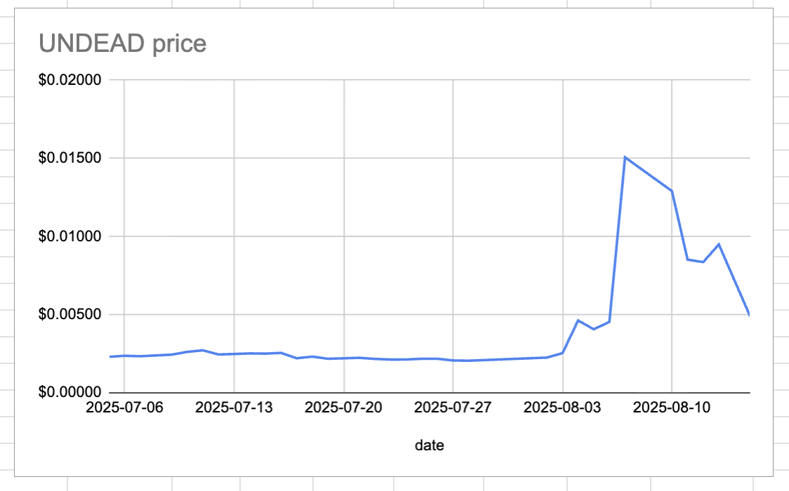
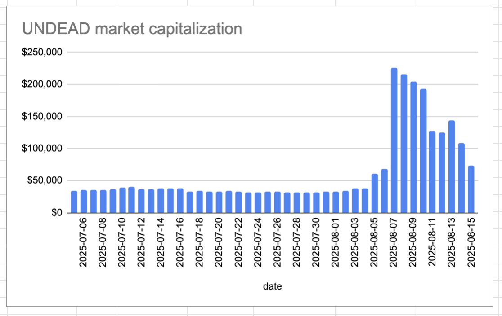
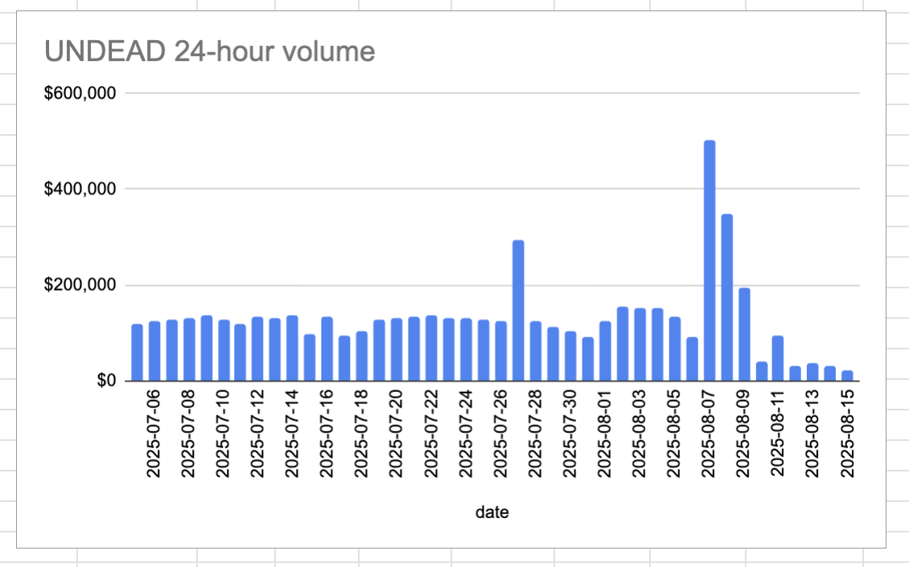

# State of the Pivot Protocol, 2025-08-15 

 
 
 

News: What is happening with $UNDEAD? Well, besides the fact we are up 100% – I will get into that token-analysis next – but how stands the Pivot Protocol? 

Very well, as a matter of fact. We are up 10x from where we were for half-a-year.

## Observing Distributions today

The interesting thing, for me, will be distributions. When the bear hits, hard, distributions go through the roof.

Let us see what happens today, distribution-wise.

# 2025-08-15 Status of @UndeadBlocks / $UNDEAD 

 
 
 
 

* rank: 7810 
* quote: $0.00490 
* market cap: $73,451 
* 24-hr volume: $21,996 (δ: -$7,019 ) 

[UNDEAD data source](https://www.coingecko.com/en/coins/undead-blocks) 

When we get LPs funded on multiple blockchains, what will $UNDEAD look like? 

## $UNDEAD performance analysis, 2025-08-15 

* "δ" indicates change since 2025-07-17 
* "α" is annualized since 2025-07-17 

 
 
 
 

* rank: 7810 (δ: 7.90% ) , α: 99.44% 
* quote: $0.00490 (δ: 121.57% ) , α: 1530.15% 
* market cap: $73,451 (δ: 121.33% ) , α: 1527.04% 
* 24-hr volume: $21,996 (δ: -76.75% ) , α: -966.02% 

[2025-07-17 $UNDEAD report (archived)](https://github.com/pivoteur/biz/tree/main/blog/snapshot) 
