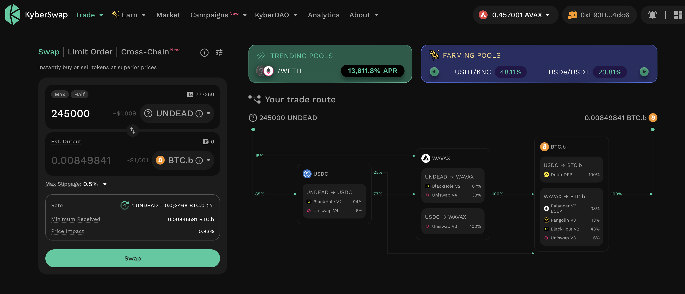
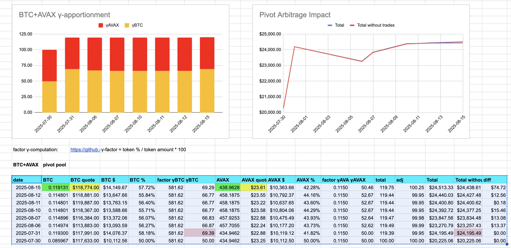
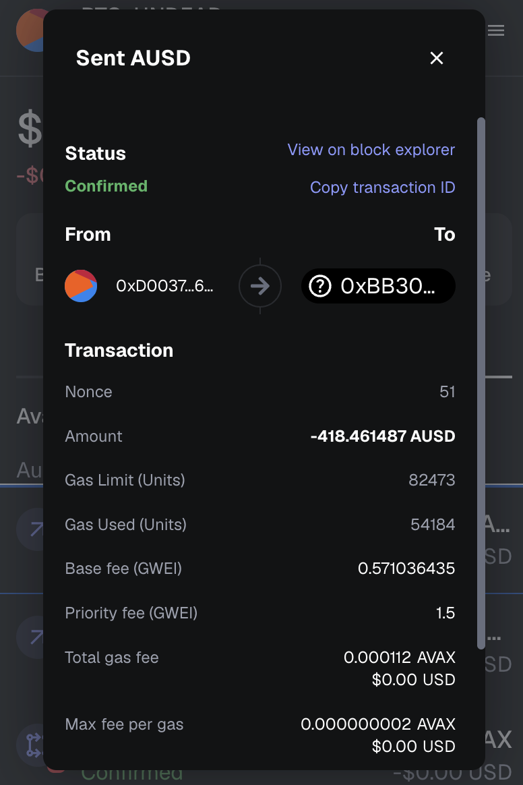
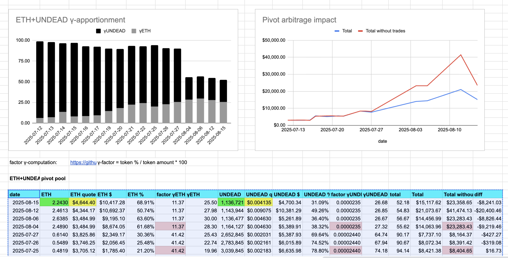
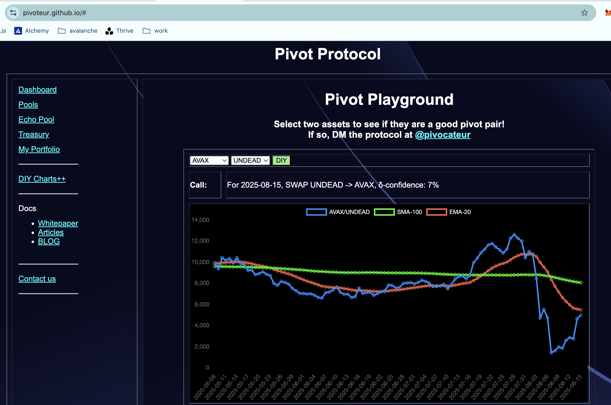
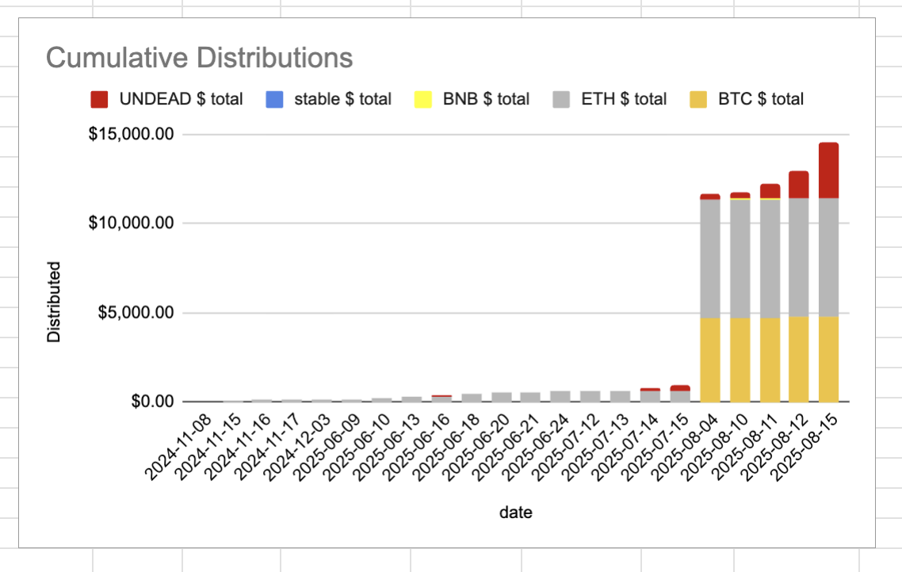

# State of the Pivot Protocol, 2025-08-15 

 
 
 

News: What is happening with $UNDEAD? Well, besides the fact we are up 100% – I will get into that token-analysis next – but how stands the Pivot Protocol? 

Very well, as a matter of fact. We are up 10x from where we were for half-a-year.

## Observing Distributions today

The interesting thing, for me, will be distributions. When the bear hits, hard, distributions go through the roof.

Let us see what happens today, distribution-wise.

# 2025-08-15 Status of @UndeadBlocks / $UNDEAD 

 
 
 
 

* rank: 7810 
* quote: $0.00490 
* market cap: $73,451 
* 24-hr volume: $21,996 (δ: -$7,019 ) 

[UNDEAD data source](https://www.coingecko.com/en/coins/undead-blocks) 

When we get LPs funded on multiple blockchains, what will $UNDEAD look like? 

## $UNDEAD performance analysis, 2025-08-15 

* "δ" indicates change since 2025-07-17 
* "α" is annualized since 2025-07-17 

 
 
 
 

* rank: 7810 (δ: 7.90% ) , α: 99.44% 
* quote: $0.00490 (δ: 121.57% ) , α: 1530.15% 
* market cap: $73,451 (δ: 121.33% ) , α: 1527.04% 
* 24-hr volume: $21,996 (δ: -76.75% ) , α: -966.02% 

[2025-07-17 $UNDEAD report (archived)](https://github.com/pivoteur/biz/tree/main/blog/snapshot) 
# DEX UNDEAD/USDC-swap Race 

Same swap; 4 DEX, 2025-08-15 

I swap 110000 $UNDEAD for: 

1. 464.68 $USDC on @PharaohExchange 

 

2. 463.90 $USDC on @BlackholeDex 

 

3. 464.45 $USDC on @KyberNetwork 

 

4. 464.92 $USDC on @LFJ_gg 💥 

 

Winner: @LFJ_gg (5-day streak) 
# Liquidity Pools 

* I harvest the yields from the LPs on @BlackholeDex and @Uniswap 

 

* swap the yields to $USDC, 

 

* then provide liquidity to the @Uniswap LP UNDEAD/USDC. 

 
 

The Uniswap UNDEAD LPs are as shown. 
# PIVOTS 

## BTC+ETH 

No close pivots. 

### Open BTC+ETH pivots 

 
 

The negative δ calls to open an ETH-on-BTC pivot, which I do. 

 

I also open an BTC-on-ETH hedge. 

 

The BTC+ETH pivot pool composition and γ-apportionment are as charted. 

 
 
## BTC+AVAX 

No close pivots. 

### Open BTC+AVAX pivots 

 
 

The negative δ calls to open an AVAX-on-BTC pivot, which I do. 

 

I also open an BTC-on-AVAX hedge. 

 

The BTC+AVAX pivot pool composition and γ-apportionment are as charted. 

 
 

## BTC+USDC 

No close pivots. 

### Open BTC+USDC pivots 

 
 

The meh δ makes no call, but I open an USDC-on-BTC pivot, anyway. 

 

I also open an BTC-on-USDC pivot. 

 

The BTC+USDC pivot pool composition and γ-apportionment are as charted. 

 
 

## BTC+UNDEAD 

 

I close 1 UNDEAD-on-BTC pivot for gains of: 

* actual ROI: 115.71% / 10558.42% APR projected 
* or: 113000 $UNDEAD -> $BTC -> 243746 $UNDEAD 
* or: $541.99 gain on a pivot of $990.21 

 
 

I distribute 80% of the gains to stakers. 

### Open BTC+UNDEAD pivots 

 
 

The meh δ makes no call, but I open an UNDEAD-on-BTC pivot, anyway. 

 

I also open an BTC-on-UNDEAD pivot. 

 

The BTC+UNDEAD pivot pool composition and γ-apportionment are as charted. 

 
 
## ETH+UNDEAD 

 

I close 1 UNDEAD-on-ETH pivot for gains of: 

* actual ROI: 123.53% / 11271.81% APR projected 
* or: 107500 $UNDEAD -> $ETH -> 240290 $UNDEAD 
* or: $549.10 gain on a pivot of $948.52 

 
 

I distribute 80% of the gains to stakers. 

### Open ETH+UNDEAD pivots 

 
 

The meh δ makes no call, but I open an UNDEAD-on-ETH pivot, anyway. 

 

I also open an ETH-on-UNDEAD pivot. 

 

The ETH+UNDEAD pivot pool composition and γ-apportionment are as charted. 

 
 
## AVAX+UNDEAD 

 

I close 1 UNDEAD-on-AVAX pivot for gains of: 

* actual ROI: 116.48% / 10628.79% APR projected 
* or: 110000 $UNDEAD -> $AVAX -> 237794 $UNDEAD 
* or: $532.38 gain on a pivot of $990.10 

 
 

I distribute 80% of the gains to stakers. 

### Open AVAX+UNDEAD pivots 

 
 

The meh δ makes no call, but I open an UNDEAD-on-AVAX pivot, anyway. 

 

I also open an AVAX-on-UNDEAD pivot. 

 

The AVAX+UNDEAD pivot pool composition and γ-apportionment are as charted. 

 
 

## UNDEAD+USDC 

 

I close 1 UNDEAD-on-USDC pivot for gains of: 

* actual ROI: 120.10% / 14611.98% APR projected 
* or: 110700 $UNDEAD -> $USDC -> 243649 $UNDEAD 
* or: $546.95 gain on a pivot of $1,001.17 

 
 

I distribute 80% of the gains to stakers. 

### Open UNDEAD+USDC pivots 

 
 

The meh δ makes no call, but I open an UNDEAD-on-USDC pivot, anyway. 

 

I also open an USDC-on-UNDEAD pivot. 

 

The UNDEAD+USDC pivot pool composition and γ-apportionment are as charted. 

 
 

# CONCLUSION, 2025-08-15 

This concludes pivot-activity for today. 

 
 
 
 

* gains distributed to stakers or reinvested, total: $14,578.00 
* protocol NAV: $237,387.78 
* protocol 24-hour volume: $130,636.68 
* transactions executed: 58 

[The Pivot protocol](https://pivoteur.github.io/#) 
