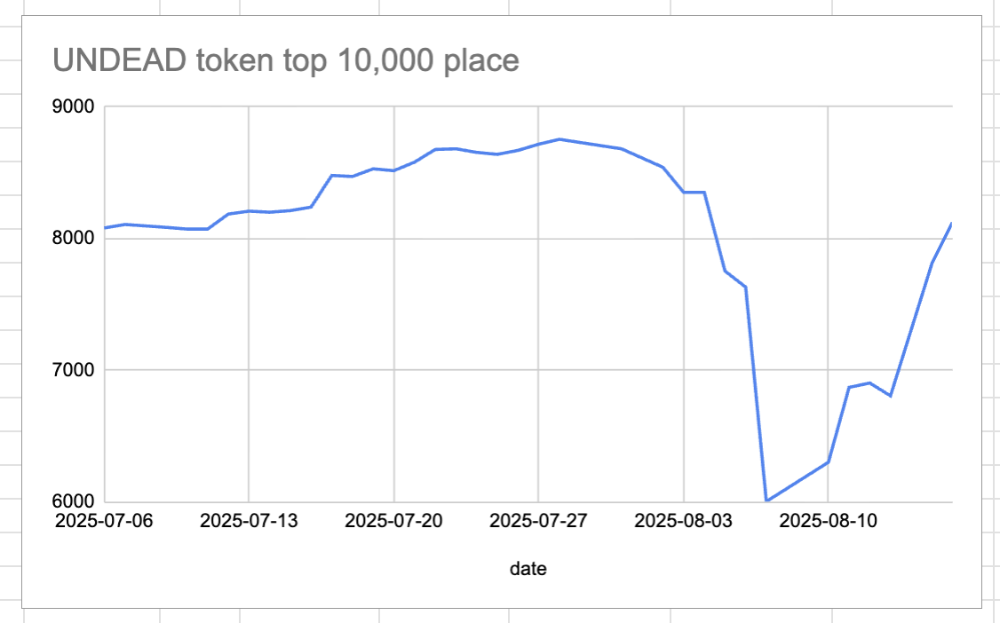
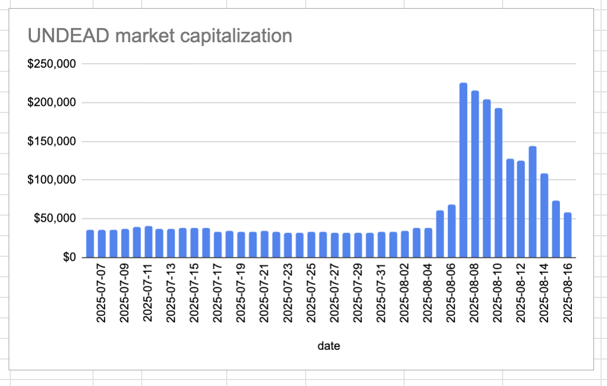
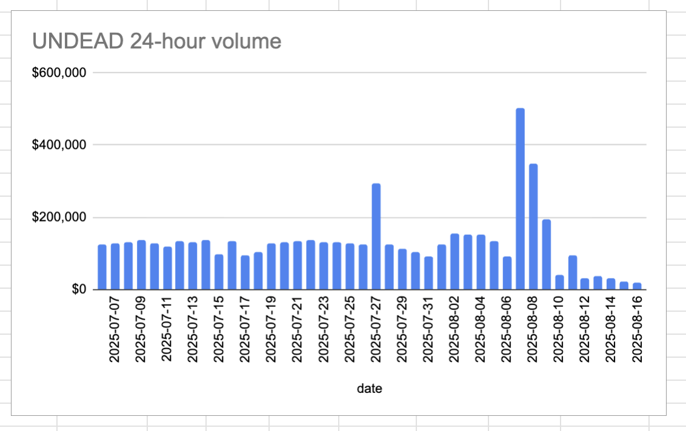

# 2025-08-16 Status of @UndeadBlocks / $UNDEAD 

 
 
 
 

* rank: 8124 
* quote: $0.00390 
* market cap: $58,482 
* 24-hr volume: $17,041 (δ: -$4,956 ) 

[UNDEAD data source](https://www.coingecko.com/en/coins/undead-blocks) 

When we get LPs funded on multiple blockchains, what will $UNDEAD look like? 

## $UNDEAD performance analysis, 2025-08-16 

* "δ" indicates change since 2025-07-17 
* "α" is annualized since 2025-07-17 

 
 
 
 

* rank: 8124 (δ: 4.20% ) , α: 51.08% 
* quote: $0.00390 (δ: 76.35% ) , α: 928.87% 
* market cap: $58,482 (δ: 76.22% ) , α: 927.33% 
* 24-hr volume: $17,041 (δ: -81.99% ) , α: -997.54% 

[2025-07-17 $UNDEAD report (archived)](https://github.com/pivoteur/biz/tree/main/blog/snapshot) 
