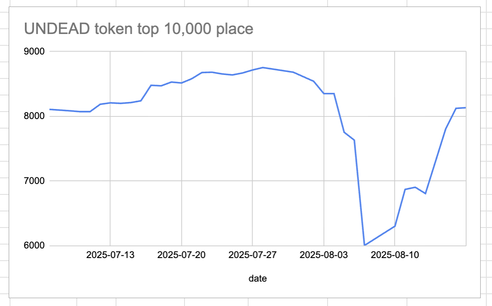

# 2025-08-17 Status of @UndeadBlocks / $UNDEAD 

 
 
 
 

* rank: 8134 
* quote: $0.00397 
* market cap: $59,445 
* 24-hr volume: $21,127 (δ: $4,086 ) 

[UNDEAD data source](https://www.coingecko.com/en/coins/undead-blocks) 

When we get LPs funded on multiple blockchains, what will $UNDEAD look like? 

## $UNDEAD performance analysis, 2025-08-17 

* "δ" indicates change since 2025-07-17 
* "α" is annualized since 2025-07-17 

 
 
 
 

* rank: 8134 (δ: 4.08% ) , α: 48.04% 
* quote: $0.00397 (δ: 79.33% ) , α: 934.05% 
* market cap: $59,445 (δ: 79.12% ) , α: 931.61% 
* 24-hr volume: $21,127 (δ: -77.67% ) , α: -914.52% 

[2025-07-17 $UNDEAD report (archived)](https://github.com/pivoteur/biz/tree/main/blog/snapshot) 

# PIVOTS

## Bridging $UNDEAD HOWTO

To prepare for opening pivots with little liquidity left in some pivot pools, I bridge $UNDEAD over from my @ethereum @Ledger wallet to my treasury on @avax using the @veraswapio bridge.

I created an [youtube HOWTO](https://x.com/pivocateur/status/1957223276775915766), demonstrating bridging $UNDEAD.
