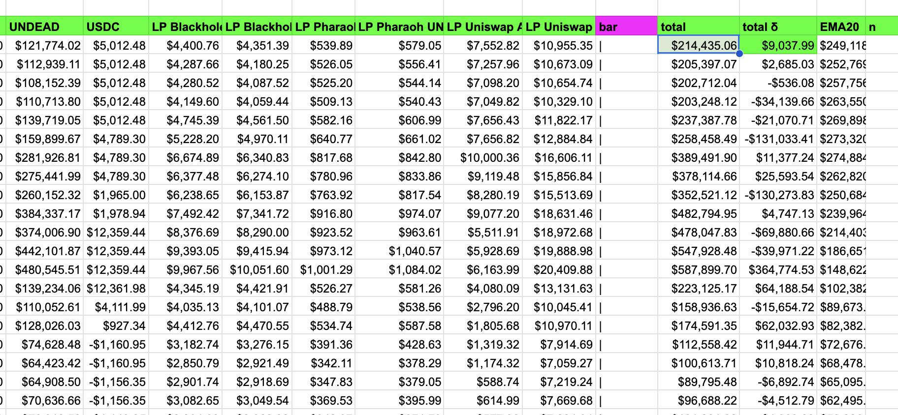

# State of the Pivot Protocol, 2025-08-19

News:

* An 8-fold increase in NAV
* partnership with Wagyu games
* our first $BTC-investor
* launching of our pivot pools

 
 
 

All detailed in our linkedin-post on the [state of the Pivot Protocol over the past 6 months](https://www.linkedin.com/feed/update/urn:li:activity:7363597728792080384/).

# 2025-08-19 Status of @UndeadBlocks / $UNDEAD 

 
 
 
 

* rank: 7888 
* quote: $0.00467 
* market cap: $69,632 
* 24-hr volume: $27,278 (δ: $3,075 ) 

[UNDEAD data source](https://www.coingecko.com/en/coins/undead-blocks) 

When we get LPs funded on multiple blockchains, the game released, and the Pivot protocol launched, what will $UNDEAD look like? 

## $UNDEAD performance analysis, 2025-08-19 

* "δ" indicates change since 2025-07-17 
* "α" is annualized since 2025-07-17 

 
 
 
 

* rank: 7888 (δ: 6.98% ) , α: 77.22% 
* quote: $0.00467 (δ: 111.31% ) , α: 1231.12% 
* market cap: $69,632 (δ: 109.82% ) , α: 1214.67% 
* 24-hr volume: $27,278 (δ: -71.17% ) , α: -787.19% 

[2025-07-17 $UNDEAD report (archived)](https://github.com/pivoteur/biz/tree/main/blog/snapshot) 
# DEX UNDEAD/USDC-swap Race 

Same swap; 4 DEX, 2025-08-19 

I swap 118000 $UNDEAD for: 

1. 501.93 $USDC on @PharaohExchange 

 

2. 500.58 $USDC on @BlackholeDex 

 

3. 502.12 $USDC on @KyberNetwork 

 

4. 502.34 $USDC on @LFJ_gg 💥 

 

Winner: @LFJ_gg (9-day streak) 

# Liquidity Pools.

First up, the $UNDEAD LPs on @PharaohExchange have earned neither yields nor fees since incept.

I remove liquidity from these pools on this DEX. 
