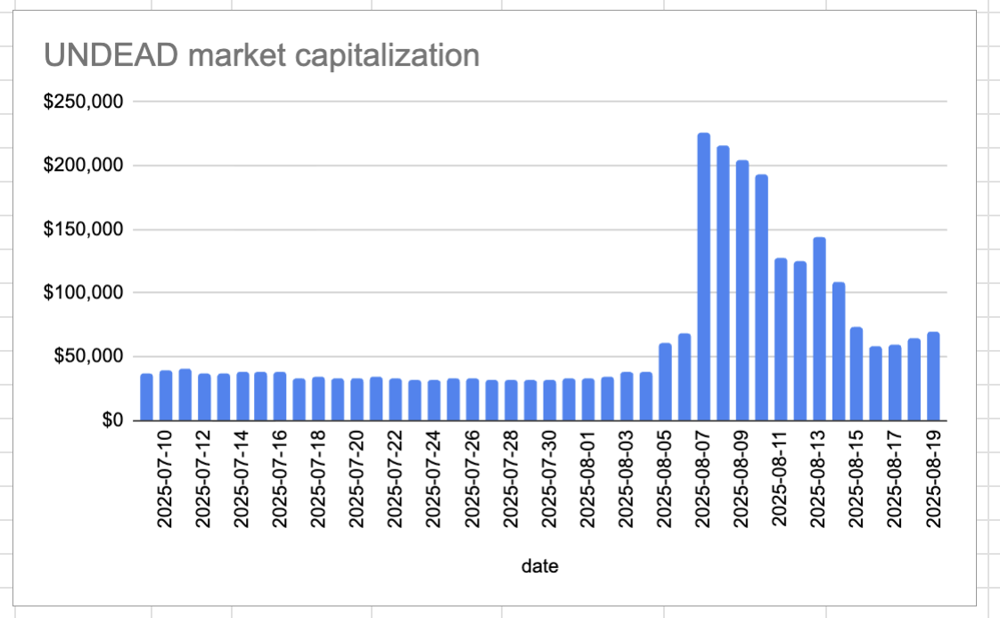

# State of the Pivot Protocol, 2025-08-19

News:

* An 8-fold increase in NAV
* partnership with Wagyu games
* our first $BTC-investor
* launching of our pivot pools

 
 
 

All detailed in our linkedin-post on the [state of the Pivot Protocol over the past 6 months](https://www.linkedin.com/feed/update/urn:li:activity:7363597728792080384/).

# 2025-08-19 Status of @UndeadBlocks / $UNDEAD 

 
 
 
 

* rank: 7888 
* quote: $0.00467 
* market cap: $69,632 
* 24-hr volume: $27,278 (δ: $3,075 ) 

[UNDEAD data source](https://www.coingecko.com/en/coins/undead-blocks) 

When we get LPs funded on multiple blockchains, the game released, and the Pivot protocol launched, what will $UNDEAD look like? 

