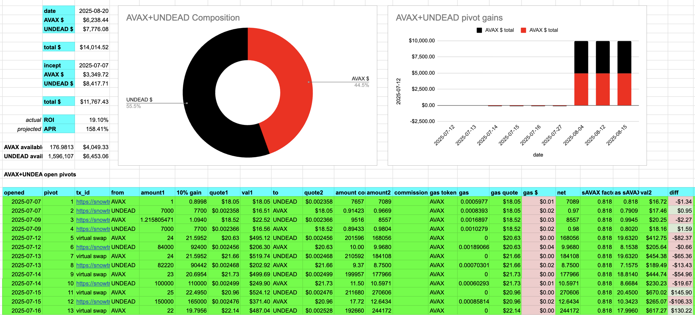

State of the Pivot Protocol, 2025-08-20

Good day, pivoteurs!

News:

* Our first investor increased their stake to 1.0 $BTC and 3M+ $UNDEAD into the pivot pools of the protocol
* This pushes the NAV of the Pivot Protocol above $300k

 
 
 

## Vault established and funded

* We have established a vault for the protocol with our first asset, 0.0005 $BTC, generated from yields on assets held.

# 2025-08-20 Status of @UndeadBlocks / $UNDEAD 

 
 
 
 

* rank: 8035 
* quote: $0.00408 
* market cap: $61,125 
* 24-hr volume: $22,858 (δ: -$4,420 ) 

[UNDEAD data source](https://www.coingecko.com/en/coins/undead-blocks) 

When we get LPs funded on multiple blockchains, the game released, and the Pivot protocol launched, what will $UNDEAD look like? 

## $UNDEAD performance analysis, 2025-08-20 

* "δ" indicates change since 2025-07-17 
* "α" is annualized since 2025-07-17 

 
 
 
 

* rank: 8035 (δ: 5.25% ) , α: 56.33% 
* quote: $0.00408 (δ: 84.40% ) , α: 906.02% 
* market cap: $61,125 (δ: 84.19% ) , α: 903.76% 
* 24-hr volume: $22,858 (δ: -75.84% ) , α: -814.19% 

[2025-07-17 $UNDEAD report (archived)](https://github.com/pivoteur/biz/tree/main/blog/snapshot) 
# DEX UNDEAD/USDC-swap Race 

Same swap; 3 DEX, 2025-08-20 

I swap 127000 $UNDEAD for: 

1. 500.64 $USDC on @BlackholeDex 

 

2. 500.29 $USDC on @KyberNetwork 

 

3. 505.02 $USDC on @LFJ_gg 💥 

 

Winner: @LFJ_gg (10-day streak) 
# Liquidity Pools 

* I harvest the yields from the LPs on @BlackholeDex and @Uniswap 

 

* swap the yields to $USDC, 

 

* then provide liquidity to the @Uniswap LP UNDEAD/USDC. 

 
 

The Uniswap UNDEAD LPs are as shown. 

# PIVOTS 

Let's start with the $UNDEAD pivot pools today.

## BTC+UNDEAD 

No close pivots. 

### Open BTC+UNDEAD pivots 

 
 

The meh δ makes no call, but I open an UNDEAD-on-BTC pivot, anyway. 

 

I also open an BTC-on-UNDEAD pivot. 

 

The BTC+UNDEAD pivot pool composition and γ-apportionment are as charted. 

 
 

## ETH+UNDEAD 

No close pivots. 

### Open ETH+UNDEAD pivots 

 
 

The positive δ calls to open an ETH-on-UNDEAD pivot, which I do. 

 

I also open an UNDEAD-on-ETH hedge. 

 

The ETH+UNDEAD pivot pool composition and γ-apportionment are as charted. 

 
 

## AVAX+UNDEAD 

No close pivots. 

### Open AVAX+UNDEAD pivots 

 
 

The meh δ makes no call, but I open an UNDEAD-on-AVAX pivot, anyway. 

 

I also open an AVAX-on-UNDEAD pivot. 

 

The AVAX+UNDEAD pivot pool composition and γ-apportionment are as charted. 

 
 
