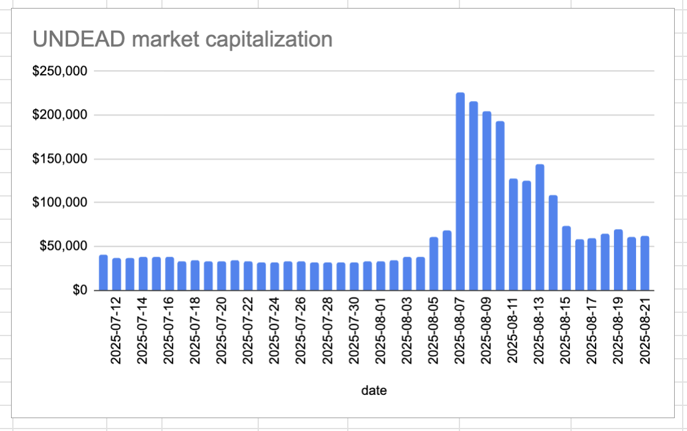

# 2025-08-21 Status of @UndeadBlocks / $UNDEAD 

 
 
 
 

* rank: 8047 
* quote: $0.00415 
* market cap: $62,209 
* 24-hr volume: $26,278 (δ: $3,420 ) 

[UNDEAD data source](https://www.coingecko.com/en/coins/undead-blocks) 

When we get LPs funded on multiple blockchains, the game released, and the Pivot protocol launched, what will $UNDEAD look like? 

## $UNDEAD performance analysis, 2025-08-21 

* "δ" indicates change since 2025-07-17 
* "α" is annualized since 2025-07-17 

 
 
 
 

* rank: 8047 (δ: 5.11% ) , α: 53.25% 
* quote: $0.00415 (δ: 87.56% ) , α: 913.15% 
* market cap: $62,209 (δ: 87.45% ) , α: 911.99% 
* 24-hr volume: $26,278 (δ: -72.23% ) , α: -753.22% 

[2025-07-17 $UNDEAD report (archived)](https://github.com/pivoteur/biz/tree/main/blog/snapshot) 
