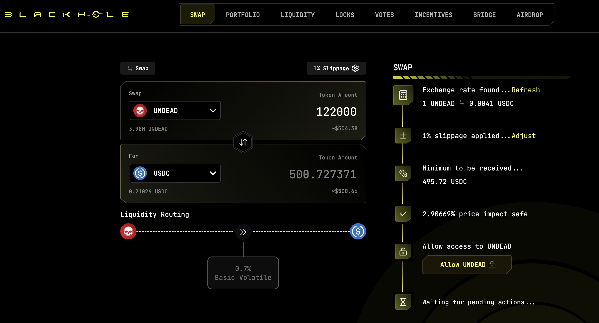
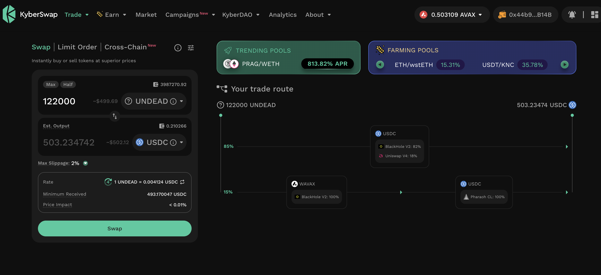
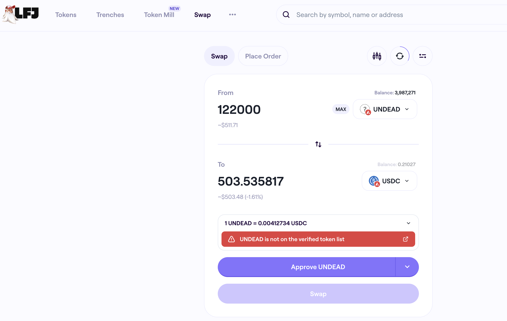

# State of the Pivot Protocol, 2025-08-22 

 
 
 
 

Good day, pivoteurs! 

## News

Some changes to our α front-end: 

* The dashboard has eliminated the redundant Echo pool. 
* The My Portfolio-mock-up has outlived its usefulness 
* The treasury now incorporates both the treasury and the (newly-created) vault 
 
# 2025-08-22 Status of @UndeadBlocks / $UNDEAD 

 
 
 
 

* rank: 8108 
* quote: $0.004064 
* market cap: $60,944 
* 24-hr volume: $35,958 (δ: $9,680 ) 

[UNDEAD data source](https://www.coingecko.com/en/coins/undead-blocks) 

When we get LPs funded on multiple blockchains, the game released, and the Pivot protocol launched, what will $UNDEAD look like? 

## $UNDEAD performance analysis, 2025-08-22 

* "δ" indicates change since 2025-07-17 
* "α" is annualized since 2025-07-17 

 
 
 
 

* rank: 8108 (δ: 4.39% ) , α: 44.48% 
* quote: $0.004064 (δ: 83.81% ) , α: 849.72% 
* market cap: $60,944 (δ: 83.64% ) , α: 848.02% 
* 24-hr volume: $35,958 (δ: -62.00% ) , α: -628.57% 

[2025-07-17 $UNDEAD report (archived)](https://github.com/pivoteur/biz/tree/main/blog/snapshot) 
# DEX UNDEAD/USDC-swap Race 

Same swap; 3 DEX, 2025-08-22 

I swap 122000 $UNDEAD for: 

1. 500.73 $USDC on @BlackholeDex 

 

2. 503.23 $USDC on @KyberNetwork 

 

3. 503.54 $USDC on @LFJ_gg 💥 

 

Winner: @LFJ_gg (12-day streak) 
