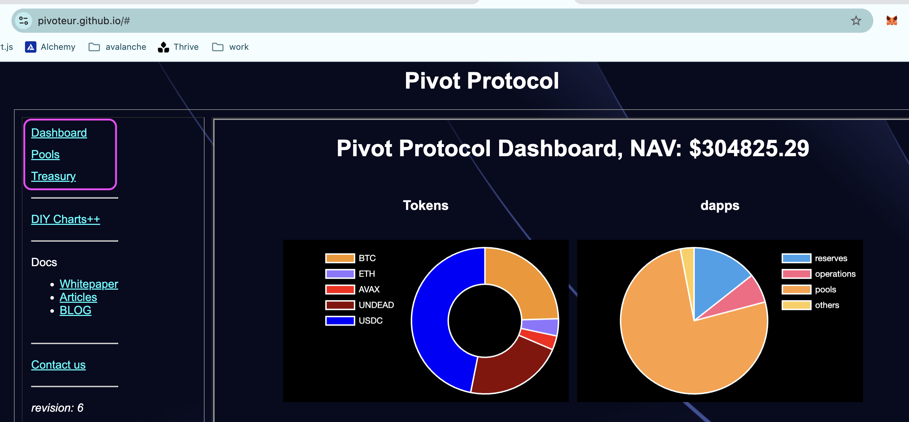

# State of the Pivot Protocol, 2025-08-22 

 
 
 
 

Good day, pivoteurs! 

## News

Some changes to our α front-end: 

* The dashboard has eliminated the redundant Echo pool. 
* The My Portfolio-mock-up has outlived its usefulness 
* The treasury now incorporates both the treasury and the (newly-created) vault 
 
# 2025-08-22 Status of @UndeadBlocks / $UNDEAD 

 
 
 
 

* rank: 8108 
* quote: $0.004064 
* market cap: $60,944 
* 24-hr volume: $35,958 (δ: $9,680 ) 

[UNDEAD data source](https://www.coingecko.com/en/coins/undead-blocks) 

When we get LPs funded on multiple blockchains, the game released, and the Pivot protocol launched, what will $UNDEAD look like? 

