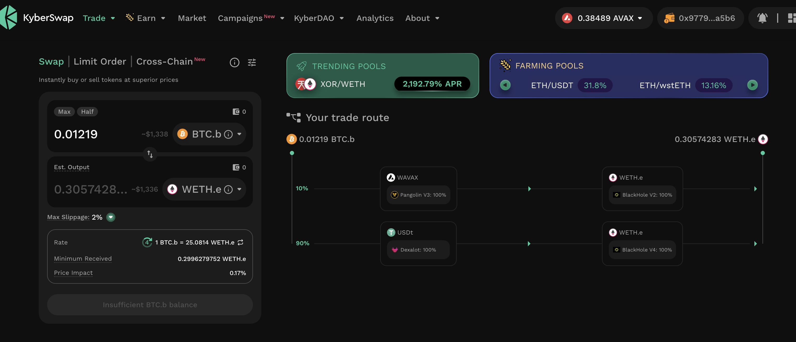
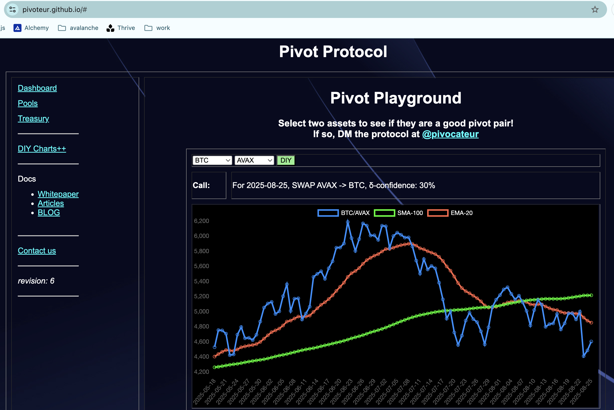

# 2025-08-25 Status of @UndeadBlocks / $UNDEAD 

 
 
 
 

* rank: 8169 
* quote: $0.004066 
* market cap: $60,885 
* 24-hr volume: $71,644 (δ: $673 ) 

[UNDEAD data source](https://www.coingecko.com/en/coins/undead-blocks) 

When we get LPs funded on multiple blockchains, the game released, and the Pivot protocol launched, what will $UNDEAD look like? 

## $UNDEAD performance analysis, 2025-08-25 

* "δ" indicates change since 2025-07-17 
* "α" is annualized since 2025-07-17 

 
 
 
 

* rank: 8169 (δ: 3.67% ) , α: 34.32% 
* quote: $0.004066 (δ: 83.90% ) , α: 785.21% 
* market cap: $60,885 (δ: 83.46% ) , α: 781.13% 
* 24-hr volume: $71,644 (δ: -24.28% ) , α: -227.24% 

[2025-07-17 $UNDEAD report (archived)](https://github.com/pivoteur/biz/tree/main/blog/snapshot) 
# DEX UNDEAD/USDC-swap Race 

Same swap; 3 DEX, 2025-08-25 

I swap 125500 $UNDEAD for: 

1. 500.60 $USDC on @BlackholeDex 

 

2. 501.77 $USDC on @KyberNetwork 

 

3. 501.84 $USDC on @LFJ_gg 💥 

 

Winner: @LFJ_gg (15-day streak) 

# Liquidity Pools 

* I harvest the yields from the LPs on @BlackholeDex and @Uniswap 

 

* swap the yields to $USDC, 

 

* then provide liquidity to the @Uniswap LP UNDEAD/USDC. 

 
 

The Uniswap UNDEAD LPs are as shown. 

# Bitcoin vault 

* I swap some accumulated $AVAX to $BTC.b 

 

* I send this $BTC.b to the vault 

 

# State of the Pivot Protocol, 2025-08-25 

 
 
 

Good day, pivoteurs! 

News: $BTC down; $UNDEAD down; ... it looks like there will be some pivot-opportunities today! 😎 

# PIVOTS 

## BTC+ETH 

No close pivots. 

### Open BTC+ETH pivots 

 
 

The negative δ calls to open an ETH-on-BTC pivot, which I do. 

 

I also open an BTC-on-ETH hedge. 

 

The BTC+ETH pivot pool composition and γ-apportionment are as charted. 

 
 

## BTC+AVAX 

 

I close 1 BTC-on-AVAX pivot for gains of: 

* actual ROI: 10.31% / 940.92% APR projected 
* or: 0.008583 $BTC -> $AVAX -> 0.009468 $BTC 
* or: $98.59 gain on a pivot of $993.20 

 
 

I reinvest the gains or distribute 80% to stakers. 

### Open BTC+AVAX pivots 

 
 

The negative δ calls to open an AVAX-on-BTC pivot, which I do. 

 

I also open an BTC-on-AVAX hedge. 

 

The BTC+AVAX pivot pool composition and γ-apportionment are as charted. 

 
 
## BTC+USDC 

 

I close 1 BTC-on-USDC pivot for gains of: 

* actual ROI: 10.45% / 254.32% APR projected 
* or: 0.008219 $BTC -> $USDC -> 0.009078 $BTC 
* or: $95.69 gain on a pivot of $996.13 

 
 

I reinvest the gains or distribute 80% to stakers. 

