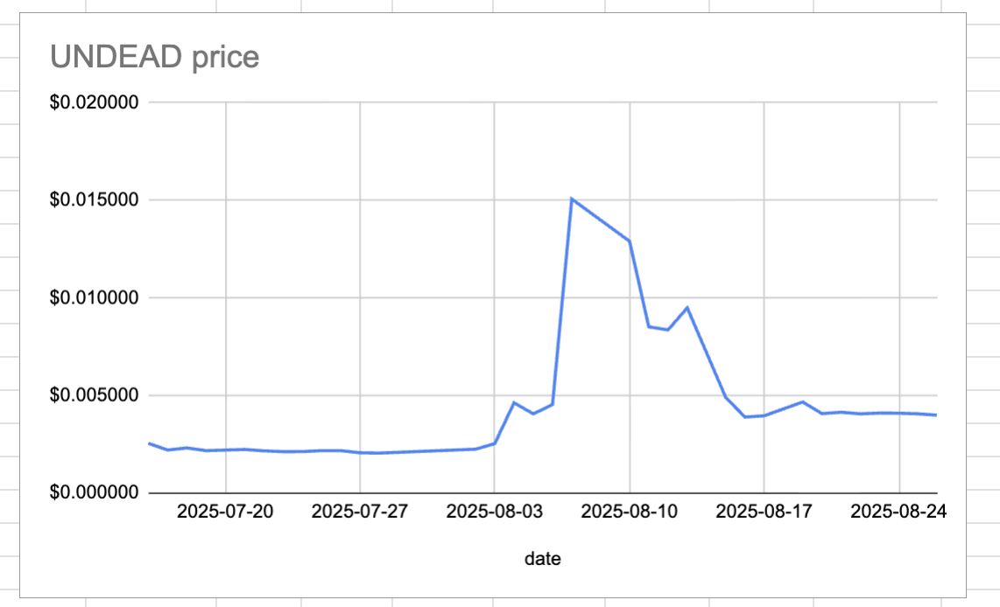
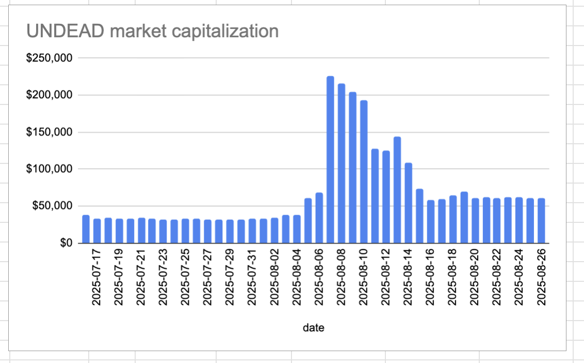
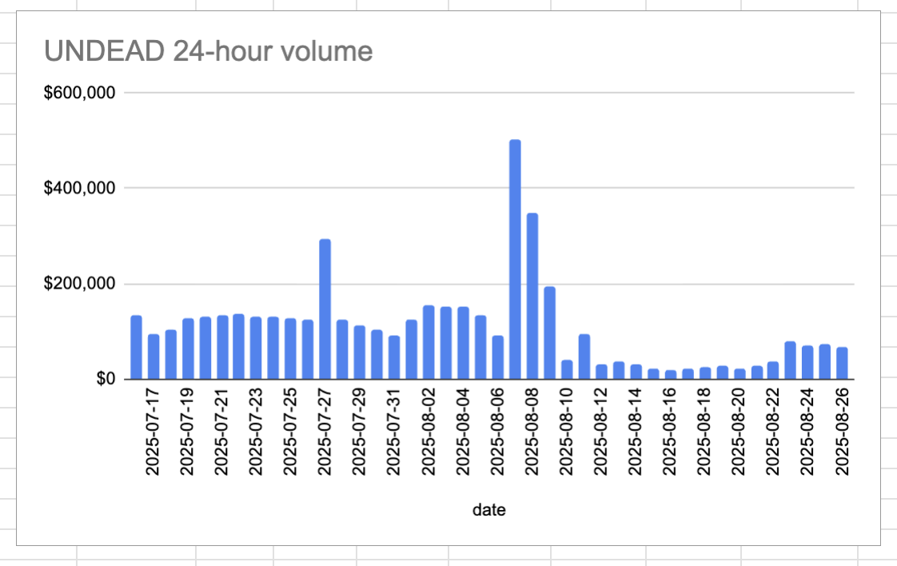

# 2025-08-26 Status of @UndeadBlocks / $UNDEAD 

 
 
 
 

* rank: 8120 
* quote: $0.003995 
* market cap: $60,677 
* 24-hr volume: $68,180 (δ: -$3,464 ) 

[UNDEAD data source](https://www.coingecko.com/en/coins/undead-blocks) 

When we get LPs funded on multiple blockchains, the game released, and the Pivot protocol launched, what will $UNDEAD look like? 

## $UNDEAD performance analysis, 2025-08-26 

* "δ" indicates change since 2025-07-17 
* "α" is annualized since 2025-07-17 

 
 
 
 

* rank: 8120 (δ: 4.25% ) , α: 38.74% 
* quote: $0.003995 (δ: 80.69% ) , α: 736.27% 
* market cap: $60,677 (δ: 82.83% ) , α: 755.87% 
* 24-hr volume: $68,180 (δ: -27.94% ) , α: -254.97% 

[2025-07-17 $UNDEAD report (archived)](https://github.com/pivoteur/biz/tree/main/blog/snapshot) 
