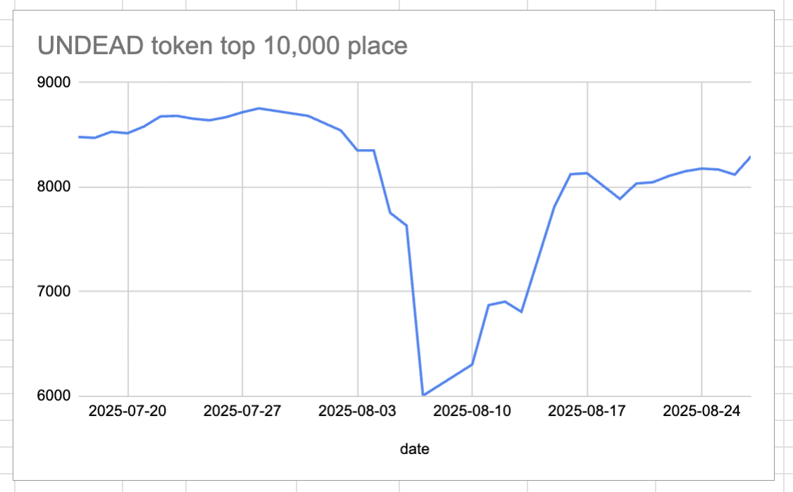
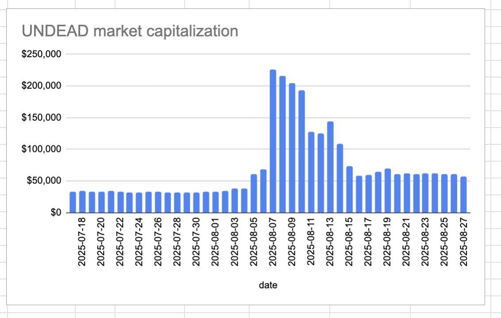

# 2025-08-27 Status of @UndeadBlocks / $UNDEAD 

 
 
 
 

* rank: 8296 
* quote: $0.003793 
* market cap: $56,905 
* 24-hr volume: $77,328 (δ: $9,149 ) 

[UNDEAD data source](https://www.coingecko.com/en/coins/undead-blocks) 

When we get LPs funded on multiple blockchains, the game released, and the Pivot protocol launched, what will $UNDEAD look like? 

## $UNDEAD performance analysis, 2025-08-27 

* "δ" indicates change since 2025-07-17 
* "α" is annualized since 2025-07-17 

 
 
 
 

* rank: 8296 (δ: 2.17% ) , α: 19.32% 
* quote: $0.003793 (δ: 71.55% ) , α: 636.98% 
* market cap: $56,905 (δ: 71.47% ) , α: 636.25% 
* 24-hr volume: $77,328 (δ: -18.27% ) , α: -162.67% 

[2025-07-17 $UNDEAD report (archived)](https://github.com/pivoteur/biz/tree/main/blog/snapshot) 
# DEX UNDEAD/USDC-swap Race 

Same swap; 3 DEX, 2025-08-27 

I swap 137000 $UNDEAD for: 

1. 501.43 $USDC on @BlackholeDex 

 

2. 504.75 $USDC on @KyberNetwork 

 

3. 504.91 $USDC on @LFJ_gg 💥 

 

Winner: @LFJ_gg 💥 Renewed title-holder! 

