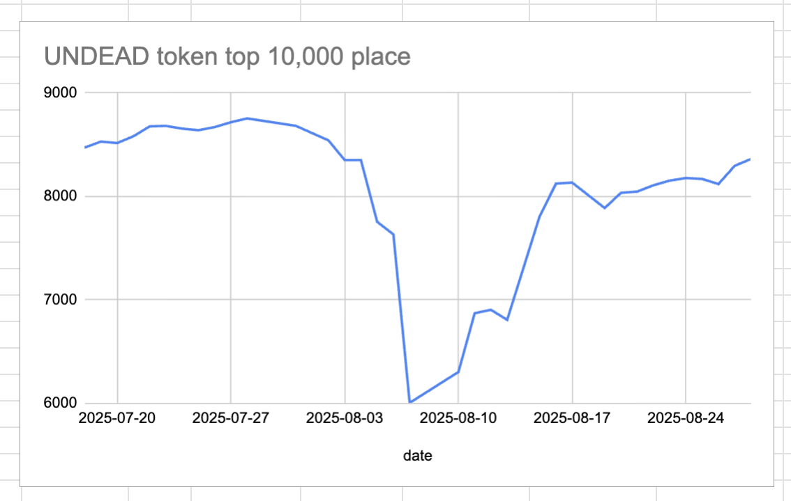
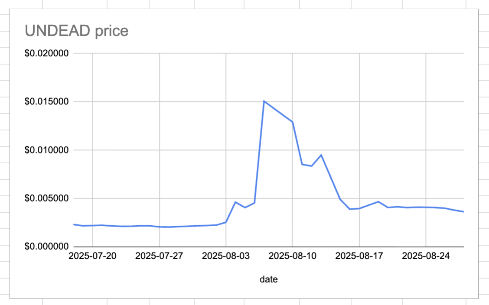
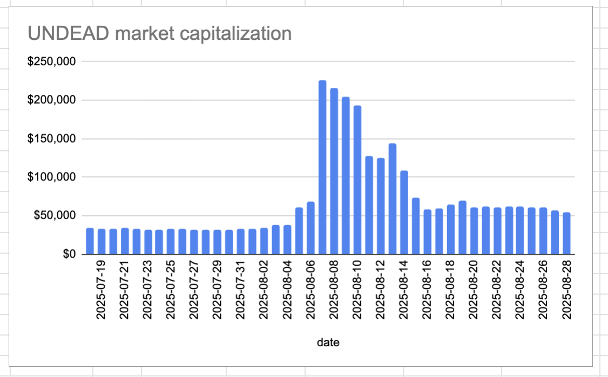
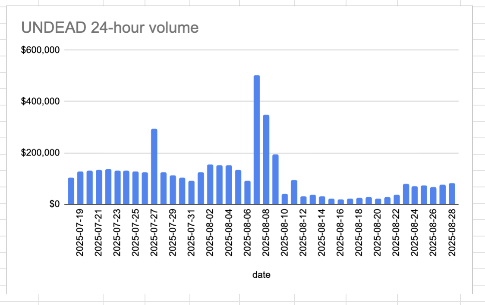

# 2025-08-28 Status of @UndeadBlocks / $UNDEAD 

 
 
 
 

* rank: 8362 
* quote: $0.003632 
* market cap: $54,849 
* 24-hr volume: $80,899 (δ: $3,570 ) 

[UNDEAD data source](https://www.coingecko.com/en/coins/undead-blocks) 

When we get LPs funded on multiple blockchains, the game released, and the Pivot protocol launched, what will $UNDEAD look like? 

## $UNDEAD performance analysis, 2025-08-28 

* "δ" indicates change since 2025-07-17 
* "α" is annualized since 2025-07-17 

 
 
 
 

* rank: 8362 (δ: 1.39% ) , α: 12.09% 
* quote: $0.003632 (δ: 64.27% ) , α: 558.53% 
* market cap: $54,849 (δ: 65.27% ) , α: 567.25% 
* 24-hr volume: $80,899 (δ: -14.50% ) , α: -126.01% 

[2025-07-17 $UNDEAD report (archived)](https://github.com/pivoteur/biz/tree/main/blog/snapshot) 
