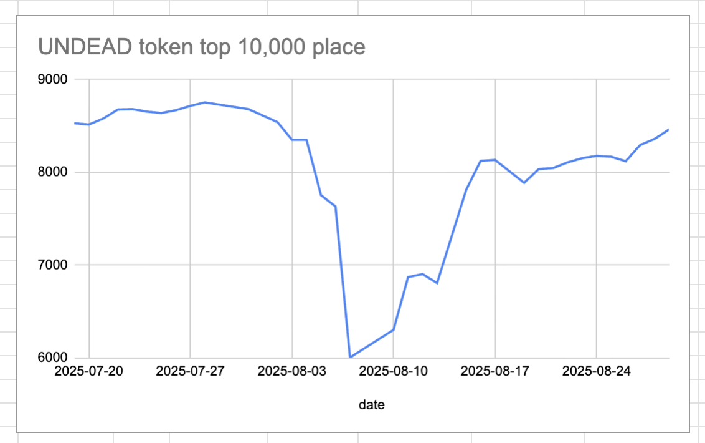
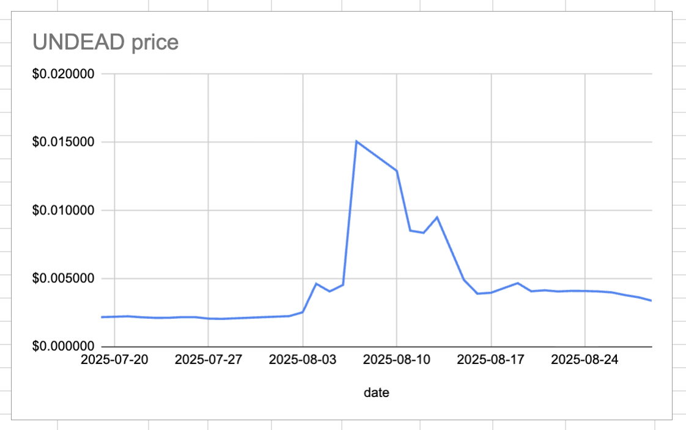
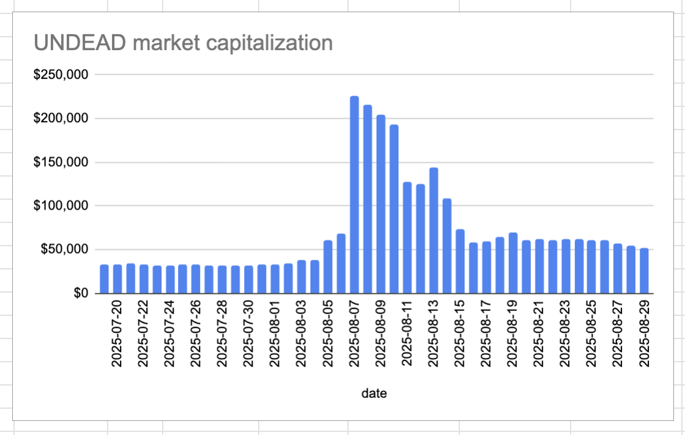
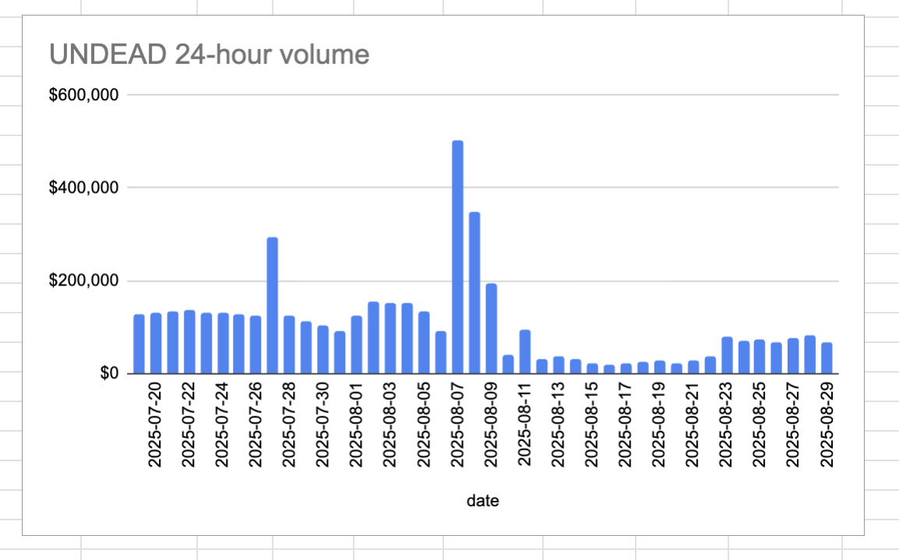

# 2025-08-29 Status of @UndeadBlocks / $UNDEAD 

 
 
 
 

* rank: 8464 
* quote: $0.003378 
* market cap: $51,206 
* 24-hr volume: $65,986 (δ: -$14,913 ) 

[UNDEAD data source](https://www.coingecko.com/en/coins/undead-blocks) 

When we get LPs funded on multiple blockchains, the game released, and the Pivot protocol launched, what will $UNDEAD look like? 

## $UNDEAD performance analysis, 2025-08-29 

* "δ" indicates change since 2025-07-17 
* "α" is annualized since 2025-07-17 

 
 
 
 

* rank: 8464 (δ: 0.19% ) , α: 1.60% 
* quote: $0.003378 (δ: 52.78% ) , α: 448.03% 
* market cap: $51,206 (δ: 54.30% ) , α: 460.88% 
* 24-hr volume: $65,986 (δ: -30.26% ) , α: -256.86% 

[2025-07-17 $UNDEAD report (archived)](https://github.com/pivoteur/biz/tree/main/blog/snapshot) 

