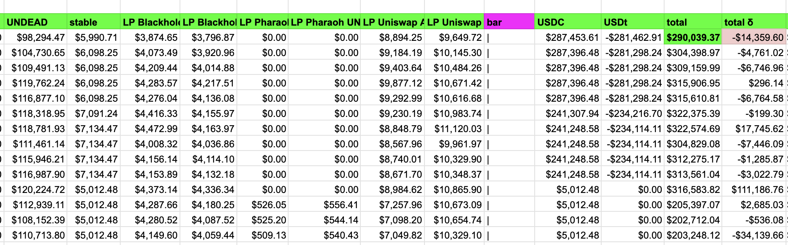

# 2025-08-29 Status of @UndeadBlocks / $UNDEAD 

 
 
 
 

* rank: 8464 
* quote: $0.003378 
* market cap: $51,206 
* 24-hr volume: $65,986 (δ: -$14,913 ) 

[UNDEAD data source](https://www.coingecko.com/en/coins/undead-blocks) 

When we get LPs funded on multiple blockchains, the game released, and the Pivot protocol launched, what will $UNDEAD look like? 

## $UNDEAD performance analysis, 2025-08-29 

* "δ" indicates change since 2025-07-17 
* "α" is annualized since 2025-07-17 

 
 
 
 

* rank: 8464 (δ: 0.19% ) , α: 1.60% 
* quote: $0.003378 (δ: 52.78% ) , α: 448.03% 
* market cap: $51,206 (δ: 54.30% ) , α: 460.88% 
* 24-hr volume: $65,986 (δ: -30.26% ) , α: -256.86% 

[2025-07-17 $UNDEAD report (archived)](https://github.com/pivoteur/biz/tree/main/blog/snapshot) 

# DEX UNDEAD/USDC-swap Race 

Same swap; 3 DEX, 2025-08-29 

I swap 160000 $UNDEAD for: 

1. 503.28 $USDC on @BlackholeDex 

 

2. 507.70 $USDC on @KyberNetwork 

 

3. 507.83 $USDC on @LFJ_gg 💥 

 

Winner: @LFJ_gg (3-day streak) 

# Liquidity Pools 

* I harvest the yields from the LPs on @BlackholeDex and @Uniswap 

 

* swap the yields to $USDC, 

 

* then provide liquidity to the @Uniswap LP UNDEAD/USDC. 

 
 

The Uniswap UNDEAD LPs are as shown. 

# Bitcoin vault 

* I swap some accumulated $AVAX to $BTC.b 

 

* I send this $BTC.b to the vault 

 

# State of the Pivot Protocol, 2025-08-29 

 
 

Good day, pivoteurs! 

News: I am sad to report that the Pivot protocol is up only 12-fold. jk. Some people look at price-fluctuations as the End of the World. 

 

Yes, this is the first time in 25 days that the $UNDEAD reserve has fallen below $100k. Am I worried? No. To me, this is another Friday, where I am up 12-fold. #perspective 

* 50M $UNDEAD = $170,600.00 reserve 
* 1 $BTC and 3M $UNDEAD = $118,856.00 invested 

* Pivot Protocol = $290,039.37 NAV 

This shows the protocol has generated $583.37 in value. 

# PIVOTS 

## BTC+ETH 

No close pivots. 

### Open BTC+ETH pivots 

 
 

The negative δ calls to open an ETH-on-BTC pivot, which I do. 

 

I also open an BTC-on-ETH hedge. 

 

The BTC+ETH pivot pool composition and γ-apportionment are as charted. 

 
 
