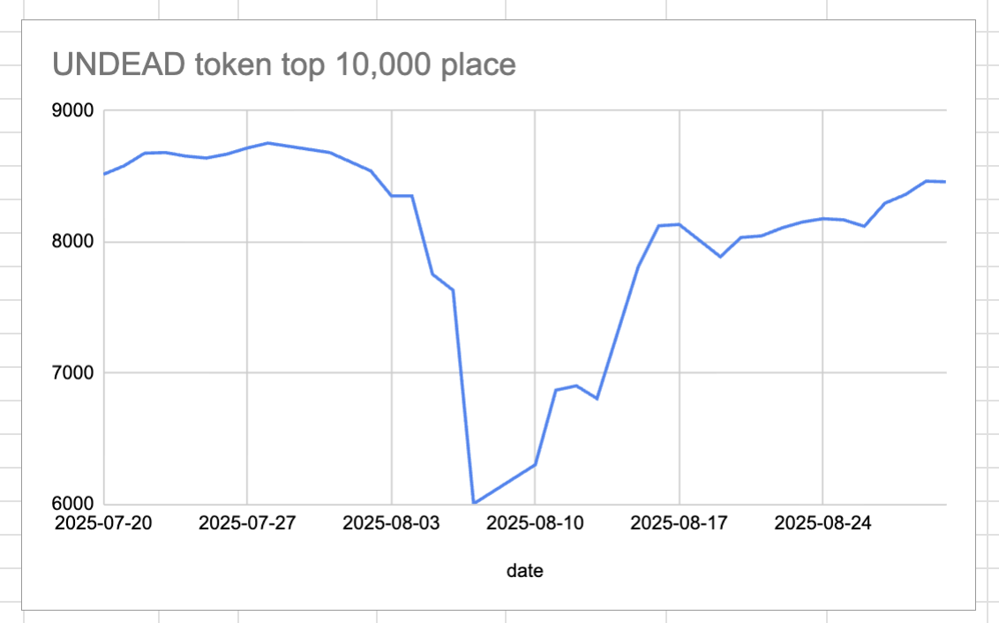
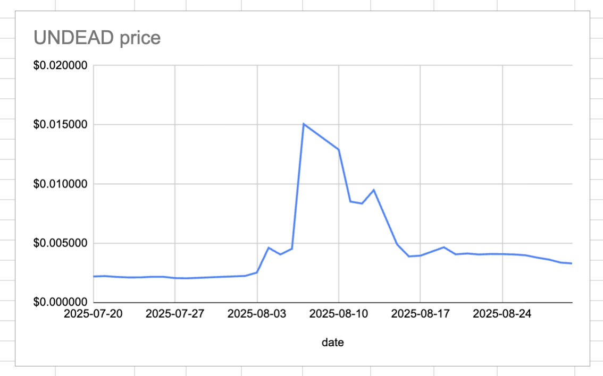
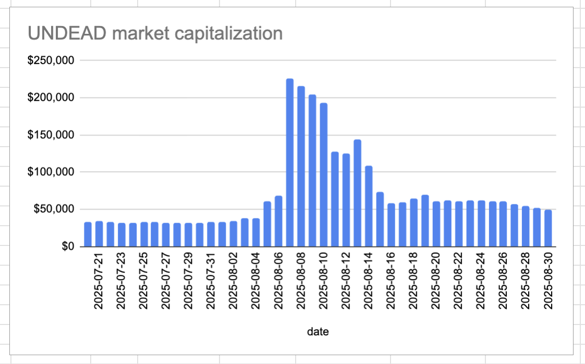
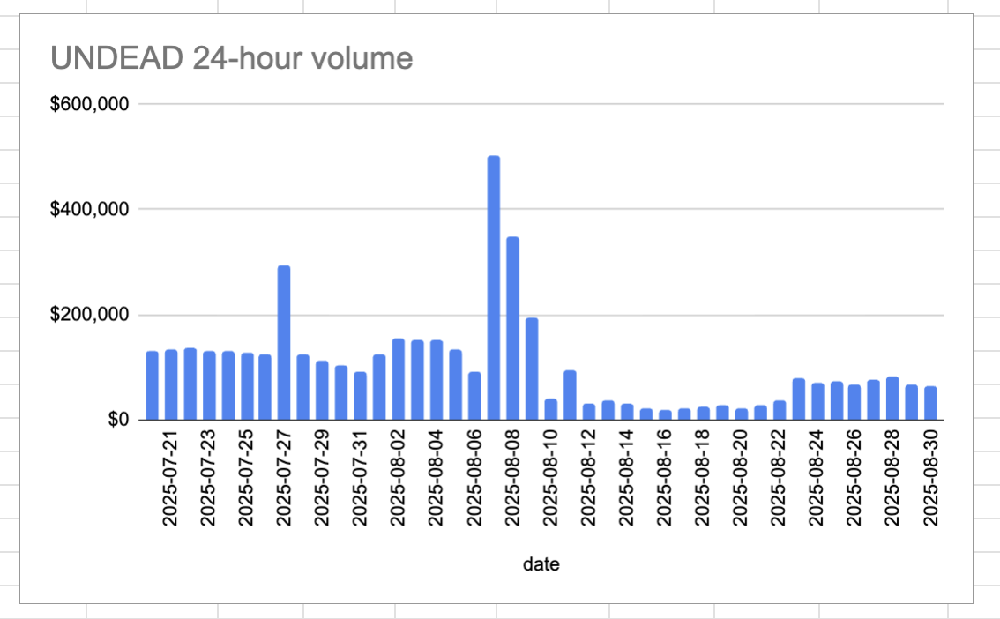
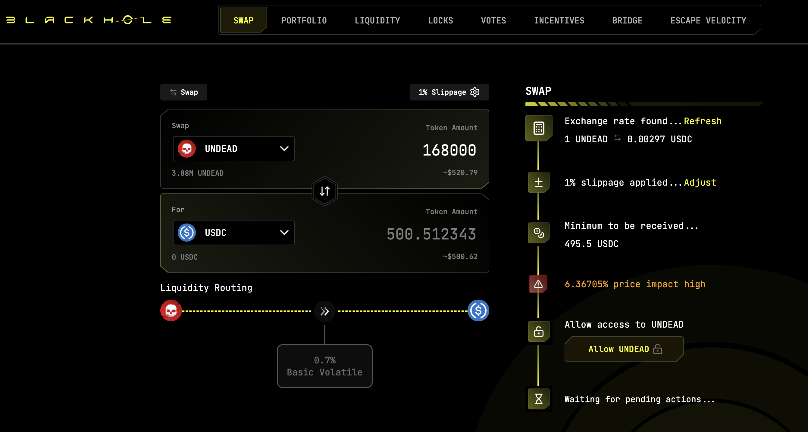
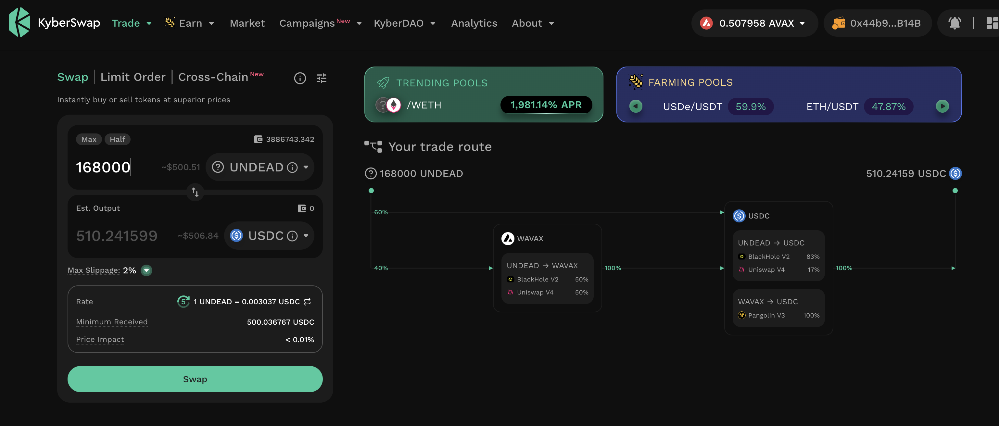
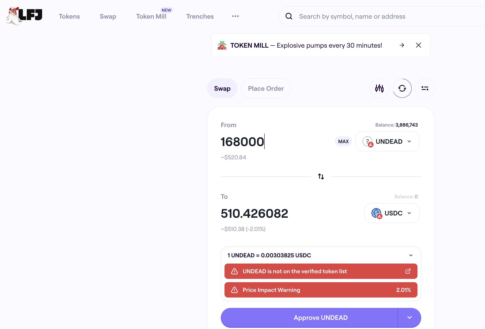

# 2025-08-30 Status of @UndeadBlocks / $UNDEAD 

 
 
 
 

* rank: 8459 
* quote: $0.003308 
* market cap: $49,612 
* 24-hr volume: $62,818 (δ: -$3,168 ) 

[UNDEAD data source](https://www.coingecko.com/en/coins/undead-blocks) 

When we get LPs funded on multiple blockchains, the game released, and the Pivot protocol launched, what will $UNDEAD look like? 

## $UNDEAD performance analysis, 2025-08-30 

* "δ" indicates change since 2025-07-17 
* "α" is annualized since 2025-07-17 

 
 
 
 

* rank: 8459 (δ: 0.25% ) , α: 2.05% 
* quote: $0.003308 (δ: 49.62% ) , α: 411.58% 
* market cap: $49,612 (δ: 49.49% ) , α: 410.57% 
* 24-hr volume: $62,818 (δ: -33.61% ) , α: -278.80% 

[2025-07-17 $UNDEAD report (archived)](https://github.com/pivoteur/biz/tree/main/blog/snapshot) 

# DEX UNDEAD/USDC-swap Race 

Same swap; 3 DEX, 2025-08-30 

I swap 168000 $UNDEAD for: 

1. 500.51 $USDC on @BlackholeDex 

 

2. 510.24 $USDC on @KyberNetwork 

 

3. 510.43 $USDC on @LFJ_gg 💥 

 

Winner: @LFJ_gg (4-day streak) 

