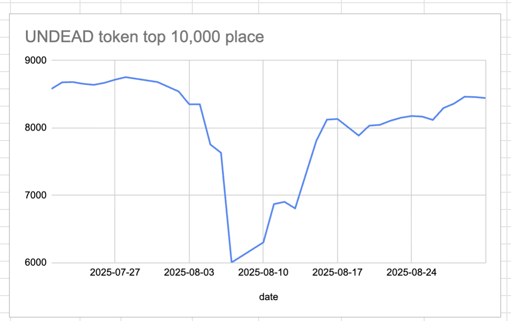
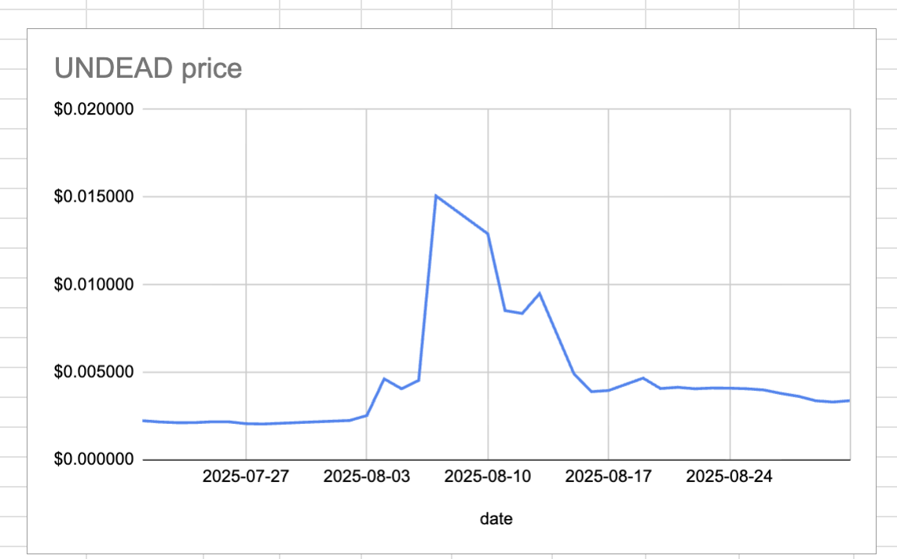
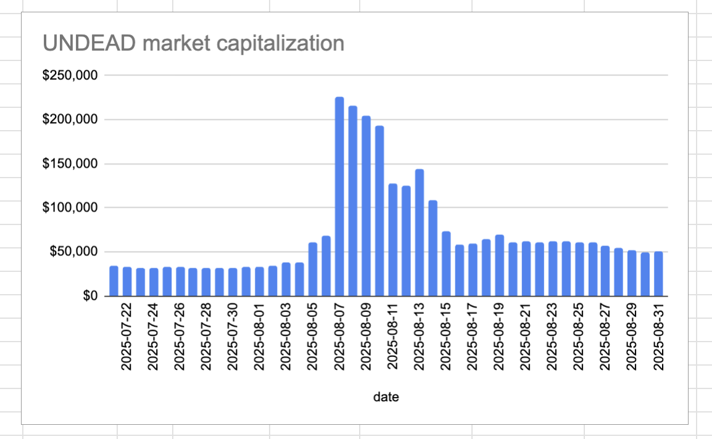
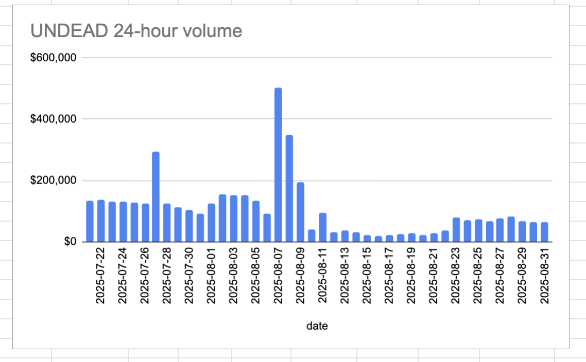

# 2025-08-31 Status of @UndeadBlocks / $UNDEAD 

 
 
 
 

* rank: 8444 
* quote: $0.003386 
* market cap: $50,578 
* 24-hr volume: $63,506 (δ: $687 ) 

[UNDEAD data source](https://www.coingecko.com/en/coins/undead-blocks) 

When we get LPs funded on multiple blockchains, the game released, and the Pivot protocol launched, what will $UNDEAD look like? 

## $UNDEAD performance analysis, 2025-08-31 

* "δ" indicates change since 2025-07-17 
* "α" is annualized since 2025-07-17 

 
 
 
 

* rank: 8444 (δ: 0.42% ) , α: 3.44% 
* quote: $0.003386 (δ: 53.14% ) , α: 431.05% 
* market cap: $50,578 (δ: 52.40% ) , α: 425.05% 
* 24-hr volume: $63,506 (δ: -32.88% ) , α: -266.71% 

[2025-07-17 $UNDEAD report (archived)](https://github.com/pivoteur/biz/tree/main/blog/snapshot) 

