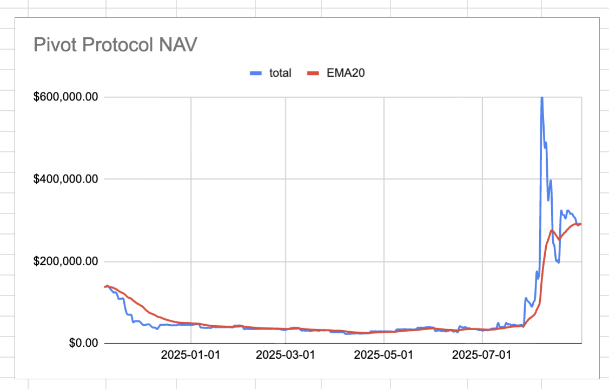
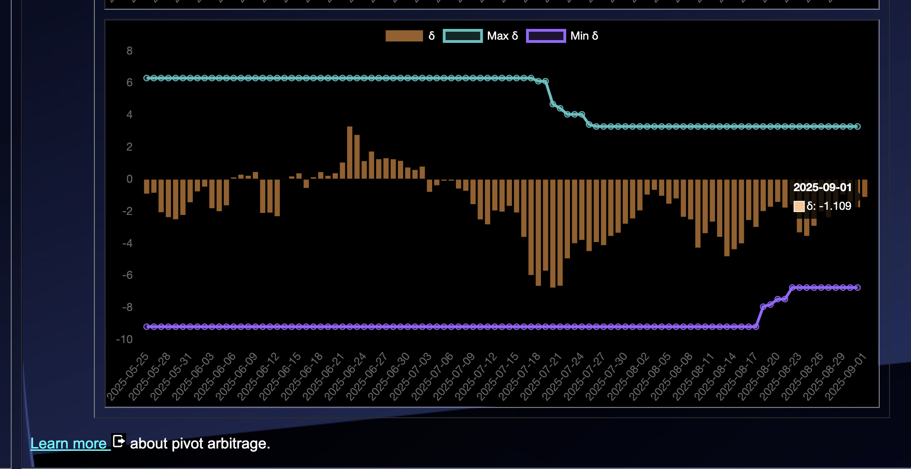
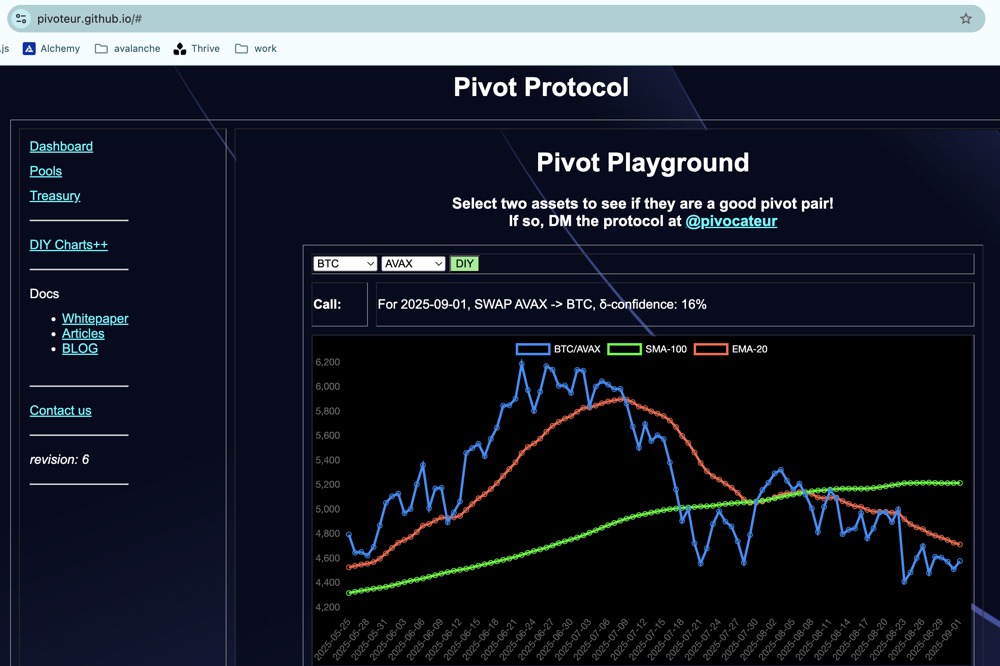

# 2025-09-01 Status of @UndeadBlocks / $UNDEAD 

 
 
 
 

* rank: 8506 
* quote: $0.003269 
* market cap: $49,245 
* 24-hr volume: $64,992 (δ: $1,486 ) 

[UNDEAD data source](https://www.coingecko.com/en/coins/undead-blocks) 

When we get LPs funded on multiple blockchains, the game released, and the Pivot protocol launched, what will $UNDEAD look like? 

## $UNDEAD performance analysis, 2025-09-01 

* "δ" indicates change since 2025-07-17 
* "α" is annualized since 2025-07-17 

 
 
 
 

* rank: 8506 (δ: -0.31% ) , α: -2.43% 
* quote: $0.003269 (δ: 47.85% ) , α: 379.69% 
* market cap: $49,245 (δ: 48.39% ) , α: 383.95% 
* 24-hr volume: $64,992 (δ: -31.31% ) , α: -248.45% 

[2025-07-17 $UNDEAD report (archived)](https://github.com/pivoteur/biz/tree/main/blog/snapshot) 

# DEX UNDEAD/USDC-swap Race 

Same swap; 3 DEX, 2025-09-01 

I swap 177000 $UNDEAD for: 

1. 501.12 $USDC on @BlackholeDex 

 

2. 507.45 $USDC on @KyberNetwork 

 

3. 508.24 $USDC on @LFJ_gg 💥 

 

Winner: @LFJ_gg (6-day streak) 

# Vote for $UNDEAD LPs on Blackhole 

2025-09-01 

Good day, pivoteurs! 

A new day; a new Epoch on @BlackholeDex. 

Reminder to go [vote](https://blackhole.xyz/vote) for the @UndeadBlocks $UNDEAD liquidity pools on that DEX. Reminder to go to https://blackhole.xyz/vote and vote for the @UndeadBlocks $UNDEAD liquidity pools on that DEX. 

 
 

[HOWTO vote instructions](https://x.com/pivocateur/status/1945637734682341791) HOWTO vote instructions: https://x.com/pivocateur/status/1945637734682341791 

#IVotedForUNDEAD 

# Liquidity Pools 

* I harvest the yields from the LPs on @BlackholeDex and @Uniswap 

 

* swap the yields to $USDC, 

 

* then provide liquidity to the @Uniswap LP UNDEAD/USDC. 

 
 

The Uniswap UNDEAD LPs are as shown. 

# Bitcoin vault 

* I swap some accumulated $AVAX to $BTC.b 

 

* I send this $BTC.b to the vault 

 

# State of the Pivot Protocol, 2025-09-01 

 
 
 

Good day, pivoteurs! 

News: While the $UNDEAD reserves settle just below $100k, the protocol NAV levels with the EMA-20 at just under $290k, finding its value independent of $UNDEAD token-price. Value-gains going forward will be investments and pivots. 

## Pivot Protocol Snapshot 

 
 
 

### Custody 

* 50M $UNDEAD = $163,450 

### Investments 

* 1 $BTC = $108,776 
* 3.501M $UNDEAD = $11,445 

total: $283,671 

### Pivot Protocol 

* NAV = $288,559 
* reinvestments/distributions = $15,238 

This shows the protocol has generated $20,126 in value. 

# PIVOTS 

## BTC+ETH 

No close pivots. 

### Open BTC+ETH pivots 

 
 

The negative δ calls to open an ETH-on-BTC pivot, which I do. 

 

I also open an BTC-on-ETH hedge. 

 

The BTC+ETH pivot pool composition and γ-apportionment are as charted. 

 
 

## BTC+AVAX 

No close pivots. 

### Open BTC+AVAX pivots 

 
 

The negative δ calls to open an AVAX-on-BTC pivot, which I do. 

 

I also open an BTC-on-AVAX hedge. 

 

The BTC+AVAX pivot pool composition and γ-apportionment are as charted. 

 
 

