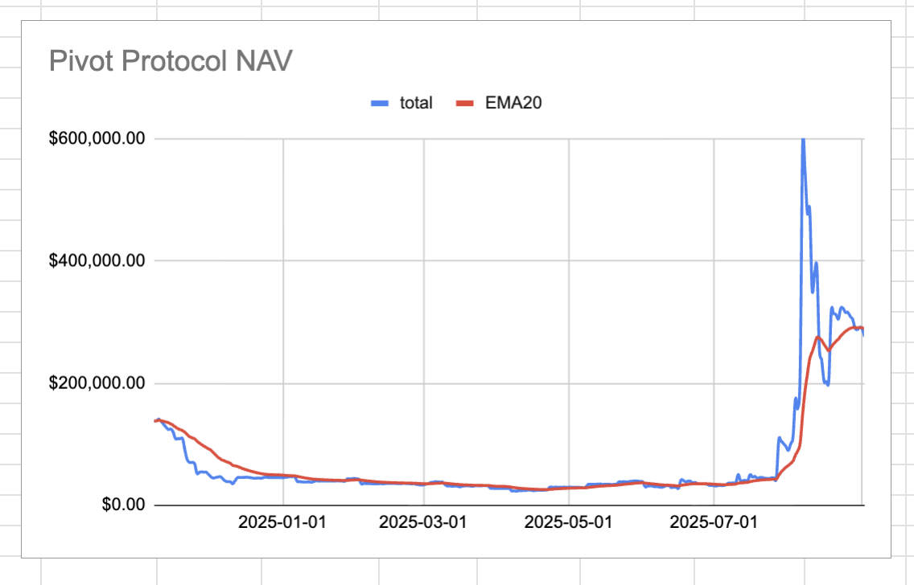
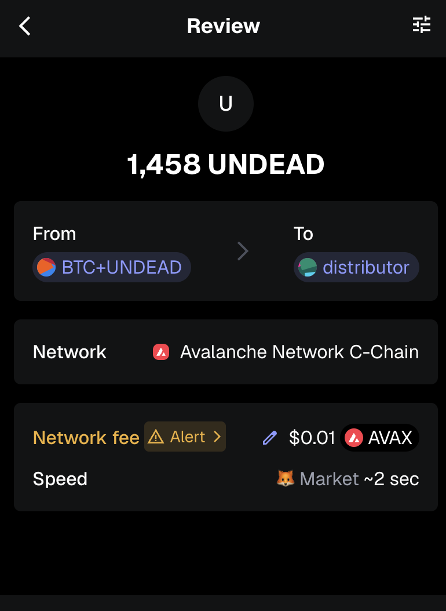

# 2025-09-02 Status of @UndeadBlocks / $UNDEAD 

 
 
 
 

* rank: 8721 
* quote: $0.002899 
* market cap: $42,975 
* 24-hr volume: $67,806 (δ: $2,815 ) 

[UNDEAD data source](https://www.coingecko.com/en/coins/undead-blocks) 

When we get LPs funded on multiple blockchains, the game released, and the Pivot protocol launched, what will $UNDEAD look like? 

## $UNDEAD performance analysis, 2025-09-02 

* "δ" indicates change since 2025-07-17 
* "α" is annualized since 2025-07-17 

 
 
 
 

* rank: 8721 (δ: -2.84% ) , α: -22.07% 
* quote: $0.002899 (δ: 31.12% ) , α: 241.65% 
* market cap: $42,975 (δ: 29.50% ) , α: 229.06% 
* 24-hr volume: $67,806 (δ: -28.34% ) , α: -220.06% 

[2025-07-17 $UNDEAD report (archived)](https://github.com/pivoteur/biz/tree/main/blog/snapshot) 

# DEX UNDEAD/USDC-swap Race 

Same swap; 3 DEX, 2025-09-02 

I swap 191000 $UNDEAD for: 

1. 501.25 $USDC on @BlackholeDex 

 

2. 512.06 $USDC on @KyberNetwork 

 

3. 513.17 $USDC on @LFJ_gg 💥 

 

Winner: @LFJ_gg (7-day streak) 

# Liquidity Pools 

* I harvest the yields from the LPs on @BlackholeDex and @Uniswap 

 

* swap the yields to $USDC, 

 

* then provide liquidity to the @Uniswap LP UNDEAD/USDC. 

 
 

The Uniswap UNDEAD LPs are as shown. 

# Bitcoin vault 

* I swap some accumulated $AVAX to $BTC.b 

 

* I send this $BTC.b to the vault 

 

# State of the Pivot Protocol, 2025-09-02 

 
 
 

Good day, pivoteurs! 

News: After pivoting $BTC, $ETH, and other assets, I saw $UNDEAD price go down. Now, let us pivot on $UNDEAD and see what that does to the token-price. 

## Pivot Protocol Snapshot 

 
 
 

### Custody 

* 50M $UNDEAD = $142,700 

### Investments 

* 1 $BTC = $109,292 
* 3.501M $UNDEAD = $9,992 

total: $261,984 

### Pivot Protocol 

* NAV = $275,918 
* reinvestments/distributions = $15,238 

This shows the protocol has generated $29,172 in value. 

# PIVOTS 

## BTC+UNDEAD 

 

I close 3 UNDEAD-on-BTC pivots for gains of: 

* actual ROI: 31.49% / 884.26% APR projected 
* or: 382000 $UNDEAD -> $BTC -> 502,295 $UNDEAD 
* or: $343.37 gain on 3 hedges totalling $1,517.65 

 

I reinvest the gains or distribute 80% to stakers. 

### Open BTC+UNDEAD pivots 

 
 

The positive δ calls to open an BTC-on-UNDEAD pivot, which I do. 

 

I also open an UNDEAD-on-BTC hedge. 

 

The BTC+UNDEAD pivot pool composition and γ-apportionment are as charted. 

 
 

# CONCLUSION 

This concludes pivot-activity for 2025-09-02 

 
 
 
 

* gains distributed to stakers or reinvested, total: $15,513 
* protocol NAV: $274,852 
* protocol 24-hour volume: $8,681 
* transactions executed: 33 

[The Pivot protocol](https://pivoteur.github.io/#) 

