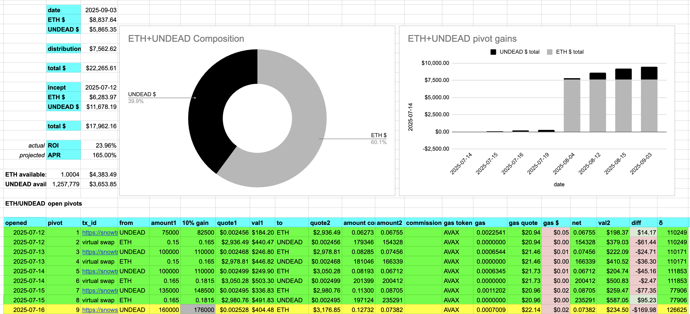
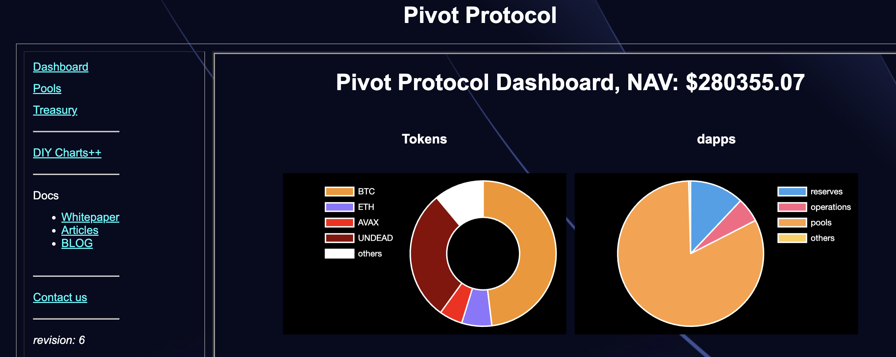

# 2025-09-03 Status of @UndeadBlocks / $UNDEAD 

 
 
 
 

* rank: 8757 
* quote: $0.002899 
* market cap: $43,481 
* 24-hr volume: $60,791 (δ: -$7,016 ) 

[UNDEAD data source](https://www.coingecko.com/en/coins/undead-blocks) 

When we get LPs funded on multiple blockchains, the game released, and the Pivot protocol launched, what will $UNDEAD look like? 

## $UNDEAD performance analysis, 2025-09-03 

* "δ" indicates change since 2025-07-17 
* "α" is annualized since 2025-07-17 

 
 
 
 

* rank: 8757 (δ: -3.27% ) , α: -24.84% 
* quote: $0.002899 (δ: 31.12% ) , α: 236.62% 
* market cap: $43,481 (δ: 31.02% ) , α: 235.87% 
* 24-hr volume: $60,791 (δ: -35.75% ) , α: -271.86% 

[2025-07-17 $UNDEAD report (archived)](https://github.com/pivoteur/biz/tree/main/blog/snapshot) 

# Liquidity Pools 

* I harvest the yields from the LPs on @BlackholeDex and @Uniswap 

 

* swap the yields to $USDC, 

 

* then provide liquidity to the @Uniswap LP UNDEAD/USDC. 

 
 

The Uniswap UNDEAD LPs are as shown. 

# Bitcoin vault 

* I swap some accumulated $AVAX to $BTC.b 

 

* I send this $BTC.b to the vault 

 

# Housekeeping

Before moving onto pivoting, I transfer 1M $UNDEAD to each $BTC pivot pool. With this liquidity, I can add a few more pivots to each $BTC pivot pool. 

# State of the Pivot Protocol, 2025-09-03 

 
 
 

Good day, pivoteurs! 

News: The pivots yesterday only slightly improved $UNDEAD token-price, but generated distributions for our stakers and improved the protocol position by $3k. Let us see what the pivots today do. 

## Pivot Protocol Snapshot 

 
 
 

### Custody 

* 50M $UNDEAD = $145,250 

### Investments 

* 1 $BTC = $111,384 
* 3.501M $UNDEAD = $10,170 

total: $266,804 

### Pivot Protocol 

* NAV = $280,225 
* reinvestments/distributions = $15,513 

This shows the protocol has generated $28,933 in value. 

# PIVOTS 

## BTC+UNDEAD 

No close pivots. 

0 

### Open BTC+UNDEAD pivots 

 
 

The positive δ calls to open an BTC-on-UNDEAD pivot, which I do. 

 

I also open an UNDEAD-on-BTC hedge. 

 

The BTC+UNDEAD pivot pool composition and γ-apportionment are as charted. 

 
 

## ETH+UNDEAD 

 

I close 2 UNDEAD-on-ETH pivots for gains of: 

* actual ROI: 34.06% / 753.54% APR projected 
* or: 252000 $UNDEAD -> $ETH -> 337,832.52 $UNDEAD 
* or: $252.86 gain on 2 pivots totalling $1,009.99 

 

I reinvest the gains or distribute 80% to stakers. 

### Open ETH+UNDEAD pivots 

 
 

The positive δ calls to open an ETH-on-UNDEAD pivot, which I do. 

 

I also open an UNDEAD-on-ETH hedge. 

 

The ETH+UNDEAD pivot pool composition and γ-apportionment are as charted. 

 
 

# CONCLUSION 

This concludes pivot-activity for 2025-09-03 

 
 
 
 

* gains distributed to stakers or reinvested, total: $15,715 
* protocol NAV: $280,355 
* protocol 24-hour volume: $98,648 
* transactions executed: 38 

[The Pivot protocol](https://pivoteur.github.io/#) 

